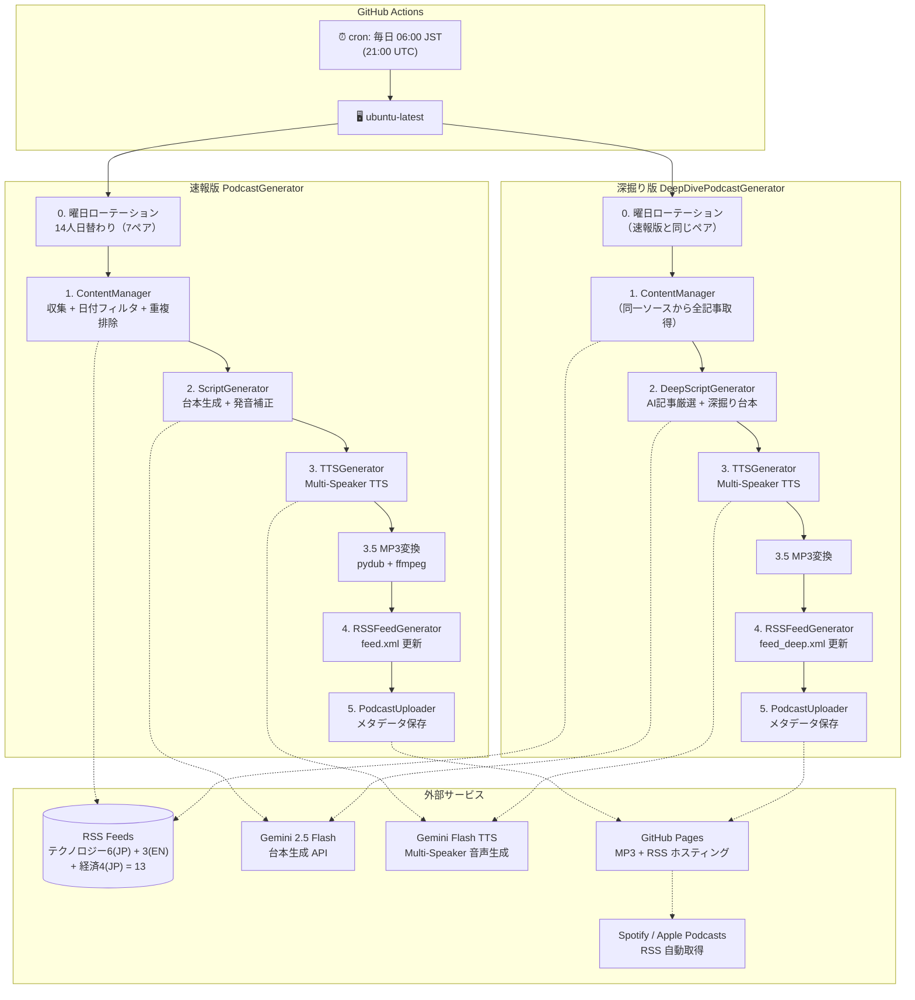
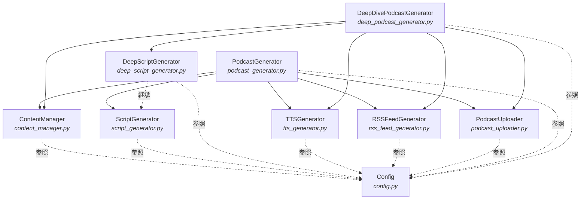
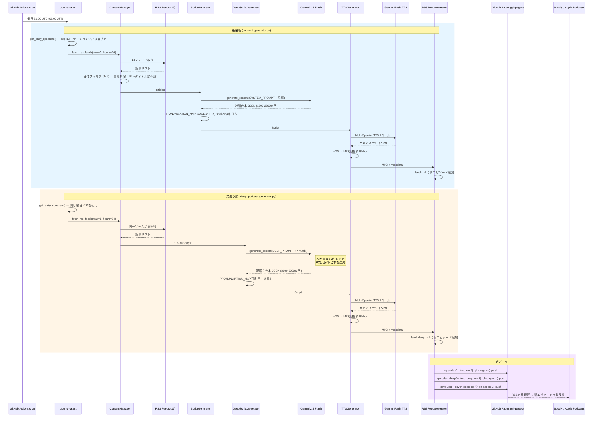
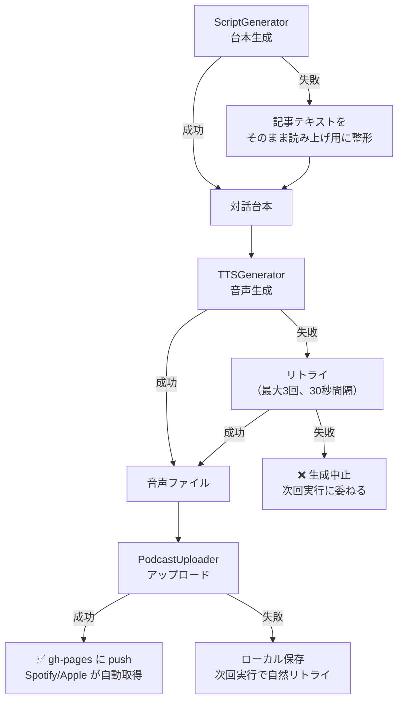

# HLD - High-Level Design
## AI Auto Podcast アーキテクチャ設計書

**採用プラン: α（完全無料 × 高品質）**

---

## 1. システムアーキテクチャ概要



---

## 2. コンポーネント構成

### 2.1 コンポーネント一覧

| コンポーネント | モジュール | 責務 |
|---------------|-----------|------|
| **PodcastGenerator** | `podcast_generator.py` | 速報版オーケストレーター。収集→台本→音声→RSS→配信の統合制御 |
| **DeepDivePodcastGenerator** | `deep_podcast_generator.py` | 深掘り版オーケストレーター。速報版と同じパイプラインだが、台本生成に DeepScriptGenerator を使用 |
| **ContentManager** | `content_manager.py` | RSSフィードからのコンテンツ収集・テキスト処理。速報版・深掘り版で共有 |
| **ScriptGenerator** | `script_generator.py` | Gemini Flash APIでポッドキャスト対話台本を生成（速報版）。PRONUNCIATION_MAP（306エントリ）による発音補正 |
| **DeepScriptGenerator** | `deep_script_generator.py` | ScriptGenerator を継承。AI記事厳選＋6次元分析の深掘り台本を生成 |
| **TTSGenerator** | `tts_generator.py` | Gemini Flash TTS APIで台本から音声ファイルを生成。速報版・深掘り版で共有 |
| **RSSFeedGenerator** | `rss_feed_generator.py` | ポッドキャスト配信用 RSS XML を生成・更新。パラメータ化により速報版・深掘り版の両方に対応 |
| **PodcastUploader** | `podcast_uploader.py` | メタデータ保存 + gh-pages へのデプロイ |
| **Config** | `config.py` | 全体設定管理（環境変数・定数・曜日ローテーション・速報版/深掘り版設定） |

### 2.2 コンポーネント関係図



### 2.3 旧アーキテクチャとの差分

| 項目 | 旧（Notebook LM） | 新（プランα） |
|------|-------------------|--------------|
| 音声生成 | Selenium + Notebook LM | Gemini Flash TTS API |
| 台本生成 | Notebook LM 内部 | Gemini Flash API（明示的） |
| 話者 | 匿名2人固定 | 14人日替わりローテーション（7ペア） |
| 認証 | OAuth + Cookie + セッション管理 | APIキー1つ |
| ブラウザ | Chrome/Firefox/Chromium/Edge | 不要 |
| コード量 | ~4,500行（6ファイル） | ~300行（3ファイル新規） |
| CI動作 | モック音声のみ | 実音声生成可能 |
| 配信 | 手動アップロード | GitHub Pages + RSS → Spotify/Apple自動取得 |

---

## 3. データフロー

### 3.1 メインフロー（日次生成 — 速報版＋深掘り版）



### 3.2 エラー時フォールバック



---

## 4. ファイル・ディレクトリ構成

```
auto-podcast/
├── .github/
│   └── workflows/
│       └── generate-podcast.yml   # GitHub Actions 定期実行（速報版+深掘り版）
│
├── docs/                          # ドキュメント
│   ├── CRD.md                     #   構想・要件定義書
│   ├── HLD.md                     #   アーキテクチャ設計書
│   └── LLD.md                     #   詳細設計書
│
├── podcast_generator.py           # 速報版オーケストレーター
├── deep_podcast_generator.py      # 深掘り版オーケストレーター
├── content_manager.py             # コンテンツ収集 + 日付フィルタ + 重複排除
├── script_generator.py            # 速報版台本生成 + 発音補正 (PRONUNCIATION_MAP 306エントリ)
├── deep_script_generator.py       # 深掘り版台本生成（ScriptGenerator 継承）
├── tts_generator.py               # Multi-Speaker TTS音声生成（速報版/深掘り版共有）
├── rss_feed_generator.py          # RSS XML 生成（パラメータ化、速報版/深掘り版共用）
├── podcast_uploader.py            # メタデータ保存 + gh-pages デプロイ
├── config.py                      # 設定管理（速報版/深掘り版の全設定、曜日ローテーション含む）
├── generate_cover.py              # 速報版カバーアート生成 (Pillow)
├── generate_cover_deep.py         # 深掘り版カバーアート生成 (Pillow)
├── cleanup_episodes.py            # 古いエピソードの自動削除（60日超）
│
├── pyproject.toml                 # プロジェクト定義 + 依存関係 (uv)
├── uv.lock                        # 依存ロックファイル
├── .python-version                # Python 3.11
├── CLAUDE.md                      # AI Agent向けガイダンス
├── README.md                      # プロジェクト説明
│
├── audio_files/                   # 生成音声ファイル（Git管理外）
│   ├── episode_N_YYYYMMDD.mp3     #   速報版 MP3
│   ├── deep_N_YYYYMMDD.mp3        #   深掘り版 MP3
│   ├── feed.xml                   #   速報版 RSS（生成後 gh-pages にコピー）
│   └── feed_deep.xml              #   深掘り版 RSS（生成後 gh-pages にコピー）
├── content/                       # コンテンツ・メタデータ（Git管理外）
└── .env                           # 環境変数（Git管理外）
```

#### gh-pages ブランチ構成
```
gh-pages/
├── index.html                     # ランディングページ
├── cover.jpg                      # 速報版カバーアート (1400x1400)
├── cover_deep.jpg                 # 深掘り版カバーアート (1400x1400)
├── feed.xml                       # 速報版 RSS フィード
├── feed_deep.xml                  # 深掘り版 RSS フィード
├── episodes/                      # 速報版 MP3
│   └── episode_N_YYYYMMDD.mp3
└── episodes_deep/                 # 深掘り版 MP3
    └── deep_N_YYYYMMDD.mp3
```

---

## 5. 技術スタック

| レイヤー | 技術 | 備考 |
|---------|------|------|
| **言語** | Python 3.11 | `.python-version` で固定 |
| **パッケージ管理** | uv | pyproject.toml + uv.lock |
| **LLM** | Gemini 2.5 Flash | 台本生成（無料枠） |
| **TTS** | Gemini 2.5 Flash Preview TTS | Multi-Speaker 音声生成（無料枠、RPD=10） |
| **RSS生成** | xml.etree.ElementTree | Apple Podcasts RSS仕様準拠 |
| **音声変換** | pydub + ffmpeg | WAV→MP3 (128kbps, 約5x圧縮) |
| **RSS解析** | feedparser | 13フィード対応（テクノロジーJP 6 + EN 3 + 経済JP 4） |
| **HTMLスクレイピング** | BeautifulSoup4 | 記事本文取得 |
| **API SDK** | google-genai v1.63+ | Gemini LLM + TTS 統合SDK |
| **環境変数** | python-dotenv | ローカル開発用 |
| **スケジューリング** | GitHub Actions cron | 毎日 06:00 JST (21:00 UTC) |
| **実行基盤** | GitHub Actions (ubuntu-latest) | Free tier 2000分/月 |
| **ホスティング** | GitHub Pages (gh-pages) | MP3 + RSS 配信。無料 100GB/月帯域 |
| **配信** | Spotify / Apple Podcasts | RSS経由で自動配信 |

---

## 6. 環境・デプロイ構成

### 6.1 環境一覧

| 環境 | 用途 | 認証 |
|------|------|------|
| **ローカル開発** | テスト・手動実行 | `.env` ファイル内 GEMINI_API_KEY |
| **GitHub Actions** | 定期自動実行 | GitHub Secrets `GEMINI_API_KEY` |

### 6.2 GitHub Actions ワークフロー

```yaml
# .github/workflows/generate-podcast.yml
on:
  schedule:
    - cron: "0 21 * * *"    # 毎日 06:00 JST
  workflow_dispatch:         # 手動実行対応

jobs:
  generate:
    runs-on: ubuntu-latest
    timeout-minutes: 15
    steps:
      - Checkout → uv setup → uv sync → ffmpeg install
      - 既存 feed.xml を gh-pages から curl で復元
      - 既存 feed_deep.xml を gh-pages から curl で復元
      - podcast_generator.py 実行（速報版生成 + feed.xml 追記）
      - deep_podcast_generator.py 実行（深掘り版生成 + feed_deep.xml 追記）
      - gh-pages ブランチに MP3 + feed.xml + feed_deep.xml を push
      - cover.jpg + cover_deep.jpg を gh-pages にコピー
      - 古いエピソードのクリーンアップ（60日超、速報版+深掘り版両方）
      - Artifacts にバックアップ保存（90日）
```

- GitHub Actions はクリーン環境のため、Generate 前に gh-pages の既存 feed.xml および feed_deep.xml を復元する
- 速報版 → 深掘り版 の順に逐次実行（同一ステップ内）
- 生成した MP3 + feed.xml + feed_deep.xml は **gh-pages ブランチ** に自動 push
- 速報版 MP3 は `episodes/`、深掘り版 MP3 は `episodes_deep/` に格納
- GitHub Pages が `https://necoha.github.io/auto-podcast/` で配信
- Spotify / Apple Podcasts が RSS を定期取得 → 新エピソード自動反映
- Artifacts には90日間バックアップ保存

### 6.3 環境変数

| 変数名 | 用途 | 必須 |
|--------|------|------|
| `GEMINI_API_KEY` | Gemini API（台本生成 + TTS 共通） | Yes |
| `PODCAST_BASE_URL` | GitHub Pages のベースURL | No（デフォルト: `https://necoha.github.io/auto-podcast`） |
| `PODCAST_TITLE` | ポッドキャスト名 | No（デフォルトあり） |
| `PODCAST_LANGUAGE` | 言語コード | No（デフォルト: ja） |
| `PODCAST_OWNER_EMAIL` | RSS/Spotify登録用メールアドレス | Yes（GitHub Secrets） |

> **配信方式**: GitHub Pages で MP3 と RSS をホスティング。
> Spotify for Creators と Apple Podcasts Connect に RSS URL を初回登録するだけで、
> 以降は新エピソードが自動的に配信される。
>
> 速報版 RSS URL: `https://necoha.github.io/auto-podcast/feed.xml`
> 深掘り版 RSS URL: `https://necoha.github.io/auto-podcast/feed_deep.xml`
>
> **注意**: 深掘り版は速報版とは別のポッドキャストとしてSpotifyに登録が必要。

---

## 7. エラーハンドリング戦略

| レベル | 戦略 |
|--------|------|
| **コンテンツ収集** | フィード単位でエラーキャッチ、取得できたフィードで続行 |
| **台本生成** | Gemini API失敗 → 記事テキストをそのまま読み上げテキストとして使用 |
| **音声生成** | Gemini TTS失敗 → リトライ（最大3回、30秒間隔）→ 失敗時は生成中止、次回実行に委ねる |
| **アップロード** | 失敗 → ローカル保存。次回実行で自然リトライ |
| **レート制限** | Gemini無料枠の制限に到達 → ログ出力して次回実行にスキップ |

---

## 8. セキュリティ

| 項目 | 対策 |
|------|------|
| APIキー | 環境変数で管理。コードに平文保存しない |
| Git管理 | `.env`, `audio_files/`, `content/` は `.gitignore` に追加 |
| 通信 | 全てHTTPS経由 |
| GitHub Actions | Secrets で API キー管理。GitHub Pages配信のためPublic（APIキーはSecretsで保護） |
