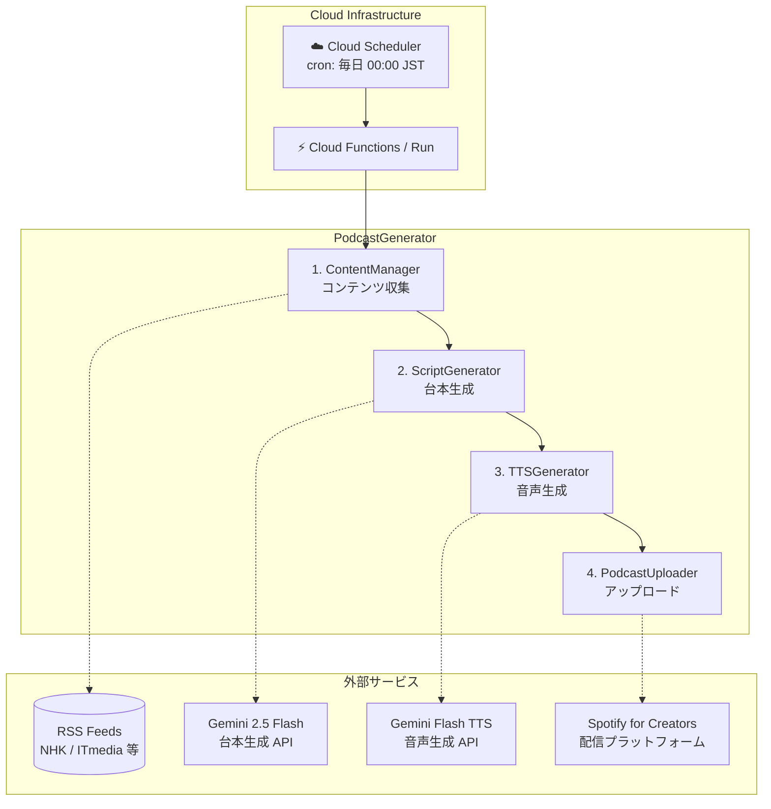
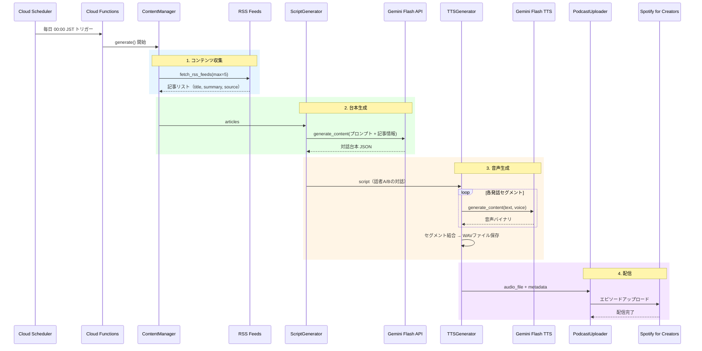

# HLD - High-Level Design
## AI Auto Podcast アーキテクチャ設計書

**採用プラン: α（完全無料 × 高品質）**

---

## 1. システムアーキテクチャ概要



---

## 2. コンポーネント構成

### 2.1 コンポーネント一覧

| コンポーネント | モジュール | 責務 |
|---------------|-----------|------|
| **PodcastGenerator** | `podcast_generator.py` | オーケストレーター。収集→台本→音声→アップロードの統合制御 |
| **ContentManager** | `content_manager.py` | RSSフィードからのコンテンツ収集・テキスト処理（既存流用） |
| **ScriptGenerator** | `script_generator.py` | Gemini Flash APIでポッドキャスト対話台本を生成 |
| **TTSGenerator** | `tts_generator.py` | Gemini Flash TTS APIで台本から音声ファイルを生成 |
| **PodcastUploader** | `podcast_uploader.py` | 生成した音声をSpotify for Creatorsにアップロード |
| **Config** | `config.py` | 全体設定管理（環境変数・定数） |

### 2.2 コンポーネント関係図


### 2.3 旧アーキテクチャとの差分

| 項目 | 旧（Notebook LM） | 新（プランα） |
|------|-------------------|--------------|
| 音声生成 | Selenium + Notebook LM | Gemini Flash TTS API |
| 台本生成 | Notebook LM 内部 | Gemini Flash API（明示的） |
| 認証 | OAuth + Cookie + セッション管理 | APIキー1つ |
| ブラウザ | Chrome/Firefox/Chromium/Edge | 不要 |
| コード量 | ~4,500行（6ファイル） | ~300行（3ファイル新規） |
| CI動作 | モック音声のみ | 実音声生成可能 |

---

## 3. データフロー

### 3.1 メインフロー（日次生成）



### 3.2 エラー時フォールバック


---

## 4. ファイル・ディレクトリ構成

```
auto-podcast/
├── docs/                          # ドキュメント
│   ├── CRD.md                     #   構想・要件定義書
│   ├── HLD.md                     #   アーキテクチャ設計書
│   └── LLD.md                     #   詳細設計書
│
├── podcast_generator.py           # オーケストレーター（書き直し）
├── content_manager.py             # コンテンツ収集（既存流用）
├── script_generator.py            # 台本生成（新規）
├── tts_generator.py               # TTS音声生成（新規）
├── podcast_uploader.py            # アップロード（新規）
├── config.py                      # 設定管理（更新）
│
├── requirements.txt               # Python依存関係（更新）
├── CLAUDE.md                      # AI Agent向けガイダンス
├── README.md                      # プロジェクト説明
│
├── audio_files/                   # 生成音声ファイル（Git管理外）
├── content/                       # コンテンツ・メタデータ（Git管理外）
└── .env                           # 環境変数（Git管理外）
```

---

## 5. 技術スタック

| レイヤー | 技術 | 備考 |
|---------|------|------|
| **言語** | Python | 3.11+ |
| **LLM** | Google Gemini 2.5 Flash | 台本生成（無料枠） |
| **TTS** | Gemini 2.5 Flash Preview TTS | 音声生成（無料枠） |
| **RSS解析** | feedparser | 既存流用 |
| **HTMLスクレイピング** | BeautifulSoup4 | 既存流用 |
| **HTTP** | google-genai | Gemini API通信 |
| **環境変数** | python-dotenv | ローカル開発用 |
| **スケジューリング** | Cloud Scheduler | 正確なcron実行 |
| **実行基盤** | Cloud Functions / Cloud Run | サーバーレス |
| **配信** | Spotify for Creators | 無料・無制限ホスティング |

### 5.1 削除した依存関係

| 旧パッケージ | 理由 |
|-------------|------|
| selenium | ブラウザ自動操作不要 |
| webdriver-manager | 同上 |
| feedgen | RSS自前生成不要（Spotify側で管理） |
| pydub | 音声メタデータ取得不要 |
| schedule | Cloud Scheduler に移行 |
| google-cloud-texttospeech | Gemini TTS に統一 |
| openai | Gemini に統一 |

---

## 6. 環境・デプロイ構成

### 6.1 環境一覧

| 環境 | 用途 | 認証 |
|------|------|------|
| **ローカル開発** | テスト・手動実行 | `.env` ファイル内 GEMINI_API_KEY |
| **Cloud Functions** | 定期自動実行 | 環境変数 GEMINI_API_KEY |

### 6.2 環境変数

| 変数名 | 用途 | 必須 |
|--------|------|------|
| `GEMINI_API_KEY` | Gemini API（台本生成 + TTS 共通） | Yes |
| `PODCAST_TITLE` | ポッドキャスト名 | No（デフォルトあり） |
| `PODCAST_LANGUAGE` | 言語コード | No（デフォルト: ja） |

> **注**: Spotify for Creators に公式アップロードAPIがない場合は、
> 手動アップロード or GitHub Pages + 自前RSS にフォールバック。
> その場合 `PODCAST_BASE_URL` と `feedgen` が必要になる。

---

## 7. エラーハンドリング戦略

| レベル | 戦略 |
|--------|------|
| **コンテンツ収集** | フィード単位でエラーキャッチ、取得できたフィードで続行 |
| **台本生成** | Gemini API失敗 → 記事テキストをそのまま読み上げテキストとして使用 |
| **音声生成** | Gemini TTS失敗 → Google Cloud TTS WaveNet（無料枠）にフォールバック |
| **アップロード** | 失敗 → ローカル保存 + 次回リトライキューに追加 |
| **レート制限** | Gemini無料枠の制限に到達 → ログ出力して次回実行にスキップ |

---

## 8. セキュリティ

| 項目 | 対策 |
|------|------|
| APIキー | 環境変数で管理。コードに平文保存しない |
| Git管理 | `.env`, `audio_files/`, `content/` は `.gitignore` に追加 |
| 通信 | 全てHTTPS経由 |
| Cloud Functions | IAMで最小権限アクセス |
