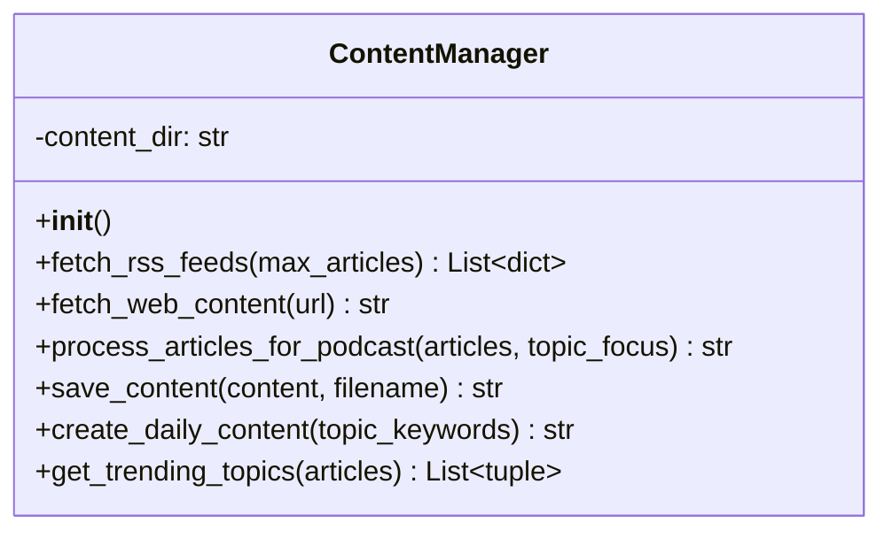
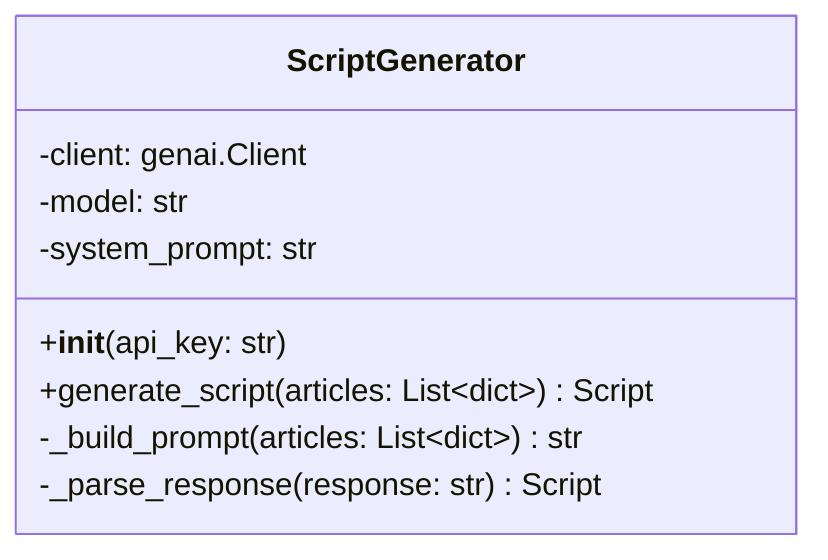
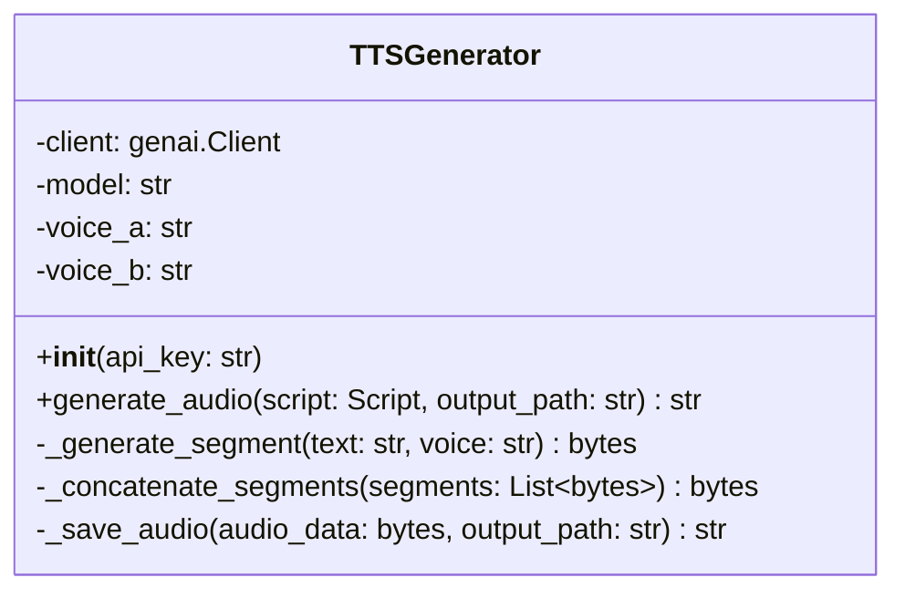
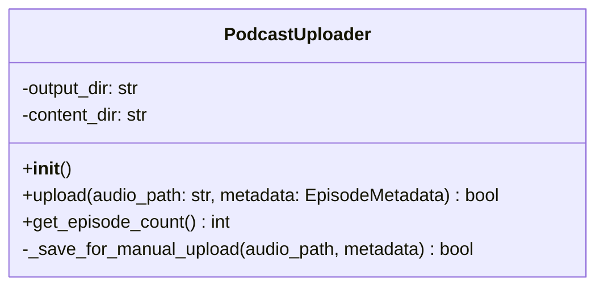
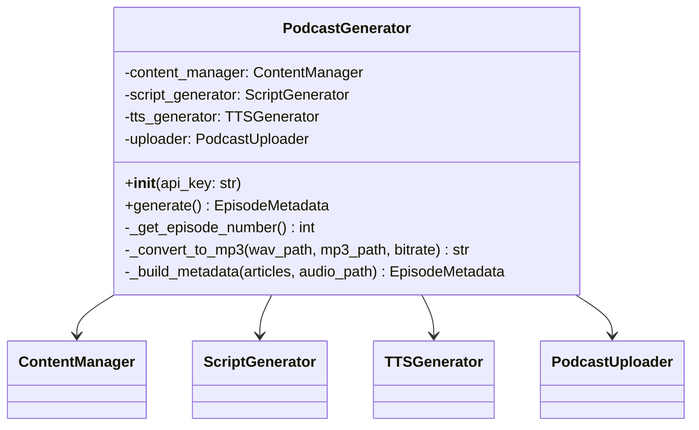

# LLD - Low-Level Design
## AI Auto Podcast 詳細設計書

**採用プラン: α（Gemini Flash + Gemini Flash TTS / 完全無料）**

---

## 1. クラス・モジュール詳細設計

---

### 1.1 ContentManager (`content_manager.py`) — 既存流用

**責務**: RSSフィードからのコンテンツ収集、テキスト処理

#### クラス図


#### メソッド詳細

| メソッド | 入力 | 出力 | 処理概要 |
|---------|------|------|---------|
| `fetch_rss_feeds` | max_articles: int | List[dict] | config.RSS_FEEDSの各URLをfeedparserで解析。title/summary/link/published/sourceを抽出 |
| `fetch_web_content` | url: str | str | BeautifulSoupでHTML本文抽出。MAX_CONTENT_LENGTH文字で切り詰め |
| `process_articles_for_podcast` | articles, topic_focus | str | キーワードフィルタ → 上位5件をテキスト整形 |
| `create_daily_content` | topic_keywords | str(filepath) | fetch → process → save の統合処理 |

#### データ構造: 記事オブジェクト
```python
article = {
    'title': str,       # 記事タイトル
    'summary': str,     # 記事要約
    'link': str,        # 記事URL
    'published': str,   # 公開日時文字列
    'source': str       # フィード名
}
```

---

### 1.2 ScriptGenerator (`script_generator.py`) — 新規作成

**責務**: Gemini Flash APIを使い、記事情報からポッドキャスト対話台本を生成

#### クラス図


#### メソッド詳細

| メソッド | 入力 | 出力 | 処理概要 |
|---------|------|------|---------|
| `__init__` | api_key: str | - | genai.Client初期化。モデル名・システムプロンプト設定 |
| `generate_script` | articles: List[dict] | Script | 記事リストからプロンプト構築 → Gemini呼び出し → レスポンス解析 |
| `_build_prompt` | articles: List[dict] | str | 記事タイトル・要約を含むプロンプトテキスト構築 |
| `_parse_response` | response: str | Script | Geminiレスポンスを構造化されたScript型に変換 |

#### システムプロンプト（概要）
```
あなたはポッドキャストの台本ライターです。
以下のニュース記事をもとに、2人の話者（ホストとゲスト）による
自然な日本語の対話形式でポッドキャスト台本を作成してください。

要件:
- 15分程度の会話になるボリューム
- 各記事について分かりやすく解説
- 話者Aはホスト（進行役）、話者Bはゲスト（解説役）
- 自然な相槌・質問・感想を含める
- JSON形式で出力: [{"speaker": "A", "text": "..."}, ...]
```

#### データ構造: Script
```python
@dataclass
class ScriptLine:
    speaker: str        # "A" or "B"
    text: str           # 発話テキスト

Script = List[ScriptLine]
```

#### Gemini API呼び出し仕様
```python
from google import genai
from google.genai import types

client = genai.Client(api_key=api_key)
response = client.models.generate_content(
    model="gemini-2.5-flash",
    config=types.GenerateContentConfig(
        system_instruction=system_prompt,
        response_mime_type="application/json",
    ),
    contents=prompt,
)
```

---

### 1.3 TTSGenerator (`tts_generator.py`) — 新規作成

**責務**: Gemini Flash TTS APIを使い、台本テキストから音声ファイルを生成

#### クラス図


#### メソッド詳細

| メソッド | 入力 | 出力 | 処理概要 |
|---------|------|------|---------|
| `__init__` | api_key: str | - | genai.Client初期化。音声名設定 |
| `generate_audio` | script, output_path | str | 台本の各行を話者別にTTS → 結合 → ファイル保存 |
| `_generate_segment` | text, voice | bytes | 1発話分のTTS API呼び出し。音声バイナリ取得 |
| `_concatenate_segments` | segments | bytes | 複数音声セグメントを連結（無音間隔挿入含む） |
| `_save_audio` | audio_data, path | str | 音声データをファイルに書き出し |

#### Gemini TTS API 呼び出し仕様
```python
from google import genai
from google.genai import types

client = genai.Client(api_key=api_key)
response = client.models.generate_content(
    model="gemini-2.5-flash-preview-tts",
    contents="こんにちは、今日のニュースをお届けします。",
    config=types.GenerateContentConfig(
        response_modalities=["AUDIO"],
        speech_config=types.SpeechConfig(
            voice_config=types.VoiceConfig(
                prebuilt_voice_id="Aoede"  # or other voice
            )
        ),
    ),
)

# レスポンスから音声データ取得
audio_data = response.candidates[0].content.parts[0].inline_data.data
```

#### 利用可能な音声（Gemini TTS）
```
Aoede, Charon, Fenrir, Kore, Puck,
Leda, Orus, Zephyr, ...
（※ 日本語対応の音声を要テスト・選定）
```

#### 音声結合仕様
```
各セグメント間: 500ms の無音を挿入
出力フォーマット: WAV (PCM 24kHz 16bit mono)
後処理: 必要に応じて ffmpeg で MP3 変換
```

---

### 1.4 PodcastUploader (`podcast_uploader.py`) — 新規作成

**責務**: 生成した音声ファイルをポッドキャスト配信プラットフォームにアップロード

#### クラス図


#### メソッド詳細

| メソッド | 入力 | 出力 | 処理概要 |
|---------|------|------|---------|
| `upload` | audio_path, metadata | bool | メタデータJSONをcontent/に保存 |
| `get_episode_count` | - | int | content/内のJSONファイル数を返す |
| `_save_for_manual_upload` | audio_path, metadata | bool | メタデータJSON出力（手動Spotifyアップロード用） |

#### データ構造: EpisodeMetadata
```python
@dataclass
class EpisodeMetadata:
    title: str              # エピソードタイトル
    description: str        # エピソード説明文
    episode_number: int     # エピソード番号
    published_date: str     # 配信日
    source_articles: List[dict]  # 元記事情報
    duration_seconds: int   # 音声の長さ（秒）
```

> **設計判断**: Spotify for Creators に公式APIが提供されていない場合、
> 初期実装では `_save_for_manual_upload` をデフォルトとし、
> 音声ファイル + メタデータを `audio_files/` に保存する方式とする。
> 手動で Spotify にアップロードするか、将来的にAPI対応に切り替える。

---

### 1.5 PodcastGenerator (`podcast_generator.py`)

**責務**: 全体のオーケストレーション（収集→台本→音声→MP3変換→保存）

#### クラス図


#### メソッド詳細

| メソッド | 入力 | 出力 | 処理概要 |
|---------|------|------|---------|
| `__init__` | api_key: str | - | 4つのサブコンポーネントを初期化 |
| `generate` | - | EpisodeMetadata or None | メインフロー: 収集→台本→音声→アップロード |
| `_get_episode_number` | - | int | content/ 内のメタデータファイル数 + 1 |
| `_build_metadata` | articles, audio_path | EpisodeMetadata | メタデータ構築 |

#### generate() フロー（疑似コード）
```python
def generate(self) -> EpisodeMetadata | None:
    # 1. コンテンツ収集（24h以内 + 重複排除）
    articles = self.content_manager.fetch_rss_feeds(max_articles=5, hours=24)

    # 2. 台本生成（+ PRONUNCIATION_MAP発音補正）
    script = self.script_generator.generate_script(articles)

    # 3. TTS音声生成（Multi-Speaker 1コール）
    self.tts_generator.generate_audio(script, audio_path)  # → WAV

    # 3.5 WAV → MP3 変換 (pydub + ffmpeg, 128kbps)
    mp3_path = self._convert_to_mp3(audio_path, mp3_path)
    #   変換成功時はWAV削除、失敗時はWAVフォールバック

    # 4. メタデータ保存
    self.uploader.upload(mp3_path, metadata)
```

---

### 1.6 Config (`config.py`)

**責務**: 全コンポーネントの設定値を一元管理

| 設定名 | 型 | 値 | 説明 |
|--------|---|-----|------|
| `GEMINI_API_KEY` | str | env | Gemini APIキー（台本 + TTS 共通） |
| `LLM_MODEL` | str | `gemini-2.5-flash` | 台本生成用モデル |
| `TTS_MODEL` | str | `gemini-2.5-flash-preview-tts` | TTS用モデル |
| `TTS_VOICE_A` | str | `Kore` | 話者A（ホスト）の音声 |
| `TTS_VOICE_B` | str | `Charon` | 話者B（ゲスト）の音声 |
| `RSS_FEEDS` | List[str] | 12フィード | テクノロジー7 + 経済5 |
| `MAX_ARTICLES` | int | `5` | フィードあたりの最大取得数 |

#### RSSフィード一覧（12フィード）
| カテゴリ | ソース | URL |
|---------|--------|-----|
| テクノロジー | ITmedia NEWS | `rss.itmedia.co.jp/rss/2.0/news_bursts.xml` |
| テクノロジー | Publickey | `www.publickey1.jp/atom.xml` |
| テクノロジー | GIGAZINE | `gigazine.net/news/rss_2.0/` |
| テクノロジー | CNET Japan | `japan.cnet.com/rss/index.rdf` |
| テクノロジー | Impress Watch | `www.watch.impress.co.jp/data/rss/1.0/ipw/feed.rdf` |
| テクノロジー | gihyo.jp | `gihyo.jp/feed/rss2` |
| テクノロジー | ASCII.jp | `ascii.jp/rss.xml` |
| 経済 | 日経ビジネス | `business.nikkei.com/rss/sns/nb.rdf` |
| 経済 | NHK経済 | `www3.nhk.or.jp/rss/news/cat5.xml` |
| 経済 | ロイター日本語 | `assets.wor.jp/rss/rdf/reuters/top.rdf` |
| 経済 | Yahoo経済 | `news.yahoo.co.jp/rss/topics/business.xml` |
| 経済 | 朝日新聞経済 | `www.asahi.com/rss/asahi/business.rdf` |

---

## 2. ファイル命名規則

| ファイル種別 | 命名パターン | 例 |
|------------|-------------|-----|
| 音声ファイル | `episode_{N}_{YYYYMMDD}.mp3` | `episode_42_20260216.mp3` |
| メタデータ | `episode_{N}_{YYYYMMDD}.json` | `episode_42_20260216.json` |

---

## 3. エラー処理パターン

### 3.1 例外処理の基本方針
- 各モジュールは自身のエラーをキャッチしログ出力
- `logging` モジュールを使用（`print()` から移行）
- メソッドは成功時に結果、失敗時に例外を送出
- オーケストレーター（PodcastGenerator）がフォールバックを判断

### 3.2 フォールバック一覧

| シナリオ | フォールバック |
|---------|--------------|
| RSS取得失敗（一部） | 取得できたフィードで続行 |
| RSS取得失敗（全部） | 処理中止。次回実行に委ねる |
| 台本生成失敗 | 記事テキストを箇条書きにして読み上げテキスト化 |
| Gemini TTS失敗 | Google Cloud TTS WaveNet にフォールバック |
| アップロード失敗 | ローカル保存。次回リトライキューに追加 |
| レート制限到達 | ログ出力してスキップ。次回実行で再試行 |

---

## 4. 外部APIとのインタラクション

### 4.1 RSSフィード取得（既存）
```
プロトコル: HTTP GET
ライブラリ: feedparser
タイムアウト: feedparserデフォルト
レスポンス: XML (RSS/Atom)
エラー処理: フィード単位で例外キャッチ
```

### 4.2 Gemini Flash API（台本生成）
```
プロトコル: HTTPS
ライブラリ: google-genai
エンドポイント: generativelanguage.googleapis.com
認証: APIキー
モデル: gemini-2.5-flash
入力: テキスト（記事情報 + システムプロンプト）
出力: JSON（対話台本）
レート制限（無料枠）: 15 RPM, 100万トークン/日
```

### 4.3 Gemini Flash TTS API（Multi-Speaker 音声生成）
```
プロトコル: HTTPS
ライブラリ: google-genai
エンドポイント: generativelanguage.googleapis.com
認証: APIキー（台本生成と共通）
モデル: gemini-2.5-flash-preview-tts
入力: Director's Notes + MultiSpeaker トランスクリプト
出力: 音声バイナリ（WAV PCM 24kHz 16bit mono）
レスポンスモダリティ: AUDIO
APIコール数: 1回/エピソード
レート制限 (Free Tier): RPM=3, RPD=10
話者: HostA=Kore, GuestB=Charon
```

---

## 5. GitHub Actions デプロイ仕様

### 5.1 ワークフローファイル
```yaml
# .github/workflows/generate-podcast.yml
name: Generate Podcast
on:
  schedule:
    - cron: "0 15 * * *"    # 毎日 00:00 JST = 15:00 UTC
  workflow_dispatch:         # 手動実行対応

jobs:
  generate:
    runs-on: ubuntu-latest
    timeout-minutes: 15
    steps:
      - uses: actions/checkout@v4
      - uses: astral-sh/setup-uv@v5
      - run: uv python install
      - run: uv sync
      - run: uv run python podcast_generator.py
        env:
          GEMINI_API_KEY: ${{ secrets.GEMINI_API_KEY }}
      - uses: actions/upload-artifact@v4
        with:
          name: episode-${{ github.run_number }}
          path: |
            audio_files/*.mp3
            content/*.json
          retention-days: 90
```

### 5.2 セットアップ手順
1. GitHub Secrets に `GEMINI_API_KEY` を設定
2. ワークフローファイルを push
3. Actions タブで手動実行 or cron 待ち
4. Artifacts から MP3 をダウンロード → Spotify にアップロード

---

## 6. 依存パッケージ一覧

**パッケージ管理: uv** (`pyproject.toml` + `uv.lock`)

| パッケージ | バージョン | 用途 |
|-----------|----------|------|
| google-genai | >=1.0.0 | Gemini API（台本生成 + Multi-Speaker TTS） |
| feedparser | >=6.0.10 | RSS/Atomフィード解析 |
| beautifulsoup4 | >=4.12.2 | HTML本文抽出 |
| requests | >=2.31.0 | HTTP通信 |
| python-dotenv | >=1.0.0 | ローカル環境変数読み込み |
| pydub | >=0.25.1 | WAV→MP3変換（ffmpeg経由） |

### システム依存
| ツール | 用途 |
|-------|------|
| ffmpeg | pydubのバックエンド（MP3エンコード） |
| uv | パッケージ管理・仮想環境 |
