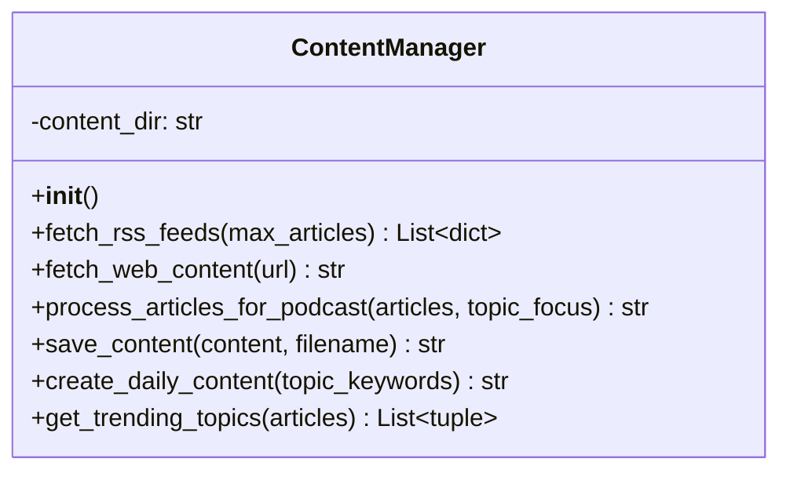
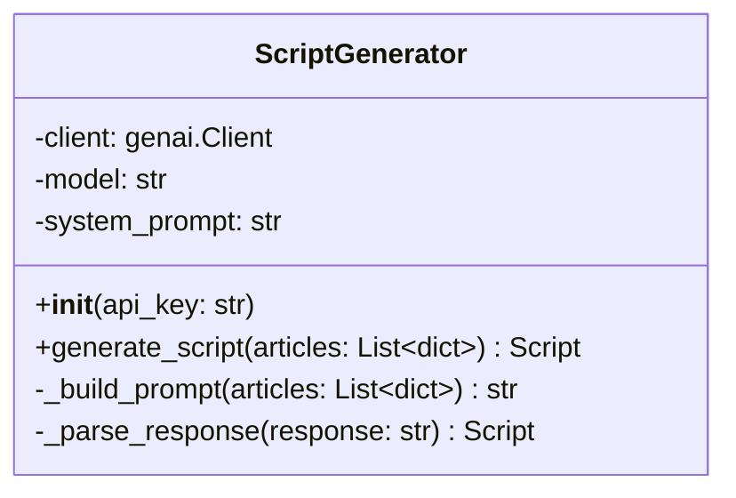
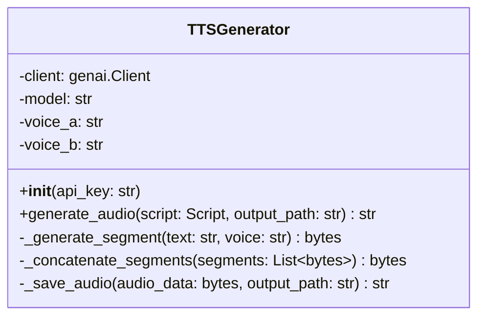
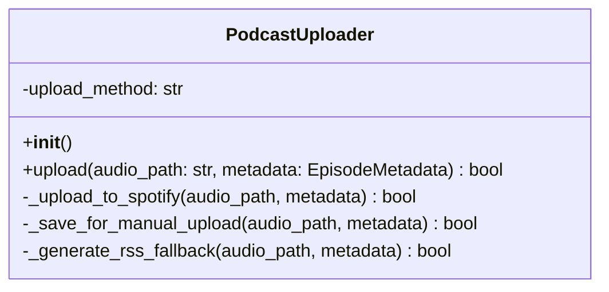
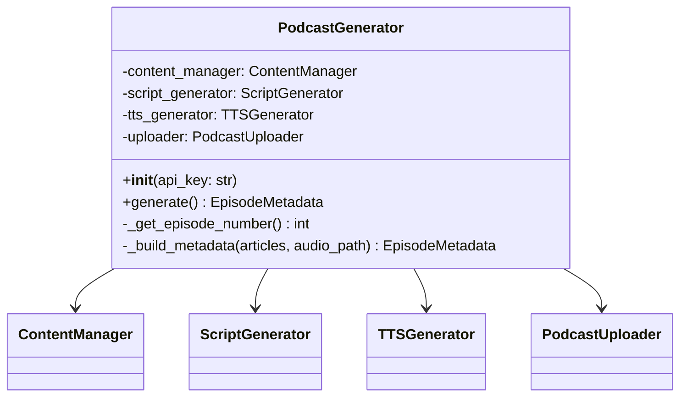

# LLD - Low-Level Design
## AI Auto Podcast 詳細設計書

**採用プラン: α（Gemini Flash + Gemini Flash TTS / 完全無料）**

---

## 1. クラス・モジュール詳細設計

---

### 1.1 ContentManager (`content_manager.py`) — 既存流用

**責務**: RSSフィードからのコンテンツ収集、テキスト処理

#### クラス図


#### メソッド詳細

| メソッド | 入力 | 出力 | 処理概要 |
|---------|------|------|---------|
| `fetch_rss_feeds` | max_articles: int | List[dict] | config.RSS_FEEDSの各URLをfeedparserで解析。title/summary/link/published/sourceを抽出 |
| `fetch_web_content` | url: str | str | BeautifulSoupでHTML本文抽出。MAX_CONTENT_LENGTH文字で切り詰め |
| `process_articles_for_podcast` | articles, topic_focus | str | キーワードフィルタ → 上位5件をテキスト整形 |
| `create_daily_content` | topic_keywords | str(filepath) | fetch → process → save の統合処理 |

#### データ構造: 記事オブジェクト
```python
article = {
    'title': str,       # 記事タイトル
    'summary': str,     # 記事要約
    'link': str,        # 記事URL
    'published': str,   # 公開日時文字列
    'source': str       # フィード名
}
```

---

### 1.2 ScriptGenerator (`script_generator.py`) — 新規作成

**責務**: Gemini Flash APIを使い、記事情報からポッドキャスト対話台本を生成

#### クラス図


#### メソッド詳細

| メソッド | 入力 | 出力 | 処理概要 |
|---------|------|------|---------|
| `__init__` | api_key: str | - | genai.Client初期化。モデル名・システムプロンプト設定 |
| `generate_script` | articles: List[dict] | Script | 記事リストからプロンプト構築 → Gemini呼び出し → レスポンス解析 |
| `_build_prompt` | articles: List[dict] | str | 記事タイトル・要約を含むプロンプトテキスト構築 |
| `_parse_response` | response: str | Script | Geminiレスポンスを構造化されたScript型に変換 |

#### システムプロンプト（概要）
```
あなたはポッドキャストの台本ライターです。
以下のニュース記事をもとに、2人の話者（ホストとゲスト）による
自然な日本語の対話形式でポッドキャスト台本を作成してください。

要件:
- 15分程度の会話になるボリューム
- 各記事について分かりやすく解説
- 話者Aはホスト（進行役）、話者Bはゲスト（解説役）
- 自然な相槌・質問・感想を含める
- JSON形式で出力: [{"speaker": "A", "text": "..."}, ...]
```

#### データ構造: Script
```python
@dataclass
class ScriptLine:
    speaker: str        # "A" or "B"
    text: str           # 発話テキスト

Script = List[ScriptLine]
```

#### Gemini API呼び出し仕様
```python
from google import genai
from google.genai import types

client = genai.Client(api_key=api_key)
response = client.models.generate_content(
    model="gemini-2.5-flash",
    config=types.GenerateContentConfig(
        system_instruction=system_prompt,
        response_mime_type="application/json",
    ),
    contents=prompt,
)
```

---

### 1.3 TTSGenerator (`tts_generator.py`) — 新規作成

**責務**: Gemini Flash TTS APIを使い、台本テキストから音声ファイルを生成

#### クラス図


#### メソッド詳細

| メソッド | 入力 | 出力 | 処理概要 |
|---------|------|------|---------|
| `__init__` | api_key: str | - | genai.Client初期化。音声名設定 |
| `generate_audio` | script, output_path | str | 台本の各行を話者別にTTS → 結合 → ファイル保存 |
| `_generate_segment` | text, voice | bytes | 1発話分のTTS API呼び出し。音声バイナリ取得 |
| `_concatenate_segments` | segments | bytes | 複数音声セグメントを連結（無音間隔挿入含む） |
| `_save_audio` | audio_data, path | str | 音声データをファイルに書き出し |

#### Gemini TTS API 呼び出し仕様
```python
from google import genai
from google.genai import types

client = genai.Client(api_key=api_key)
response = client.models.generate_content(
    model="gemini-2.5-flash-preview-tts",
    contents="こんにちは、今日のニュースをお届けします。",
    config=types.GenerateContentConfig(
        response_modalities=["AUDIO"],
        speech_config=types.SpeechConfig(
            voice_config=types.VoiceConfig(
                prebuilt_voice_id="Aoede"  # or other voice
            )
        ),
    ),
)

# レスポンスから音声データ取得
audio_data = response.candidates[0].content.parts[0].inline_data.data
```

#### 利用可能な音声（Gemini TTS）
```
Aoede, Charon, Fenrir, Kore, Puck,
Leda, Orus, Zephyr, ...
（※ 日本語対応の音声を要テスト・選定）
```

#### 音声結合仕様
```
各セグメント間: 500ms の無音を挿入
出力フォーマット: WAV (PCM 24kHz 16bit mono)
後処理: 必要に応じて ffmpeg で MP3 変換
```

---

### 1.4 PodcastUploader (`podcast_uploader.py`) — 新規作成

**責務**: 生成した音声ファイルをポッドキャスト配信プラットフォームにアップロード

#### クラス図


#### メソッド詳細

| メソッド | 入力 | 出力 | 処理概要 |
|---------|------|------|---------|
| `upload` | audio_path, metadata | bool | upload_method に基づいて適切なアップロード方式を呼び出し |
| `_upload_to_spotify` | audio_path, metadata | bool | Spotify for Creators API（利用可能な場合） |
| `_save_for_manual_upload` | audio_path, metadata | bool | ローカル保存 + メタデータJSON出力。手動アップロード用 |
| `_generate_rss_fallback` | audio_path, metadata | bool | feedgen で自前RSS生成（GitHub Pages等で配信） |

#### データ構造: EpisodeMetadata
```python
@dataclass
class EpisodeMetadata:
    title: str              # エピソードタイトル
    description: str        # エピソード説明文
    episode_number: int     # エピソード番号
    published_date: str     # 配信日
    source_articles: List[dict]  # 元記事情報
    duration_seconds: int   # 音声の長さ（秒）
```

> **設計判断**: Spotify for Creators に公式APIが提供されていない場合、
> 初期実装では `_save_for_manual_upload` をデフォルトとし、
> 音声ファイル + メタデータを `audio_files/` に保存する方式とする。
> 手動で Spotify にアップロードするか、将来的にAPI対応に切り替える。

---

### 1.5 PodcastGenerator (`podcast_generator.py`) — 書き直し

**責務**: 全体のオーケストレーション

#### クラス図


#### メソッド詳細

| メソッド | 入力 | 出力 | 処理概要 |
|---------|------|------|---------|
| `__init__` | api_key: str | - | 4つのサブコンポーネントを初期化 |
| `generate` | - | EpisodeMetadata or None | メインフロー: 収集→台本→音声→アップロード |
| `_get_episode_number` | - | int | content/ 内のメタデータファイル数 + 1 |
| `_build_metadata` | articles, audio_path | EpisodeMetadata | メタデータ構築 |

#### generate() フロー（疑似コード）
```python
def generate(self) -> EpisodeMetadata | None:
    # 1. コンテンツ収集
    articles = self.content_manager.fetch_rss_feeds(max_articles=5)
    if not articles:
        log.error("記事が取得できませんでした")
        return None

    # 2. 台本生成
    try:
        script = self.script_generator.generate_script(articles)
    except Exception as e:
        log.warning(f"台本生成失敗、フォールバック: {e}")
        script = self._fallback_script(articles)

    # 3. 音声生成
    episode_num = self._get_episode_number()
    audio_filename = f"episode_{episode_num}_{date.today()}.wav"
    audio_path = os.path.join(config.AUDIO_OUTPUT_DIR, audio_filename)
    
    try:
        self.tts_generator.generate_audio(script, audio_path)
    except Exception as e:
        log.error(f"音声生成失敗: {e}")
        return None

    # 4. メタデータ保存 & アップロード
    metadata = self._build_metadata(articles, audio_path)
    self.uploader.upload(audio_path, metadata)
    
    return metadata
```

---

### 1.6 Config (`config.py`) — 更新

**責務**: 全コンポーネントの設定値を一元管理

| 設定名 | 型 | デフォルト値 | 説明 |
|--------|---|-------------|------|
| `GEMINI_API_KEY` | str | env | Gemini APIキー（台本生成 + TTS 共通） |
| `GEMINI_MODEL` | str | `gemini-2.5-flash` | 台本生成用モデル |
| `GEMINI_TTS_MODEL` | str | `gemini-2.5-flash-preview-tts` | TTS用モデル |
| `TTS_VOICE_A` | str | `Aoede` | 話者Aの音声 |
| `TTS_VOICE_B` | str | `Charon` | 話者Bの音声 |
| `RSS_FEEDS` | List[str] | 5フィード | 監視するRSSフィード一覧 |
| `AUDIO_OUTPUT_DIR` | str | `./audio_files` | 音声出力ディレクトリ |
| `CONTENT_DIR` | str | `./content` | コンテンツディレクトリ |
| `PODCAST_TITLE` | str | `AI Auto Podcast` | ポッドキャスト名 |
| `PODCAST_DESCRIPTION` | str | 日本語説明 | ポッドキャスト説明 |
| `PODCAST_AUTHOR` | str | `Auto Podcast Generator` | 著者名 |
| `PODCAST_LANGUAGE` | str | `ja` | 言語コード |
| `MAX_CONTENT_LENGTH` | int | `10000` | 最大コンテンツ長（文字） |
| `MAX_ARTICLES` | int | `5` | 1エピソードに含む記事数上限 |

#### 削除した設定
| 旧設定名 | 理由 |
|---------|------|
| `NOTEBOOKLM_URL` | Notebook LM 不使用 |
| `GOOGLE_OAUTH_CREDENTIALS` | OAuth不要 |
| `OAUTH_SESSION_DATA` | セッション管理不要 |
| `GOOGLE_ACCOUNT_EMAIL` | アプリパスワード不要 |
| `GOOGLE_ACCOUNT_PASSWORD` | 同上 |
| `RSS_OUTPUT_FILE` | Spotify側でRSS管理 |
| `MAX_DAILY_GENERATIONS` | Cloud Schedulerで制御 |
| `GENERATION_SCHEDULE` | 同上 |

#### デフォルトRSSフィード一覧（既存維持）
| ソース | URL |
|--------|-----|
| NHKニュース | `https://www3.nhk.or.jp/rss/news/cat0.xml` |
| ITmedia | `https://rss.itmedia.co.jp/rss/2.0/news_bursts.xml` |
| TechCrunch | `https://feeds.feedburner.com/TechCrunch` |
| Ars Technica | `https://feeds.arstechnica.com/arstechnica/index` |
| GitHub Blog | `https://github.blog/feed/` |

---

## 2. ファイル命名規則

| ファイル種別 | 命名パターン | 例 |
|------------|-------------|-----|
| 音声ファイル | `episode_{N}_{YYYYMMDD}.wav` | `episode_42_20260216.wav` |
| メタデータ | `episode_{N}_{YYYYMMDD}.json` | `episode_42_20260216.json` |

---

## 3. エラー処理パターン

### 3.1 例外処理の基本方針
- 各モジュールは自身のエラーをキャッチしログ出力
- `logging` モジュールを使用（`print()` から移行）
- メソッドは成功時に結果、失敗時に例外を送出
- オーケストレーター（PodcastGenerator）がフォールバックを判断

### 3.2 フォールバック一覧

| シナリオ | フォールバック |
|---------|--------------|
| RSS取得失敗（一部） | 取得できたフィードで続行 |
| RSS取得失敗（全部） | 処理中止。次回実行に委ねる |
| 台本生成失敗 | 記事テキストを箇条書きにして読み上げテキスト化 |
| Gemini TTS失敗 | Google Cloud TTS WaveNet にフォールバック |
| アップロード失敗 | ローカル保存。次回リトライキューに追加 |
| レート制限到達 | ログ出力してスキップ。次回実行で再試行 |

---

## 4. 外部APIとのインタラクション

### 4.1 RSSフィード取得（既存）
```
プロトコル: HTTP GET
ライブラリ: feedparser
タイムアウト: feedparserデフォルト
レスポンス: XML (RSS/Atom)
エラー処理: フィード単位で例外キャッチ
```

### 4.2 Gemini Flash API（台本生成）
```
プロトコル: HTTPS
ライブラリ: google-genai
エンドポイント: generativelanguage.googleapis.com
認証: APIキー
モデル: gemini-2.5-flash
入力: テキスト（記事情報 + システムプロンプト）
出力: JSON（対話台本）
レート制限（無料枠）: 15 RPM, 100万トークン/日
```

### 4.3 Gemini Flash TTS API（音声生成）
```
プロトコル: HTTPS
ライブラリ: google-genai
エンドポイント: generativelanguage.googleapis.com
認証: APIキー（台本生成と共通）
モデル: gemini-2.5-flash-preview-tts
入力: テキスト + 音声設定（voice_id）
出力: 音声バイナリ（WAV PCM）
レスポンスモダリティ: AUDIO
レート制限: Preview版のためレート制限は変動の可能性あり
```

### 4.4 Google Cloud TTS WaveNet（フォールバック）
```
プロトコル: HTTPS (gRPC)
ライブラリ: google-cloud-texttospeech
認証: サービスアカウントキー or APIキー
モデル: WaveNet
入力: テキスト or SSML
出力: MP3/WAV
無料枠: 月400万文字
使用条件: Gemini TTS が失敗した場合のみ
```

---

## 5. Cloud Functions デプロイ仕様

### 5.1 エントリポイント
```python
# main.py (Cloud Functions用)
import functions_framework
from podcast_generator import PodcastGenerator
import os

@functions_framework.http
def generate_podcast(request):
    """Cloud Functions エントリポイント"""
    api_key = os.environ.get("GEMINI_API_KEY")
    generator = PodcastGenerator(api_key=api_key)
    result = generator.generate()
    
    if result:
        return {"status": "success", "episode": result.title}, 200
    else:
        return {"status": "error", "message": "Generation failed"}, 500
```

### 5.2 Cloud Scheduler 設定
```
ジョブ名: auto-podcast-daily
スケジュール: 0 0 * * * (毎日 00:00 JST)
タイムゾーン: Asia/Tokyo
ターゲット: HTTP
URL: https://<region>-<project>.cloudfunctions.net/generate_podcast
HTTPメソッド: POST
```

### 5.3 デプロイコマンド
```bash
gcloud functions deploy generate_podcast \
  --gen2 \
  --runtime python311 \
  --trigger-http \
  --allow-unauthenticated \
  --set-env-vars GEMINI_API_KEY=<key> \
  --memory 512MB \
  --timeout 300s \
  --region asia-northeast1
```

---

## 6. 依存パッケージ一覧（更新後）

| パッケージ | 用途 |
|-----------|------|
| google-genai | Gemini API（台本生成 + TTS） |
| feedparser | RSS/Atomフィード解析 |
| beautifulsoup4 | HTML本文抽出 |
| requests | HTTP通信（RSS取得等） |
| python-dotenv | ローカル環境変数読み込み |
| functions-framework | Cloud Functions エントリポイント（デプロイ時） |

### オプション（フォールバック用）
| パッケージ | 用途 |
|-----------|------|
| google-cloud-texttospeech | WaveNet フォールバックTTS |
| feedgen | 自前RSS生成（Spotify不使用時） |
