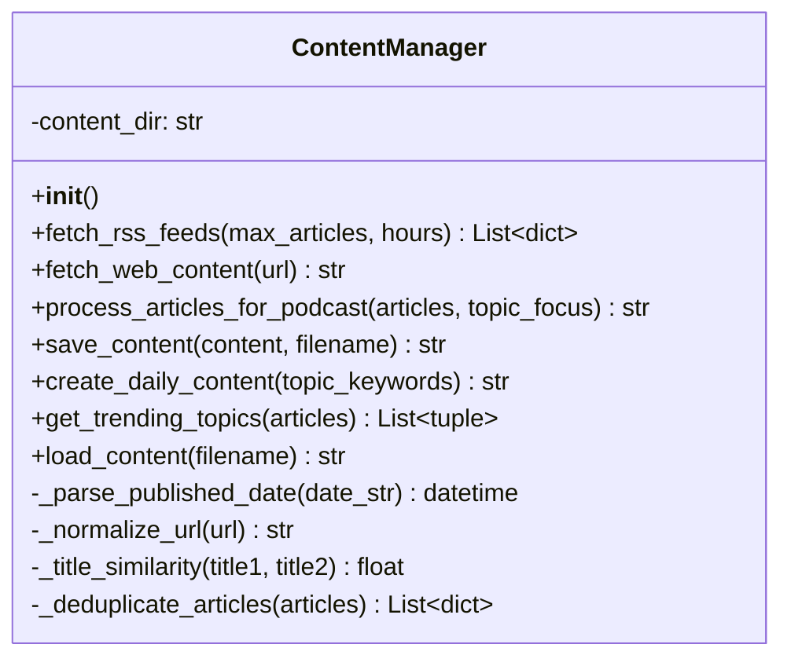
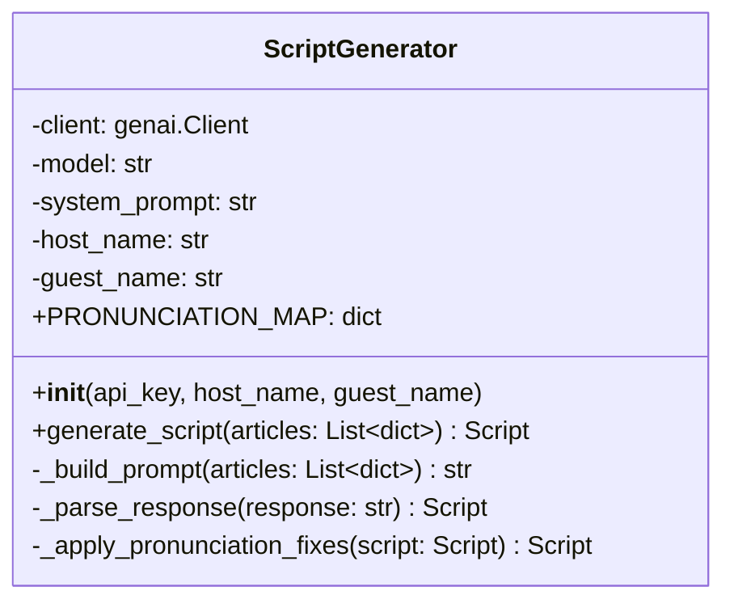
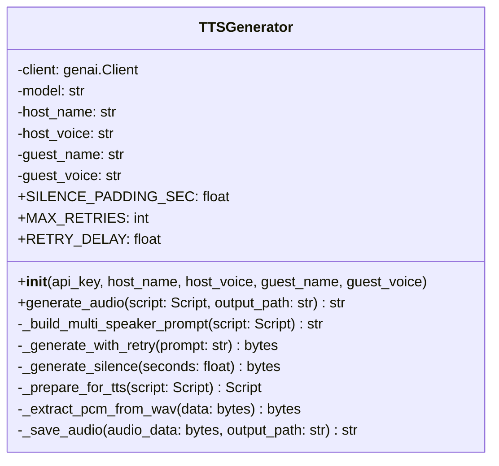
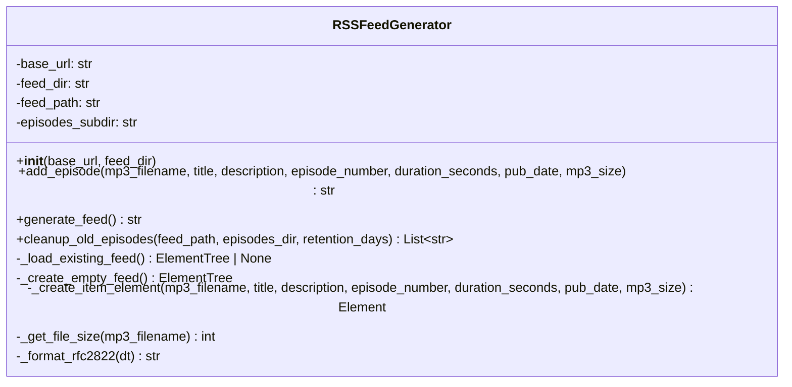
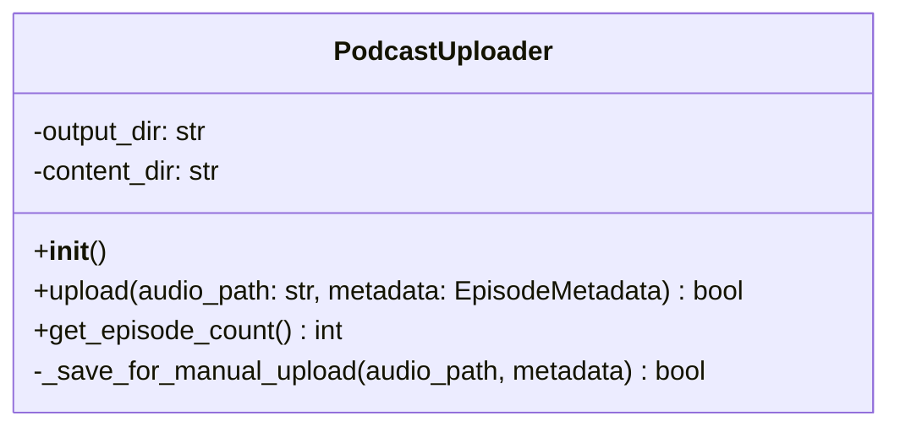
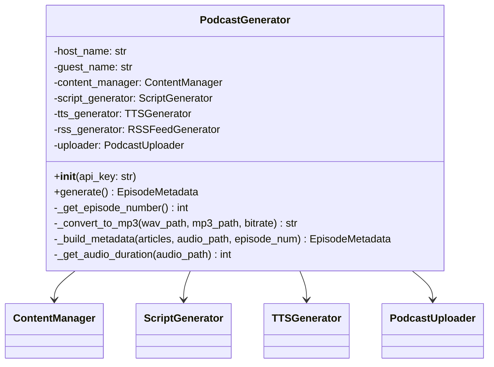

# LLD - Low-Level Design
## AI Auto Podcast 詳細設計書

**採用プラン: α（Gemini Flash + Gemini Flash TTS / 完全無料）**

---

## 1. クラス・モジュール詳細設計

---

### 1.1 ContentManager (`content_manager.py`) — 既存流用

**責務**: RSSフィードからのコンテンツ収集、テキスト処理

#### クラス図


#### メソッド詳細

| メソッド | 入力 | 出力 | 処理概要 |
|---------|------|------|---------|
| `fetch_rss_feeds` | max_articles: int, hours: int | List[dict] | config.RSS_FEEDSの各URLをfeedparserで解析。hours時間以内の記事をフィルタ。URL・タイトル重複排除 |
| `fetch_web_content` | url: str | str | BeautifulSoupでHTML本文抽出。MAX_CONTENT_LENGTH文字で切り詰め |
| `process_articles_for_podcast` | articles, topic_focus | str | キーワードフィルタ → 上位5件をテキスト整形 |
| `create_daily_content` | topic_keywords | str(filepath) | fetch → process → save の統合処理 |

#### データ構造: 記事オブジェクト
```python
article = {
    'title': str,       # 記事タイトル
    'summary': str,     # 記事要約
    'link': str,        # 記事URL
    'published': str,   # 公開日時文字列
    'source': str       # フィード名
}
```

---

### 1.2 ScriptGenerator (`script_generator.py`) — 新規作成

**責務**: Gemini Flash APIを使い、記事情報からポッドキャスト対話台本を生成

#### クラス図


#### メソッド詳細

| メソッド | 入力 | 出力 | 処理概要 |
|---------|------|------|---------|
| `__init__` | api_key, host_name, guest_name | - | genai.Client初期化。ホスト/ゲスト名でプロンプトテンプレート展開 |
| `generate_script` | articles: List[dict] | Script | 記事リストからプロンプト構築 → Gemini呼び出し → レスポンス解析 |
| `_build_prompt` | articles: List[dict] | str | 記事タイトル・要約を含むプロンプトテキスト構築 |
| `_parse_response` | response: str | Script | Geminiレスポンスを構造化されたScript型に変換 |

#### システムプロンプト（概要）
```
あなたはポッドキャストの台本ライターです。
以下のニュース記事をもとに、{host_name}（ホスト）と{guest_name}（ゲスト）の
2人による自然な日本語の対話形式でポッドキャスト台本を作成してください。

要件:
- 5〜8分程度の会話（合計1500〜2500文字）
- 各記事について分かりやすく解説
- ホスト（進行役）、ゲスト（解説役）
- 自然な相槌・質問・感想を含める
- 英語の固有名詞にはカタカナ読みを併記
- TTS読み上げに適した平易な表現
- JSON形式で出力: [{"speaker": "{host_name}", "text": "..."}, ...]
```

#### データ構造: Script
```python
@dataclass
class ScriptLine:
    speaker: str        # "A" or "B"
    text: str           # 発話テキスト

Script = List[ScriptLine]
```

#### Gemini API呼び出し仕様
```python
from google import genai
from google.genai import types

client = genai.Client(api_key=api_key)
response = client.models.generate_content(
    model="gemini-2.5-flash",
    config=types.GenerateContentConfig(
        system_instruction=system_prompt,
        response_mime_type="application/json",
    ),
    contents=prompt,
)
```

---

### 1.3 TTSGenerator (`tts_generator.py`) — 新規作成

**責務**: Gemini Flash TTS APIを使い、台本テキストから音声ファイルを生成

#### クラス図


#### メソッド詳細

| メソッド | 入力 | 出力 | 処理概要 |
|---------|------|------|---------|
| `__init__` | api_key, host_name, host_voice, guest_name, guest_voice | - | genai.Client初期化。曜日ローテーションの音声名設定 |
| `generate_audio` | script, output_path | str | 台本全体をMulti-Speaker TTS 1コールで音声化 → WAV保存 |
| `_build_multi_speaker_prompt` | script | str | Director's Notes + 話者名付きトランスクリプト構築 |
| `_call_tts_api` | prompt | bytes | Gemini TTS API呼び出し。SpeakerVoiceConfigで話者別音声指定 |
| `_save_audio` | audio_data, path | str | 音声データをWAVファイルに書き出し |

#### Gemini TTS API 呼び出し仕様（Multi-Speaker）
```python
from google import genai
from google.genai import types

client = genai.Client(api_key=api_key)
response = client.models.generate_content(
    model="gemini-2.5-flash-preview-tts",
    contents=multi_speaker_prompt,  # Director's Notes + トランスクリプト
    config=types.GenerateContentConfig(
        response_modalities=["AUDIO"],
        speech_config=types.SpeechConfig(
            multi_speaker_voice_config=types.MultiSpeakerVoiceConfig(
                speaker_voice_configs=[
                    types.SpeakerVoiceConfig(
                        speaker=host_name,
                        voice_config=types.VoiceConfig(
                            prebuilt_voice_id=host_voice
                        ),
                    ),
                    types.SpeakerVoiceConfig(
                        speaker=guest_name,
                        voice_config=types.VoiceConfig(
                            prebuilt_voice_id=guest_voice
                        ),
                    ),
                ]
            )
        ),
    ),
)
audio_data = response.candidates[0].content.parts[0].inline_data.data
```

#### 利用可能な音声（Gemini TTS）
```
Aoede, Charon, Fenrir, Kore, Puck,
Leda, Orus, Zephyr, ...
（※ 日本語対応の音声を要テスト・選定）
```

#### 音声仕様
```
TTS方式: Multi-Speaker 1コール（セグメント分割なし）
末尾パディング: 800ms の無音を挿入
出力フォーマット: WAV (PCM 24kHz 16bit mono)
後処理: pydub + ffmpeg で MP3 変換 (128kbps)
リトライ: 最大3回、30秒間隔
```

---

### 1.4 RSSFeedGenerator (`rss_feed_generator.py`)

**責務**: ポッドキャスト配信用 RSS 2.0 XML を生成・更新する

#### クラス図


#### メソッド詳細

| メソッド | 入力 | 出力 | 処理概要 |
|---------|------|------|------|
| `add_episode` | mp3_filename, title, description, episode_number, duration_seconds, pub_date, mp3_size | str | 既存feed.xmlを読み込み、新エピソードを先頭に追加。feed.xmlパスを返す |
| `generate_feed` | - | str | 空のフィードを新規作成（チャンネル情報のみ） |
| `_create_item_element` | mp3_filename, metadata | Element | RSS item 要素を構築（enclosure + メタデータ） |

#### RSS 2.0 + iTunes 拡張仕様
```xml
<?xml version="1.0" encoding="UTF-8"?>
<rss version="2.0"
  xmlns:itunes="http://www.itunes.com/dtds/podcast-1.0.dtd"
  xmlns:atom="http://www.w3.org/2005/Atom">
  <channel>
    <title>AI Auto Podcast</title>
    <link>https://necoha.github.io/auto-podcast</link>
    <language>ja</language>
    <itunes:author>Auto Podcast Generator</itunes:author>
    <itunes:category text="Technology"/>
    <atom:link href=".../feed.xml" rel="self" type="application/rss+xml"/>

    <item>
      <title>第N話 - AI Auto Podcast (YYYY-MM-DD)</title>
      <enclosure url=".../episodes/xxx.mp3" length="..." type="audio/mpeg"/>
      <guid isPermaLink="false">episode-N-YYYYMMDD</guid>
      <pubDate>Mon, 17 Feb 2026 00:00:00 +0900</pubDate>
      <itunes:duration>600</itunes:duration>
      <description>...</description>
    </item>
  </channel>
</rss>
```

---

### 1.5 PodcastUploader (`podcast_uploader.py`)

**責務**: メタデータJSON保存。GitHub Actions が gh-pages へのデプロイを担当。

#### クラス図


#### メソッド詳細

| メソッド | 入力 | 出力 | 処理概要 |
|---------|------|------|---------|
| `upload` | audio_path, metadata | bool | メタデータJSONをcontent/に保存 |
| `get_episode_count` | - | int | content/内のJSONファイル数を返す |
| `_save_for_manual_upload` | audio_path, metadata | bool | メタデータJSON出力（手動Spotifyアップロード用） |

#### データ構造: EpisodeMetadata
```python
@dataclass
class EpisodeMetadata:
    title: str              # エピソードタイトル
    description: str        # エピソード説明文
    episode_number: int     # エピソード番号
    published_date: str     # 配信日
    source_articles: List[dict]  # 元記事情報
    duration_seconds: int   # 音声の長さ（秒）
```

> **配信方式**: MP3 + feed.xml を gh-pages ブランチに push。
> GitHub Pages がホスティングし、Spotify / Apple Podcasts が
> RSS を定期取得して新エピソードを自動配信する。

---

### 1.6 PodcastGenerator (`podcast_generator.py`)

**責務**: 全体のオーケストレーション（収集→台本→音声→MP3変換→RSS更新→保存）

#### クラス図


#### メソッド詳細

| メソッド | 入力 | 出力 | 処理概要 |
|---------|------|------|---------|
| `__init__` | api_key: str | - | get_daily_speakers()で曜日別出演者を決定。5つのサブコンポーネントを初期化 |
| `generate` | - | EpisodeMetadata or None | メインフロー: 収集→台本→音声→アップロード |
| `_get_episode_number` | - | int | feed.xmlの既存item数+1。フォールバックとしてcontent/ JSONカウント |
| `_build_metadata` | articles, audio_path | EpisodeMetadata | メタデータ構築 |

#### generate() フロー（疑似コード）
```python
def generate(self) -> EpisodeMetadata | None:
    # 1. コンテンツ収集（24h以内 + 重複排除）
    articles = self.content_manager.fetch_rss_feeds(max_articles=5, hours=24)

    # 2. 台本生成（+ PRONUNCIATION_MAP発音補正）
    script = self.script_generator.generate_script(articles)

    # 3. TTS音声生成（Multi-Speaker 1コール）
    self.tts_generator.generate_audio(script, audio_path)  # → WAV

    # 3.5 WAV → MP3 変換 (pydub + ffmpeg, 128kbps)
    mp3_path = self._convert_to_mp3(audio_path, mp3_path)

    # 4. RSS 更新
    self.rss_generator.add_episode(mp3_filename, metadata)

    # 5. メタデータ保存
    self.uploader.upload(mp3_path, metadata)
    #   GitHub Actions が gh-pages に MP3 + feed.xml を push
```

---

### 1.7 Config (`config.py`)

**責務**: 全コンポーネントの設定値を一元管理

| 設定名 | 型 | 値 | 説明 |
|--------|---|-----|------|
| `GEMINI_API_KEY` | str | env | Gemini APIキー（台本 + TTS 共通） |
| `LLM_MODEL` | str | `gemini-2.5-flash` | 台本生成用モデル |
| `TTS_MODEL` | str | `gemini-2.5-flash-preview-tts` | TTS用モデル |
| `TTS_VOICE_A` | str | `Kore` | 話者A（ホスト）のデフォルト音声 |
| `TTS_VOICE_B` | str | `Charon` | 話者B（ゲスト）のデフォルト音声 |
| `DAILY_SPEAKERS` | dict | 7曜日分 | 曜日ローテーションテーブル（7ペア×14人） |
| `RSS_FEEDS` | List[str] | 10フィード | テクノロジー6 + 経済4 |
| `MAX_ARTICLES` | int | `5` | フィードあたりの最大取得数 |
| `PODCAST_BASE_URL` | str | `https://necoha.github.io/auto-podcast` | GitHub Pages URL |
| `PODCAST_TITLE` | str | `AI Auto Podcast` | ポッドキャスト名 |
| `PODCAST_AUTHOR` | str | `Auto Podcast Generator` | 著者名 |
| `PODCAST_LANGUAGE` | str | `ja` | 言語コード |
| `PODCAST_OWNER_EMAIL` | str | env | RSS/Spotify登録用メールアドレス |
| `PODCAST_DESCRIPTION` | str | (default) | ポッドキャスト説明文 |
| `PODCAST_IMAGE_URL` | str | (default) | カバー画像URL |
| `MAX_CONTENT_LENGTH` | int | `10000` | コンテンツ文字数制限 |
| `AUDIO_OUTPUT_DIR` | str | `./audio_files` | 音声ファイル出力先 |
| `CONTENT_DIR` | str | `./content` | メタデータ保存先 |
| `RSS_FEED_FILENAME` | str | `feed.xml` | RSSフィードファイル名 |
| `EPISODES_DIR` | str | `episodes` | gh-pages上のMP3格納ディレクトリ |
| `EPISODE_RETENTION_DAYS` | int | `60` | エピソード保持日数 |

#### RSSフィード一覧（12フィード）
| カテゴリ | ソース | URL |
|---------|--------|-----|
| テクノロジー | ITmedia NEWS | `rss.itmedia.co.jp/rss/2.0/news_bursts.xml` |
| テクノロジー | Publickey | `www.publickey1.jp/atom.xml` |
| テクノロジー | GIGAZINE | `gigazine.net/news/rss_2.0/` |
| テクノロジー | CNET Japan | `japan.cnet.com/rss/index.rdf` |
| テクノロジー | Impress Watch | `www.watch.impress.co.jp/data/rss/1.0/ipw/feed.rdf` |
| テクノロジー | ASCII.jp | `ascii.jp/rss.xml` |
| 経済 | 日経ビジネス | `business.nikkei.com/rss/sns/nb.rdf` |
| 経済 | ロイター日本語 | `assets.wor.jp/rss/rdf/reuters/top.rdf` |
| 経済 | Yahoo経済 | `news.yahoo.co.jp/rss/topics/business.xml` |
| 経済 | 朝日新聞経済 | `www.asahi.com/rss/asahi/business.rdf` |

---

## 2. ファイル命名規則

| ファイル種別 | 命名パターン | 例 |
|------------|-------------|-----|
| 音声ファイル | `episode_{N}_{YYYYMMDD}.mp3` | `episode_42_20260216.mp3` |
| メタデータ | `episode_{N}_{YYYYMMDD}.json` | `episode_42_20260216.json` |

---

## 3. エラー処理パターン

### 3.1 例外処理の基本方針
- 各モジュールは自身のエラーをキャッチしログ出力
- `logging` モジュールを使用（`print()` から移行）
- メソッドは成功時に結果、失敗時に例外を送出
- オーケストレーター（PodcastGenerator）がフォールバックを判断

### 3.2 フォールバック一覧

| シナリオ | フォールバック |
|---------|--------------|
| RSS取得失敗（一部） | 取得できたフィードで続行 |
| RSS取得失敗（全部） | 処理中止。次回実行に委ねる |
| 台本生成失敗 | 記事テキストを箇条書きにして読み上げテキスト化 |
| Gemini TTS失敗 | リトライ（最大3回、30秒間隔）→ 失敗時は生成中止 |
| アップロード失敗 | ローカル保存。次回実行で自然リトライ |
| レート制限到達 | ログ出力してスキップ。次回実行で再試行 |

---

## 4. 外部APIとのインタラクション

### 4.1 RSSフィード取得（既存）
```
プロトコル: HTTP GET
ライブラリ: feedparser
タイムアウト: feedparserデフォルト
レスポンス: XML (RSS/Atom)
エラー処理: フィード単位で例外キャッチ
```

### 4.2 Gemini Flash API（台本生成）
```
プロトコル: HTTPS
ライブラリ: google-genai
エンドポイント: generativelanguage.googleapis.com
認証: APIキー
モデル: gemini-2.5-flash
入力: テキスト（記事情報 + システムプロンプト）
出力: JSON（対話台本）
レート制限（無料枠）: 15 RPM, 100万トークン/日
```

### 4.3 Gemini Flash TTS API（Multi-Speaker 音声生成）
```
プロトコル: HTTPS
ライブラリ: google-genai
エンドポイント: generativelanguage.googleapis.com
認証: APIキー（台本生成と共通）
モデル: gemini-2.5-flash-preview-tts
入力: Director's Notes + MultiSpeaker トランスクリプト
出力: 音声バイナリ（WAV PCM 24kHz 16bit mono）
レスポンスモダリティ: AUDIO
APIコール数: 1回/エピソード
レート制限 (Free Tier): RPM=3, RPD=10
話者: 曜日ローテーション（7ペア×14人）
```

---

## 5. GitHub Actions デプロイ仕様

### 5.1 ワークフローファイル
```yaml
# .github/workflows/generate-podcast.yml
name: Generate Podcast
on:
  schedule:
    - cron: "0 21 * * *"    # 毎日 06:00 JST = 21:00 UTC
  workflow_dispatch:         # 手動実行対応

jobs:
  generate:
    runs-on: ubuntu-latest
    timeout-minutes: 15
    steps:
      - uses: actions/checkout@v4
      - uses: astral-sh/setup-uv@v5
      - run: uv python install && uv sync
      - run: sudo apt-get install -yqq ffmpeg
      # 既存 feed.xml を復元（クリーン環境でもエピソード蓄積するため）
      - run: |
          mkdir -p audio_files
          curl -sSf "$PODCAST_BASE_URL/feed.xml" -o audio_files/feed.xml || true
      - run: uv run python podcast_generator.py
        env:
          GEMINI_API_KEY: ${{ secrets.GEMINI_API_KEY }}
          PODCAST_OWNER_EMAIL: ${{ secrets.PODCAST_OWNER_EMAIL }}
      # gh-pages worktree で MP3 + feed.xml をデプロイ
      # cleanup_episodes.py で60日超のエピソードを削除
      # Artifacts に90日間バックアップ保存
```

```
gh-pages/
├── feed.xml              # ポッドキャスト RSS
├── episodes/
│   ├── episode_1_20260217.mp3
│   ├── episode_2_20260218.mp3
│   └── ...
└── index.html            # 簡易ランディングページ（任意）
```

公開URL: `https://necoha.github.io/auto-podcast/`
RSS URL: `https://necoha.github.io/auto-podcast/feed.xml`

### 5.3 セットアップ手順
1. GitHub Secrets に `GEMINI_API_KEY` と `PODCAST_OWNER_EMAIL` を設定
2. `gh-pages` ブランチを作成
3. GitHub Pages を `gh-pages` ブランチから配信に設定
4. Spotify for Creators に RSS URL を登録
5. Apple Podcasts Connect に RSS URL を登録
6. Actions タブで手動実行 or cron 待ち

---

## 6. 依存パッケージ一覧

**パッケージ管理: uv** (`pyproject.toml` + `uv.lock`)

| パッケージ | バージョン | 用途 |
|-----------|----------|------|
| google-genai | >=1.0.0 | Gemini API（台本生成 + Multi-Speaker TTS） |
| feedparser | >=6.0.10 | RSS/Atomフィード解析 |
| beautifulsoup4 | >=4.12.2 | HTML本文抽出 |
| requests | >=2.31.0 | HTTP通信 |
| python-dotenv | >=1.0.0 | ローカル環境変数読み込み |
| pydub | >=0.25.1 | WAV→MP3変換（ffmpeg経由） |

### システム依存
| ツール | 用途 |
|-------|------|
| ffmpeg | pydubのバックエンド（MP3エンコード） |
| uv | パッケージ管理・仮想環境 |
