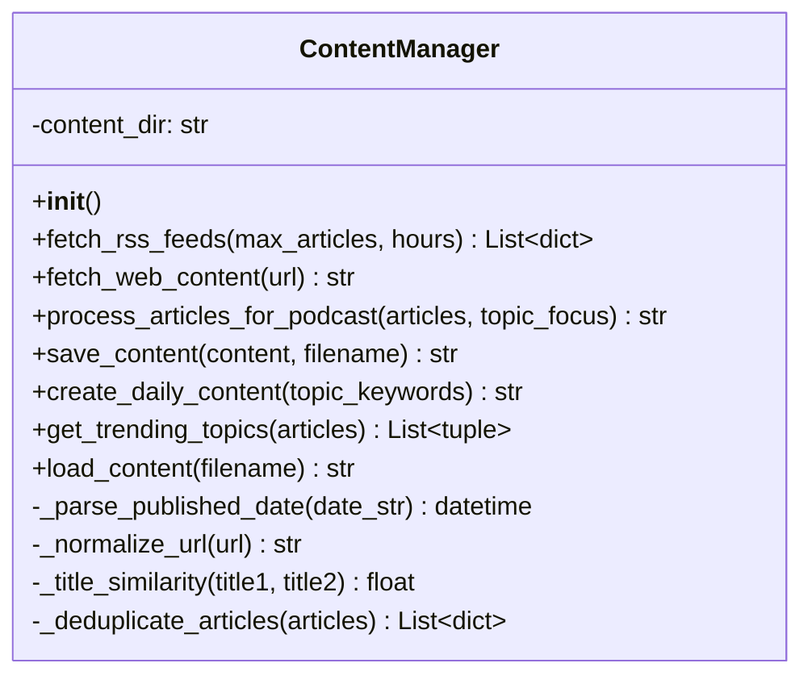
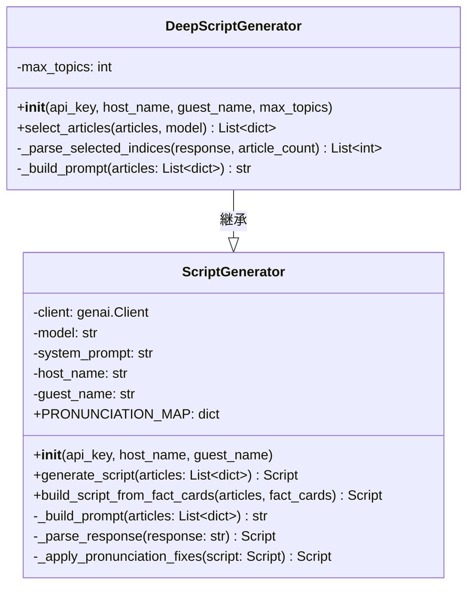
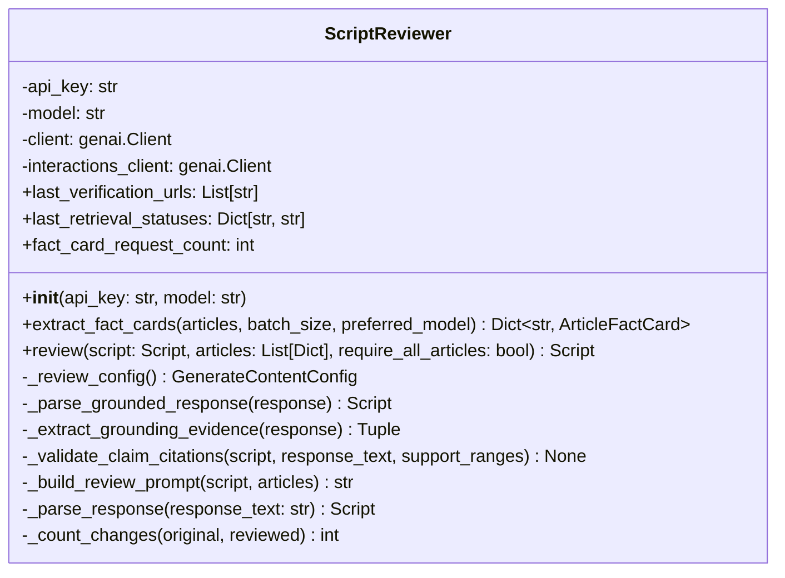
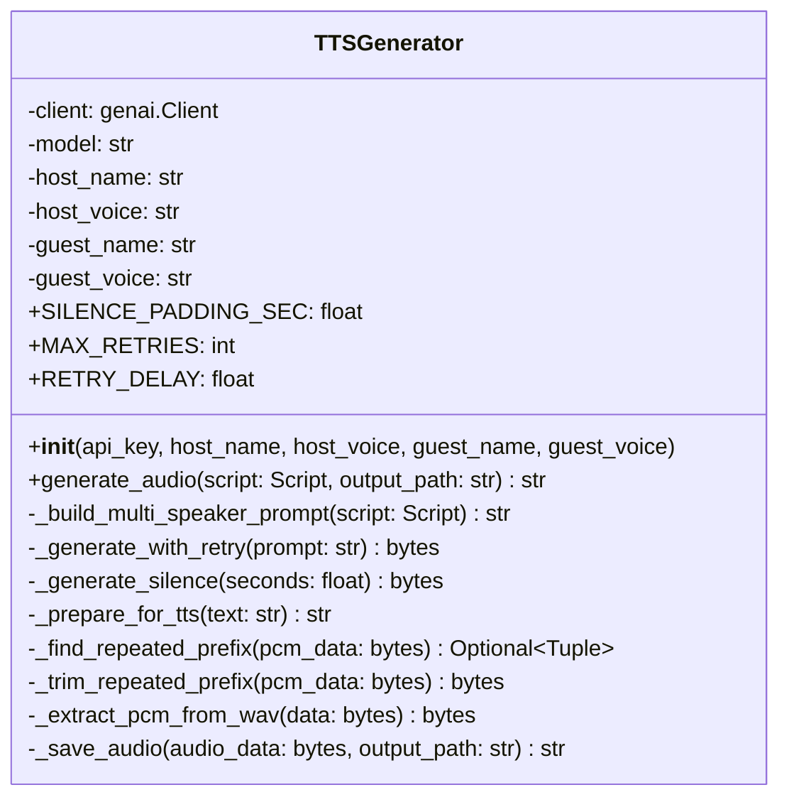
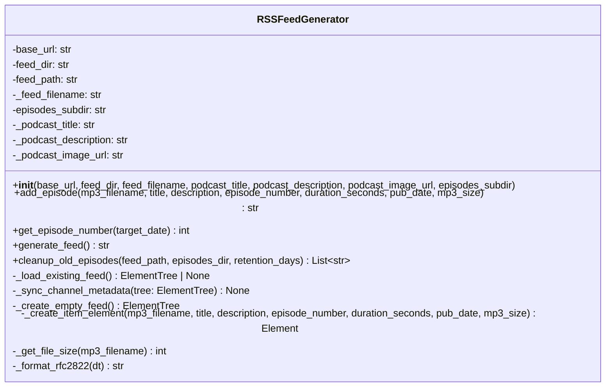
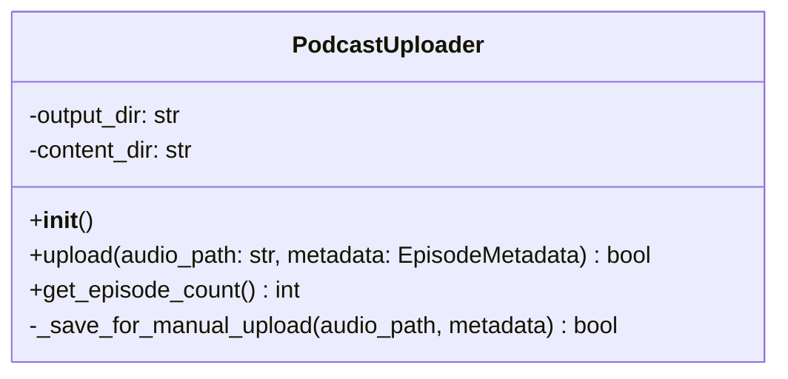
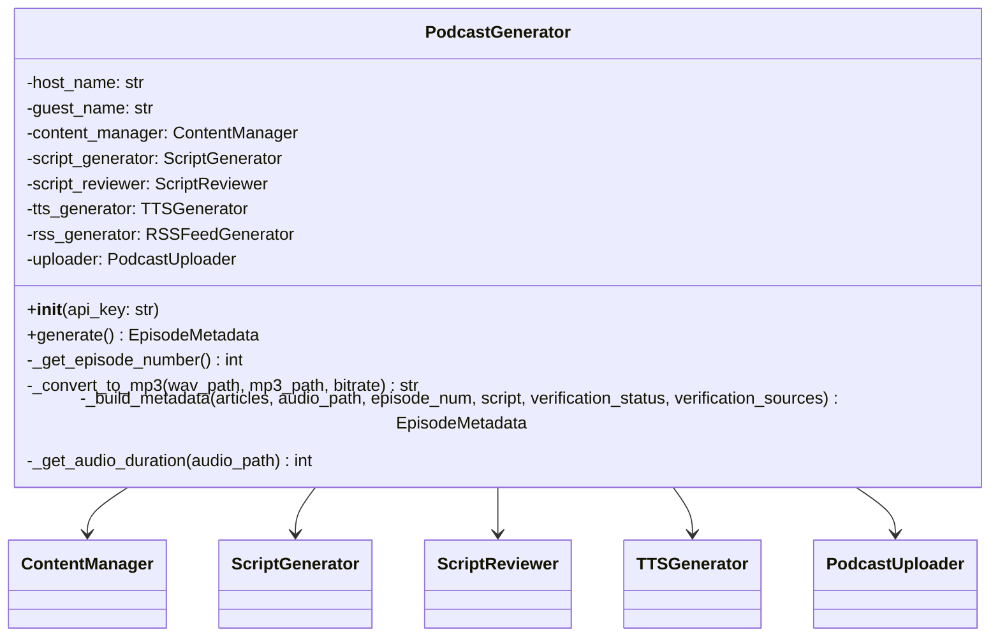
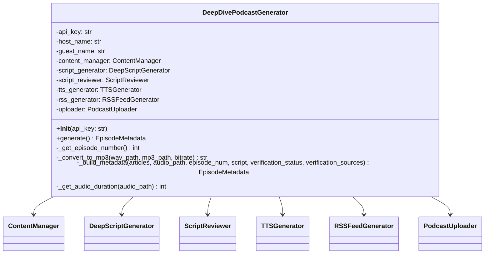

# LLD - Low-Level Design
## AI Auto Podcast 詳細設計書

**採用プラン: α（Gemini 3.8 Flash + Gemini 3.1 Flash TTS / 完全無料）**

---

## 1. クラス・モジュール詳細設計

---

### 1.1 ContentManager (`content_manager.py`) — 既存流用

**責務**: RSSフィードからのコンテンツ収集、テキスト処理

#### クラス図

```mermaid
classDiagram
    class ContentManager {
        -content_dir: str
        +__init__()
        +fetch_rss_feeds(max_articles, hours) List~dict~
        +fetch_web_content(url) str
        +process_articles_for_podcast(articles, topic_focus) str
        +save_content(content, filename) str
        +create_daily_content(topic_keywords) str
        +get_trending_topics(articles) List~tuple~
        +load_content(filename) str
        -_parse_published_date(date_str) datetime
        -_normalize_url(url) str
        -_title_similarity(title1, title2) float
        -_deduplicate_articles(articles) List~dict~
    }
```

#### メソッド詳細

| メソッド | 入力 | 出力 | 処理概要 |
|---------|------|------|---------|
| `fetch_rss_feeds` | max_articles: int, hours: int | List[dict] | config.RSS_FEEDSの各URLをfeedparserで解析。hours時間以内の記事をフィルタ。URL・タイトル重複排除 |
| `fetch_web_content` | url: str | str | BeautifulSoupでHTML本文抽出。MAX_CONTENT_LENGTH文字で切り詰め |
| `process_articles_for_podcast` | articles, topic_focus | str | キーワードフィルタ → 上位5件をテキスト整形 |
| `create_daily_content` | topic_keywords | str(filepath) | fetch → process → save の統合処理 |

#### データ構造: 記事オブジェクト
```python
article = {
    'title': str,       # 記事タイトル
    'summary': str,     # 記事要約
    'link': str,        # 記事URL
    'published': str,   # 公開日時文字列
    'source': str       # フィード名
}
```

---

### 1.2 ScriptGenerator (`script_generator.py`) — 新規作成

**責務**: 速報版は引用検証済み事実カードと見出しから対話台本を決定論的に構築する。継承先の深掘り版ではGemini Flash APIによる台本生成も提供する

#### クラス図

```mermaid
classDiagram
    class ScriptGenerator {
        -client: genai.Client
        -model: str
        -system_prompt: str
        -host_name: str
        -guest_name: str
        +PRONUNCIATION_MAP: dict
        +__init__(api_key, host_name, guest_name)
        +generate_script(articles: List~dict~) Script
        +build_script_from_fact_cards(articles, fact_cards) Script
        -_build_prompt(articles: List~dict~) str
        -_parse_response(response: str) Script
        -_apply_pronunciation_fixes(script: Script) Script
    }

    class DeepScriptGenerator {
        -max_topics: int
        +__init__(api_key, host_name, guest_name, max_topics)
        +select_articles(articles, model) List~dict~
        -_parse_selected_indices(response, article_count) List~int~
        -_build_prompt(articles: List~dict~) str
    }

    DeepScriptGenerator --|> ScriptGenerator : 継承
```

#### メソッド詳細

| メソッド | 入力 | 出力 | 処理概要 |
|---------|------|------|---------|
| `__init__` | api_key, host_name, guest_name | - | genai.Client初期化。ホスト/ゲスト名でプロンプトテンプレート展開 |
| `generate_script` | articles: List[dict] | Script | 記事リストからプロンプト構築 → Gemini呼び出し → レスポンス解析 |
| `build_script_from_fact_cards` | articles, fact_cards | Script | 最大20件すべてを維持し、カードあり記事は根拠付き解説、カードなし記事は見出しだけのA/B台本へ構築 |
| `_build_prompt` | articles: List[dict] | str | 記事タイトル・ソース名・URLのみを含むプロンプトテキスト構築（著作権対策によりsummary除去） |
| `_parse_response` | response: str | Script | Geminiレスポンスを構造化されたScript型に変換 |

#### システムプロンプト（概要）
```
あなたはポッドキャストの台本ライターです。
以下のニュース記事をもとに、{host_name}（ホスト）と{guest_name}（ゲスト）の
2人による自然な日本語の対話形式でポッドキャスト台本を作成してください。

要件:
- 5〜8分程度の会話（合計1500〜2500文字）
- 各記事について分かりやすく解説
- ホスト（進行役）、ゲスト（解説役）
- 自然な相槌・質問・感想を含める
- 英語の固有名詞にはカタカナ読みを併記
- TTS読み上げに適した平易な表現
- 著作権に関する注意: 元記事の文章をそのまま使わず独自に解説
- JSON形式で出力: [{"speaker": "{host_name}", "text": "..."}, ...]
```

#### データ構造: Script
```python
@dataclass
class ScriptLine:
    speaker: str        # "A" or "B"
    text: str           # 発話テキスト

Script = List[ScriptLine]
```

#### Gemini API呼び出し仕様
```python
from google import genai
from google.genai import types

client = genai.Client(api_key=api_key)
response = client.models.generate_content(
    model="gemini-3.8-flash",
    config=types.GenerateContentConfig(
        system_instruction=system_prompt,
        response_mime_type="application/json",
    ),
    contents=prompt,
)
```

---

### 1.2-D DeepScriptGenerator (`deep_script_generator.py`) — 新規作成

**責務**: ScriptGenerator を継承し、タイトル・媒体名による先行選定と6次元分析の深掘り台本生成を分離する

#### 継承関係
- `ScriptGenerator` を継承
- `PRONUNCIATION_MAP`（306エントリ）、`_parse_response`、`_apply_pronunciation_fixes` を親から再利用
- `system_prompt` と `_build_prompt` をオーバーライド

#### メソッド詳細

| メソッド | 入力 | 出力 | 処理概要 |
|---------|------|------|---------|
| `__init__` | api_key, host_name, guest_name, max_topics | - | 親クラス初期化後、`DEEP_SYSTEM_PROMPT_TEMPLATE` で system_prompt を上書き |
| `select_articles` | articles, model | List[dict] | 全候補のタイトル・媒体名だけを提示し、有効な記事番号を最大3件選定（URL・summaryは渡さない） |
| `_parse_selected_indices` | response, article_count | List[int] | 選定JSONを検査し、重複・範囲外・件数不正を拒否 |
| `_build_prompt` | articles: List[dict] | str | 選定済み最大3件だけで深掘り台本の生成を指示（summaryは渡さない） |

#### DEEP_SYSTEM_PROMPT_TEMPLATE（概要）
```
あなたはポッドキャストの台本ライターです。
以下の選定済みニュース記事をすべて扱い、
深い洞察と分析を含む対話形式のポッドキャスト台本を作成してください。

記事選定の基準:
- 社会的インパクトが大きいもの
- 技術的に革新的・興味深いもの
- 複数ソース（国内外）で報じられている注目度の高いもの
- リスナーにとって実用的な知見が得られるもの

各トピックで必ず含める6つの分析次元:
1. 背景・経緯
2. 技術的な解説
3. 業界・社会への影響
4. 異なる視点（賛否両論）
5. 日本と海外の比較
6. 今後の展望

要件:
- 10〜15分の会話（合計3000〜5000文字）
- 1トピックあたり5〜8往復の深い議論
- 冒頭で名乗り + 「AIによって自動生成」+ 「深掘りして解説」と趣旨説明
- 発音・表記ルール: 速報版と同一（カタカナ読み併記、ふりがな等）
- 出力形式: JSON配列 [{"speaker": "A", "text": "..."}, ...]
```

#### LLMモデル切替 + 見出し限定フォールバック
深掘り記事の先行選定でも`gemini-3.8-flash`、`gemini-3.7-flash`、`gemini-3.6-flash`を順に使用し、一時障害または不正な選定JSONでは次のモデルへ切り替える。
台本生成で503・500・接続切断・タイムアウトが発生した場合、`gemini-3.8-flash`、`gemini-3.7-flash`、`gemini-3.6-flash`を各1回ずつ試す。
1リクエストは3分でタイムアウトし、SDK内部では再試行しない。429や認証エラーではモデルを切り替えない。
全候補の失敗時は、速報版は最大5件、深掘り版は最大3件の記事タイトルだけを読む台本へ切り替える。

---

### 1.2-R ScriptReviewer (`script_reviewer.py`) — 新規作成

**責務**: 速報版ではURL Contextを小分けに実行して引用付き事実カードを抽出する。深掘り版では生成済み台本を選定済み元記事と照合する。

#### クラス図

```mermaid
classDiagram
    class ScriptReviewer {
        -api_key: str
        -model: str
        -client: genai.Client
        -interactions_client: genai.Client
        +last_verification_urls: List[str]
        +last_retrieval_statuses: Dict[str, str]
        +fact_card_request_count: int
        +__init__(api_key: str, model: str)
        +extract_fact_cards(articles, batch_size, preferred_model) Dict~str, ArticleFactCard~
        +review(script: Script, articles: List[Dict], require_all_articles: bool) Script
        -_review_config() GenerateContentConfig
        -_parse_grounded_response(response) Script
        -_extract_grounding_evidence(response) Tuple
        -_validate_claim_citations(script, response_text, support_ranges) None
        -_build_review_prompt(script, articles) str
        -_parse_response(response_text: str) Script
        -_count_changes(original, reviewed) int
    }
```

#### レビュー6項目

| # | チェック項目 | 修正内容 |
|---|------------|---------|
| 1 | フォーマット不正 | speaker が "A"/"B" 以外、text が空の行を修正 |
| 2 | 不自然な会話 | 同一フレーズの繰り返し、唐突な話題転換を修正 |
| 3 | 記事カバレッジ | 提供記事への言及漏れを追加（重複記事のまとめはOK） |
| 4 | TTS不適切表現 | URL、コード片、括弧だらけの文を自然な日本語に変換 |
| 5 | 長さの偏り | 特定トピックだけ極端に長い/短い場合にバランス調整 |
| 6 | 事実整合性 | URL Contextで数値・年月・制度・主体と指標を確認。引用のない高リスク主張を拒否 |

#### メソッド詳細

| メソッド | 入力 | 出力 | 処理概要 |
|---------|------|------|---------|
| `__init__` | api_key, model | - | Gemini Client初期化 |
| `review` | script: Script, articles: List[Dict], require_all_articles | Script | URL Context付きレビュー。証跡不足時は `FactVerificationError` |
| `extract_fact_cards` | articles, batch_size, preferred_model | Dict[str, ArticleFactCard] | Interactions APIで最大5 URLずつ処理。部分成功を保持し、URL別状態・API回数・処理時間を記録 |
| `_build_review_prompt` | script, articles | str | 記事タイトル・媒体・URL＋台本JSONをプロンプトに構成 |
| `_extract_url_context_evidence` | response | tuple | 取得成功した元記事URLと引用文字範囲を抽出 |
| `_validate_claim_citations` | script, response_text, support_ranges | None | 事実行に引用を要求し、数値・年月・制度語は語単位で引用範囲を検証 |
| `_parse_response` | response_text | Script | JSON配列 → Script型に変換 |
| `_count_changes` | original, reviewed | int | 差分行数をカウント（ログ用） |

#### エラーハンドリング

- 429/5xxなどの一時障害: 30秒後に1回リトライ
- 元記事取得・引用不足: 即時に1回再試行
- APIキー不正などの恒久エラー: 再試行しない
- 最終失敗: `FactVerificationError`を送出し、オーケストレーターが記事タイトル限定台本へ切り替える

#### API利用

- 速報版: Interactions APIで最大20件を5 URLずつ、通常最大4リクエスト。`url_context_result`で取得状態、`url_citation`でURL別引用範囲を検証し、バッチ障害時のみ次のStableモデルへ切替
- 深掘り版: `generateContent` APIで選定済み最大3 URLを1リクエスト（証跡不足時は最大1回モデル切替）
- URL Context自体は無料。取得内容はGeminiの入力トークンに算入される

---

### 1.3 TTSGenerator (`tts_generator.py`) — 新規作成

**責務**: Gemini 3.1 Flash TTS Interactions APIを使い、台本テキストから音声ファイルを生成

#### クラス図

```mermaid
classDiagram
    class TTSGenerator {
        -client: genai.Client
        -model: str
        -host_name: str
        -host_voice: str
        -guest_name: str
        -guest_voice: str
        +SILENCE_PADDING_SEC: float
        +MAX_RETRIES: int
        +RETRY_DELAY: float
        +__init__(api_key, host_name, host_voice, guest_name, guest_voice)
        +generate_audio(script: Script, output_path: str) str
        -_build_multi_speaker_prompt(script: Script) str
        -_generate_with_retry(prompt: str) bytes
        -_generate_silence(seconds: float) bytes
        -_prepare_for_tts(text: str) str
        -_find_repeated_prefix(pcm_data: bytes) Optional~Tuple~
        -_trim_repeated_prefix(pcm_data: bytes) bytes
        -_extract_pcm_from_wav(data: bytes) bytes
        -_save_audio(audio_data: bytes, output_path: str) str
    }
```

#### メソッド詳細

| メソッド | 入力 | 出力 | 処理概要 |
|---------|------|------|---------|
| `__init__` | api_key, host_name, host_voice, guest_name, guest_voice | - | genai.Client初期化。曜日ローテーションの音声名設定 |
| `generate_audio` | script, output_path | str | 台本を20行単位でMulti-Speaker TTS音声化し、結合してWAV保存 |
| `_build_multi_speaker_prompt` | script | str | Director's Notes + 話者名付きトランスクリプト構築 |
| `_call_tts_api` | prompt | bytes | Gemini TTS API呼び出し。SpeakerVoiceConfigで話者別音声指定 |
| `_prepare_for_tts` | text | str | 承認済みの読みアノテーションを読みへ変換し、単独の「国」など文脈依存語を補正 |
| `_find_repeated_prefix` | pcm_data | Optional[Tuple] | 先頭12秒の特徴量・波形が後続に再出現する位置を検出 |
| `_trim_repeated_prefix` | pcm_data | bytes | TTSが先頭から読み直した場合に未完了の先頭部分を除去 |
| `_save_audio` | audio_data, path | str | 音声データをWAVファイルに書き出し |

#### Gemini TTS API 呼び出し仕様（Multi-Speaker）
```python
from google import genai
from google.genai import types

client = genai.Client(
    api_key=api_key,
    http_options=types.HttpOptions(
        timeout=300_000,
        # google-genai 2.25.0では-1がInteractions内部再試行なしに対応
        retry_options=types.HttpRetryOptions(attempts=-1),
    ),
)
response = client.interactions.create(
    model="gemini-3.1-flash-tts-preview",
    input=multi_speaker_prompt,
    response_format={"type": "audio"},
    generation_config={
        "speech_config": [
            {"speaker": host_name, "voice": host_voice},
            {"speaker": guest_name, "voice": guest_voice},
        ],
    },
)
audio_data = base64.b64decode(response.output_audio.data)
```

#### 利用可能な音声（Gemini TTS）
```
Aoede, Charon, Fenrir, Kore, Puck,
Leda, Orus, Zephyr, ...
（※ 日本語対応の音声を要テスト・選定）
```

#### 音声仕様
```
TTS方式: Multi-Speaker（20行単位でチャンク分割）
末尾パディング: 2000ms の無音を挿入（SILENCE_PADDING_SEC=2.0）
出力フォーマット: WAV (PCM 24kHz 16bit mono)
後処理: pydub + ffmpeg で MP3 変換 (128kbps)
リトライ: チャンクごとに最大4試行、30秒/60秒/120秒の指数バックオフ
HTTP制御: 1リクエスト5分でタイムアウト、SDK内部の暗黙リトライは無効
リクエスト予算: 1番組あたり最大5回
反復対策: 台本を一度だけ読む指示 + PCM先頭再出現の検出・除去（API再呼び出しなし）
話者: 速報版・深掘り版で同じ曜日ペアを使用
```

---

### 1.4 RSSFeedGenerator (`rss_feed_generator.py`)

**責務**: ポッドキャスト配信用 RSS 2.0 XML を生成・更新する。速報版・深掘り版の両方に対応（パラメータ化）。

#### クラス図

```mermaid
classDiagram
    class RSSFeedGenerator {
        -base_url: str
        -feed_dir: str
        -feed_path: str
        -_feed_filename: str
        -episodes_subdir: str
        -_podcast_title: str
        -_podcast_description: str
        -_podcast_image_url: str
        +__init__(base_url, feed_dir, feed_filename, podcast_title, podcast_description, podcast_image_url, episodes_subdir)
        +add_episode(mp3_filename, title, description, episode_number, duration_seconds, pub_date, mp3_size) str
        +get_episode_number(target_date) int
        +generate_feed() str
        +cleanup_old_episodes(feed_path, episodes_dir, retention_days) List~str~
        -_load_existing_feed() ElementTree | None
        -_sync_channel_metadata(tree: ElementTree) None
        -_create_empty_feed() ElementTree
        -_create_item_element(mp3_filename, title, description, episode_number, duration_seconds, pub_date, mp3_size) Element
        -_get_file_size(mp3_filename) int
        -_format_rfc2822(dt) str
    }
```

#### コンストラクタ パラメータ

| パラメータ | デフォルト | 速報版の値 | 深掘り版の値 |
|-----------|----------|-----------|------------|
| `feed_filename` | `config.RSS_FEED_FILENAME` | `feed.xml` | `feed_deep.xml` |
| `podcast_title` | `config.PODCAST_TITLE` | `テック速報 AI ニュースラジオ` | `テック深掘り AI 解説ラジオ` |
| `podcast_description` | `config.PODCAST_DESCRIPTION` | （速報版説明文） | （深掘り版説明文） |
| `podcast_image_url` | `config.PODCAST_IMAGE_URL` | `.../cover.jpg` | `.../cover_deep.jpg` |
| `episodes_subdir` | `config.EPISODES_DIR` | `episodes` | `episodes_deep` |

#### メソッド詳細

| メソッド | 入力 | 出力 | 処理概要 |
|---------|------|------|------|
| `add_episode` | mp3_filename, title, description, episode_number, duration_seconds, pub_date, mp3_size | str | 既存feed.xmlを読み込み → 同日の既存itemを置換 → 新エピソードを先頭に追加。feed.xmlパスを返す |
| `get_episode_number` | target_date | int | 対象日の既存回番号があれば再利用。なければ既存最大番号+1 |
| `generate_feed` | - | str | 空のフィードを新規作成（チャンネル情報のみ） |
| `_sync_channel_metadata` | tree: ElementTree | None | 既存フィードのチャンネルメタデータ（title, description, itunes:summary, itunes:image）を現在のconfig値に同期。config変更時に自動反映を保証する |
| `_create_item_element` | mp3_filename, metadata | Element | RSS item 要素を構築（enclosure + メタデータ） |

#### RSS 2.0 + iTunes 拡張仕様
```xml
<?xml version="1.0" encoding="UTF-8"?>
<rss version="2.0"
  xmlns:itunes="http://www.itunes.com/dtds/podcast-1.0.dtd"
  xmlns:atom="http://www.w3.org/2005/Atom">
  <channel>
    <title>テック速報 AI ニュースラジオ</title>
    <link>https://necoha.github.io/auto-podcast</link>
    <language>ja</language>
    <itunes:author>Auto Podcast Generator</itunes:author>
    <itunes:category text="Technology"/>
    <atom:link href=".../feed.xml" rel="self" type="application/rss+xml"/>

    <item>
      <title>第N話 - テック速報 AI ニュースラジオ (YYYY-MM-DD)</title>
      <enclosure url=".../episodes/xxx.mp3" length="..." type="audio/mpeg"/>
      <guid isPermaLink="false">episode-N-YYYYMMDD</guid>
      <pubDate>Mon, 17 Feb 2026 00:00:00 +0900</pubDate>
      <itunes:duration>600</itunes:duration>
      <description>...</description>
    </item>
  </channel>
</rss>
```

---

### 1.5 PodcastUploader (`podcast_uploader.py`)

**責務**: メタデータJSON保存。GitHub Actions が gh-pages へのデプロイを担当。

#### クラス図

```mermaid
classDiagram
    class PodcastUploader {
        -output_dir: str
        -content_dir: str
        +__init__()
        +upload(audio_path: str, metadata: EpisodeMetadata) bool
        +get_episode_count() int
        -_save_for_manual_upload(audio_path, metadata) bool
    }
```

#### メソッド詳細

| メソッド | 入力 | 出力 | 処理概要 |
|---------|------|------|---------|
| `upload` | audio_path, metadata | bool | メタデータJSONをcontent/に保存 |
| `get_episode_count` | - | int | content/内のJSONファイル数を返す |
| `_save_for_manual_upload` | audio_path, metadata | bool | メタデータJSON出力（手動Spotifyアップロード用） |

#### データ構造: EpisodeMetadata
```python
@dataclass
class EpisodeMetadata:
    title: str              # エピソードタイトル
    description: str        # エピソード説明文
    episode_number: int     # エピソード番号
    published_date: str     # 配信日
    source_articles: List[dict]  # 元記事情報
    duration_seconds: int   # 音声の長さ（秒）
    verification_status: str  # grounded / partially_grounded / title_only_fallback / not_applicable
    verification_sources: List[str]  # URL Contextで取得成功した元記事URL
    script_lines: List[dict]  # TTSへ渡した最終台本（事後監査用）
```

> **配信方式**: MP3 + feed.xml を gh-pages ブランチに push。
> GitHub Pages がホスティングし、Spotify / Apple Podcasts が
> RSS を定期取得して新エピソードを自動配信する。

---

### 1.6 PodcastGenerator (`podcast_generator.py`)

**責務**: 全体のオーケストレーション（収集→台本→音声→MP3変換→RSS更新→保存）

#### クラス図

```mermaid
classDiagram
    class PodcastGenerator {
        -host_name: str
        -guest_name: str
        -content_manager: ContentManager
        -script_generator: ScriptGenerator
        -script_reviewer: ScriptReviewer
        -tts_generator: TTSGenerator
        -rss_generator: RSSFeedGenerator
        -uploader: PodcastUploader
        +__init__(api_key: str)
        +generate() EpisodeMetadata
        -_get_episode_number() int
        -_convert_to_mp3(wav_path, mp3_path, bitrate) str
        -_build_metadata(articles, audio_path, episode_num, script, verification_status, verification_sources) EpisodeMetadata
        -_get_audio_duration(audio_path) int
    }

    PodcastGenerator --> ContentManager
    PodcastGenerator --> ScriptGenerator
    PodcastGenerator --> ScriptReviewer
    PodcastGenerator --> TTSGenerator
    PodcastGenerator --> PodcastUploader
```

#### メソッド詳細

| メソッド | 入力 | 出力 | 処理概要 |
|---------|------|------|---------|
| `__init__` | api_key: str | - | get_daily_speakers()で曜日別出演者を決定。5つのサブコンポーネントを初期化 |
| `generate` | - | EpisodeMetadata or None | メインフロー: 収集→台本→音声→アップロード |
| `_get_episode_number` | - | int | 同日の再実行では既存回番号を再利用し、それ以外は既存最大番号+1 |
| `_build_metadata` | articles, audio_path, episode_num, script, verification_status, verification_sources | EpisodeMetadata | 元記事・検証状態・参照URL・最終台本を含むメタデータ構築 |

#### generate() フロー（疑似コード）
```python
def generate(self) -> EpisodeMetadata | None:
    # 1. コンテンツ収集（24h以内 + 重複排除）
    articles = self.content_manager.fetch_rss_feeds(max_articles=2, hours=24)

    # 2. URL Contextを5件ずつ実行し、部分成功の事実カードを保持
    fact_cards = self.script_reviewer.extract_fact_cards(articles, batch_size=5)

    # 2.5. 全記事を維持し、失敗記事だけ見出し限定にして台本構築
    script = self.script_generator.build_script_from_fact_cards(articles, fact_cards)

    # 3. TTS音声生成（Multi-Speaker、20行単位）
    self.tts_generator.generate_audio(script, audio_path)  # → WAV

    # 3.5 WAV → MP3 変換 (pydub + ffmpeg, 128kbps)
    mp3_path = self._convert_to_mp3(audio_path, mp3_path)

    # 4. RSS 更新
    self.rss_generator.add_episode(mp3_filename, metadata)

    # 5. メタデータ保存
    self.uploader.upload(mp3_path, metadata)
    #   GitHub Actions が gh-pages に MP3 + feed.xml を push
```

---

### 1.6-D DeepDivePodcastGenerator (`deep_podcast_generator.py`) — 新規作成

**責務**: 深掘り版の全体オーケストレーション。速報版と同じパイプラインだが、DeepScriptGenerator・別RSS・別ディレクトリを使用。

#### クラス図

```mermaid
classDiagram
    class DeepDivePodcastGenerator {
        -api_key: str
        -host_name: str
        -guest_name: str
        -content_manager: ContentManager
        -script_generator: DeepScriptGenerator
        -script_reviewer: ScriptReviewer
        -tts_generator: TTSGenerator
        -rss_generator: RSSFeedGenerator
        -uploader: PodcastUploader
        +__init__(api_key: str)
        +generate() EpisodeMetadata
        -_get_episode_number() int
        -_convert_to_mp3(wav_path, mp3_path, bitrate) str
        -_build_metadata(articles, audio_path, episode_num, script, verification_status, verification_sources) EpisodeMetadata
        -_get_audio_duration(audio_path) int
    }

    DeepDivePodcastGenerator --> ContentManager
    DeepDivePodcastGenerator --> DeepScriptGenerator
    DeepDivePodcastGenerator --> ScriptReviewer
    DeepDivePodcastGenerator --> TTSGenerator
    DeepDivePodcastGenerator --> RSSFeedGenerator
    DeepDivePodcastGenerator --> PodcastUploader
```

#### 速報版との差分

| 項目 | 速報版 (PodcastGenerator) | 深掘り版 (DeepDivePodcastGenerator) |
|------|--------------------------|-------------------------------------|
| 台本生成 | `ScriptGenerator` | `DeepScriptGenerator`（継承） |
| URL Context | 最大20件を5 URLずつ事実カード化 | 選定済み最大3 URLで台本レビュー |
| 台本長 | 1500-2500文字 (5-8分) | 3000-5000文字 (10-15分) |
| 記事選定 | 全記事に触れつつ重複統合 | タイトル・媒体名だけで最大3件を先行選定 |
| フォールバック | 取得・引用失敗記事だけ見出し限定 | 台本検証失敗時は選定済み最大3件の見出し限定 |
| RSSフィード | `feed.xml` | `feed_deep.xml` |
| MP3格納先 | `episodes/` | `episodes_deep/` |
| ファイル名 | `episode_N_YYYYMMDD.mp3` | `deep_N_YYYYMMDD.mp3` |
| カバーアート | `cover.jpg` | `cover_deep.jpg` |
| 話者ペア | `get_daily_speakers()` | 同一（同じ曜日ペア） |
| エピソード番号 | `feed.xml` の item 数 + 1 | `feed_deep.xml` の item 数 + 1 |

#### generate() フロー（疑似コード）
```python
def generate(self) -> EpisodeMetadata | None:
    # 1. コンテンツ収集（速報版と同じソースから全記事取得）
    articles = self.content_manager.fetch_rss_feeds(max_articles=2, hours=24)

    # 1.5. タイトル・媒体名だけで最大3件を先行選定
    selected_articles = self.script_generator.select_articles(articles)

    # 2. 選定済み記事だけで深掘り台本を生成
    script = self.script_generator.generate_script(selected_articles)

    # 2.5. 選定済み最大3 URLだけをURL Contextで検証
    script = self.script_reviewer.review(script, selected_articles)

    # 3. TTS音声生成（速報版と同じMulti-Speaker TTS）
    audio_filename = f"deep_{episode_num}_{today}.wav"
    self.tts_generator.generate_audio(script, audio_path)

    # 3.5 WAV → MP3 変換
    mp3_path = self._convert_to_mp3(audio_path, mp3_path)

    # 4. RSS更新（feed_deep.xml）
    self.rss_generator.add_episode(mp3_filename, metadata)

    # 5. メタデータ保存
    self.uploader.upload(mp3_path, metadata)
```

---

### 1.7 Config (`config.py`)

**責務**: 全コンポーネントの設定値を一元管理

#### 速報版設定

| 設定名 | 型 | 値 | 説明 |
|--------|---|-----|------|
| `GEMINI_API_KEY` | str | env | Gemini APIキー（台本 + TTS 共通） |
| `LLM_MODEL` | str | `gemini-3.8-flash` | 台本生成・URL Contextの優先モデル。環境変数で上書き可能 |
| `LLM_FALLBACK_MODELS` | tuple[str] | `3.7-flash`, `3.6-flash` | 一時障害時の代替モデル。環境変数はカンマ区切り |
| `TTS_MODEL` | str | `gemini-3.1-flash-tts-preview` | TTS用モデル。環境変数で上書き可能 |
| `TTS_VOICE` | str | `Kore` | デフォルト音声（フォールバック用） |
| `TTS_VOICE_A` | str | `Kore` | 話者A（ホスト）のデフォルト音声 |
| `TTS_VOICE_B` | str | `Charon` | 話者B（ゲスト）のデフォルト音声 |
| `DAILY_SPEAKERS` | dict | 7曜日分 | 曜日ローテーションテーブル（7ペア×14人） |
| `RSS_FEEDS` | List[str] | 13フィード | テクノロジーJP 6 + テクノロジーEN 3 + 経済JP 4 |
| `MAX_ARTICLES` | int | `2` | フィードあたりの最大取得数 |
| `MAX_TOTAL_ARTICLES` | int | `20` | 重複排除後の全体最大記事数（URL Context上限） |
| `URL_CONTEXT_BATCH_SIZE` | int | `5` | 速報版のURL Contextバッチ件数（最大20件なら4バッチ） |
| `PODCAST_BASE_URL` | str | `https://necoha.github.io/auto-podcast` | GitHub Pages URL |
| `PODCAST_TITLE` | str | `テック速報 AI ニュースラジオ` | 速報版ポッドキャスト名 |
| `PODCAST_AUTHOR` | str | `Auto Podcast Generator` | 著者名 |
| `PODCAST_LANGUAGE` | str | `ja` | 言語コード |
| `PODCAST_OWNER_EMAIL` | str | env | RSS/Spotify登録用メールアドレス |
| `PODCAST_DESCRIPTION` | str | (default) | ポッドキャスト説明文 |
| `PODCAST_IMAGE_URL` | str | `.../cover.jpg` | カバー画像URL |
| `MAX_CONTENT_LENGTH` | int | `10000` | コンテンツ文字数制限 |
| `AUDIO_OUTPUT_DIR` | str | `./audio_files` | 音声ファイル出力先 |
| `CONTENT_DIR` | str | `./content` | メタデータ保存先 |
| `RSS_FEED_FILENAME` | str | `feed.xml` | RSSフィードファイル名 |
| `EPISODES_DIR` | str | `episodes` | gh-pages上のMP3格納ディレクトリ |
| `EPISODE_RETENTION_DAYS` | int | `60` | エピソード保持日数 |

#### 深掘り版設定（DEEP_* プレフィックス）

| 設定名 | 型 | 値 | 説明 |
|--------|---|-----|------|
| `DEEP_PODCAST_TITLE` | str | `テック深掘り AI 解説ラジオ` | 深掘り版ポッドキャスト名 |
| `DEEP_PODCAST_DESCRIPTION` | str | (default) | 深掘り版説明文 |
| `DEEP_RSS_FEED_FILENAME` | str | `feed_deep.xml` | 深掘り版RSSファイル名 |
| `DEEP_EPISODES_DIR` | str | `episodes_deep` | 深掘り版MP3格納ディレクトリ |
| `DEEP_PODCAST_IMAGE_URL` | str | `.../cover_deep.jpg` | 深掘り版カバー画像URL |
| `DEEP_MAX_TOPICS` | int | `3` | AIが厳選するトピック数 |

#### RSSフィード一覧（13フィード）
| カテゴリ | ソース | URL |
|---------|--------|-----|
| テクノロジー(JP) | ITmedia NEWS | `rss.itmedia.co.jp/rss/2.0/news_bursts.xml` |
| テクノロジー(JP) | Publickey | `www.publickey1.jp/atom.xml` |
| テクノロジー(JP) | GIGAZINE | `gigazine.net/news/rss_2.0/` |
| テクノロジー(JP) | CNET Japan | `japan.cnet.com/rss/index.rdf` |
| テクノロジー(JP) | Impress Watch | `www.watch.impress.co.jp/data/rss/1.0/ipw/feed.rdf` |
| テクノロジー(JP) | ASCII.jp | `ascii.jp/rss.xml` |
| テクノロジー(EN) | TechCrunch | `techcrunch.com/feed/` |
| テクノロジー(EN) | Ars Technica | `feeds.arstechnica.com/arstechnica/index` |
| テクノロジー(EN) | Hacker News | `hnrss.org/frontpage?count=10` |
| 経済(JP) | 日経ビジネス | `business.nikkei.com/rss/sns/nb.rdf` |
| 経済(JP) | ロイター（日本語） | `assets.wor.jp/rss/rdf/reuters/top.rdf` |
| 経済(JP) | Yahoo経済 | `news.yahoo.co.jp/rss/topics/business.xml` |
| 経済(JP) | 朝日新聞経済 | `www.asahi.com/rss/asahi/business.rdf` |

### 1.8 ValidateFeeds (`validate_feeds.py`) — CI検証スクリプト

**責務**: デプロイ前にfeed.xml / feed_deep.xml の生成物が config.py の期待値と一致するか自動検証する。不一致があればワークフローを失敗させ、壊れた状態のデプロイを防止する。

#### 検証項目

| 検証項目 | 比較対象（config.py） | 失敗時 |
|---------|---------------------|--------|
| `<title>` | `PODCAST_TITLE` / `DEEP_PODCAST_TITLE` | `exit(1)` |
| `<description>` | `PODCAST_DESCRIPTION` / `DEEP_PODCAST_DESCRIPTION` | `exit(1)` |
| `<itunes:summary>` | 同上 | `exit(1)` |
| `<itunes:image>` href | `PODCAST_IMAGE_URL` / `DEEP_PODCAST_IMAGE_URL` | `exit(1)` |
| enclosure URL | `EPISODES_DIR` / `DEEP_EPISODES_DIR` がURLに含まれること | `exit(1)` |
| エピソード件数 | 1件以上 | `exit(1)` |

#### 使用方法
```bash
# ローカルテスト
uv run python validate_feeds.py /path/to/feed_dir

# GitHub Actions（ワークフロー内）
uv run python validate_feeds.py audio_files
```

#### ワークフロー上の位置
```
podcast_generator.py → deep_podcast_generator.py → validate_feeds.py → Deploy to gh-pages
```
検証失敗時はデプロイステップに到達しないため、Spotify/Apple Podcastsに壊れたフィードが配信されることを防ぐ。

### 1.9 著作権対策

Apple Podcasts Content Guidelines 準拠のため、以下の対策を実装。

#### 対策一覧

| # | 対策 | 実装箇所 | 効果 |
|---|------|----------|------|
| ① | システムプロンプトに著作権注意事項を追加 | `SYSTEM_PROMPT_TEMPLATE`, `DEEP_SYSTEM_PROMPT_TEMPLATE` | LLMが元記事を転載せず独自の言葉で解説 |
| ② | `_build_prompt()` から記事summaryを除去 | `script_generator.py`, `deep_script_generator.py` | 元記事本文がLLMに渡らないため転載リスクを根本排除 |
| ③ | フォールバック台本からもsummary除去 | `fallback_script()`, `deep_fallback_script()` | フォールバック時も著作権安全 |
| ④ | エピソード説明文にソース記事URLを追加 | `podcast_generator.py`, `deep_podcast_generator.py` | 出典明示によりフェアユース主張を強化 |
| ⑥ | チャンネル説明文にdisclaimer追加 | `config.py` | 「元記事の著作権は各メディアに帰属します」を明示 |

#### `_build_prompt()` が渡す情報（summary除去後）
```
--- 記事1 ---
タイトル: {title}
ソース: {source}
URL: {link}
```

#### プロンプトに追加された著作権指示
```
著作権に関する注意:
- 元記事の文章をそのまま引用・転載しないこと
- あなた自身の言葉で独自に要約・解説・分析すること
- 事実の伝達にとどめ、元記事の表現や文体を模倣しないこと
```

---

## 2. ファイル命名規則

| ファイル種別 | 命名パターン | 例 |
|------------|-------------|-----|
| 速報版音声 | `episode_{N}_{YYYYMMDD}.mp3` | `episode_42_20260216.mp3` |
| 深掘り版音声 | `deep_{N}_{YYYYMMDD}.mp3` | `deep_1_20260222.mp3` |
| 速報版メタデータ | `episode_{N}_{YYYYMMDD}.json` | `episode_42_20260216.json` |
| 深掘り版メタデータ | `deep_{N}_{YYYYMMDD}.json` | `deep_1_20260222.json` |
| 速報版RSS | `feed.xml` | — |
| 深掘り版RSS | `feed_deep.xml` | — |
| 速報版カバー | `cover.jpg` | 1400x1400, シアン/ブルー系 |
| 深掘り版カバー | `cover_deep.jpg` | 1400x1400, オレンジ/ピンク系 |

---

## 3. エラー処理パターン

### 3.1 例外処理の基本方針
- 各モジュールは自身のエラーをキャッチしログ出力
- `logging` モジュールを使用（`print()` から移行）
- メソッドは成功時に結果、失敗時に例外を送出
- オーケストレーター（PodcastGenerator）がフォールバックを判断

### 3.2 フォールバック一覧

| シナリオ | フォールバック |
|---------|--------------|
| RSS取得失敗（一部） | 取得できたフィードで続行 |
| RSS取得失敗（全部） | 処理中止。次回実行に委ねる |
| 台本生成一時障害 | 3.8→3.7→3.6を各1回（各3分上限）→ 全候補失敗時は見出し限定台本を配信 |
| Gemini TTS失敗 | 1回5分、最大4試行（30秒/60秒/120秒間隔）→ 失敗時は生成中止 |
| アップロード失敗 | ローカル保存。次回実行で自然リトライ |
| レート制限到達 | ログ出力してスキップ。次回実行で再試行 |

---

## 4. 外部APIとのインタラクション

### 4.1 RSSフィード取得（既存）
```
プロトコル: HTTP GET
ライブラリ: feedparser
タイムアウト: feedparserデフォルト
レスポンス: XML (RSS/Atom)
エラー処理: フィード単位で例外キャッチ
```

### 4.2 Gemini Flash API（台本生成）
```
プロトコル: HTTPS
ライブラリ: google-genai
エンドポイント: generativelanguage.googleapis.com
認証: APIキー
モデル: gemini-3.8-flash（優先）→ gemini-3.7-flash → gemini-3.6-flash
入力: テキスト（記事情報 + システムプロンプト）
出力: JSON（対話台本）
レート制限（無料枠）: プロジェクトごとのAI Studio表示値を参照
```

### 4.3 Gemini 3.1 Flash TTS Interactions API（Multi-Speaker 音声生成）
```
プロトコル: HTTPS
ライブラリ: google-genai
エンドポイント: generativelanguage.googleapis.com
認証: APIキー（台本生成と共通）
モデル: gemini-3.1-flash-tts-preview
API: Interactions API
入力: Director's Notes + MultiSpeaker トランスクリプト
出力: 音声バイナリ（WAV PCM 24kHz 16bit mono）
レスポンスモダリティ: AUDIO
APIコール数: 通常1〜3回/エピソード（20行単位で分割）、再試行込み最大5回
レート制限 (Free Tier): 実割り当てはAI Studioを参照
実行上限: 速報版5回 + 深掘り版5回 = 定期実行1回あたり最大10回
話者: 曜日ローテーション（7ペア×14人）
```

---

## 5. GitHub Actions デプロイ仕様

### 5.1 ワークフローファイル
```yaml
# .github/workflows/generate-podcast.yml
name: Generate Podcast
on:
  schedule:
    - cron: "0 21 * * *"    # 毎日 06:00 JST = 21:00 UTC
  workflow_dispatch:
    inputs:
      hours:
        description: "記事取得の時間範囲（hours, 0=無制限）"
        required: false
        default: "24"

jobs:
  generate:
    runs-on: ubuntu-latest
    timeout-minutes: 15
    steps:
      - uses: actions/checkout@v4
      - uses: astral-sh/setup-uv@v5
      - run: uv python install && uv sync
      - run: sudo apt-get install -yqq ffmpeg

      # 既存フィード復元（クリーン環境でもエピソード蓄積するため）
      - run: |
          mkdir -p audio_files
          curl -sSf "$PODCAST_BASE_URL/feed.xml" -o audio_files/feed.xml || true
      - run: |
          curl -sSf "$PODCAST_BASE_URL/feed_deep.xml" -o audio_files/feed_deep.xml || true

      # 速報版生成 → 深掘り版生成（逐次実行）
      - run: uv run python podcast_generator.py
      - run: uv run python deep_podcast_generator.py

      # デプロイ前検証: feed.xml / feed_deep.xml のメタデータをconfig値と自動照合
      - run: uv run python validate_feeds.py audio_files

      # デプロイ: gh-pages ブランチに push
      # - episodes/ に速報版 MP3（deep_* を除外）
      # - episodes_deep/ に深掘り版 MP3（deep_* のみ）
      # - feed.xml, feed_deep.xml, cover.jpg, cover_deep.jpg をコピー
      # - cleanup_episodes.py で速報版・深掘り版両方の60日超エピソードを削除

      # Artifacts に90日間バックアップ（feed.xml, feed_deep.xml, MP3, JSON）
```

#### デプロイ時の注意: MP3ファイル振り分け

ワークフローの deploy ステップでは、`audio_files/` 内の全 MP3 を正しいディレクトリに振り分ける必要がある:

| ファイルパターン | コピー先 | 説明 |
|----------------|---------|------|
| `episode_*.mp3` | `gh-pages-deploy/episodes/` | 速報版 MP3 |
| `deep_*.mp3` | `gh-pages-deploy/episodes_deep/` | 深掘り版 MP3 |

```
gh-pages/
├── feed.xml              # 速報版ポッドキャスト RSS
├── feed_deep.xml         # 深掘り版ポッドキャスト RSS
├── cover.jpg             # 速報版カバーアート (1400x1400)
├── cover_deep.jpg        # 深掘り版カバーアート (1400x1400)
├── episodes/
│   ├── episode_1_20260217.mp3
│   ├── episode_2_20260218.mp3
│   └── ...
├── episodes_deep/
│   ├── deep_1_20260222.mp3
│   └── ...
└── index.html            # 簡易ランディングページ
```

公開URL: `https://necoha.github.io/auto-podcast/`
速報版 RSS URL: `https://necoha.github.io/auto-podcast/feed.xml`
深掘り版 RSS URL: `https://necoha.github.io/auto-podcast/feed_deep.xml`

### 5.3 セットアップ手順
1. GitHub Secrets に `GEMINI_API_KEY` と `PODCAST_OWNER_EMAIL` を設定
2. `gh-pages` ブランチを作成
3. GitHub Pages を `gh-pages` ブランチから配信に設定
4. Spotify for Creators に RSS URL を登録
5. Apple Podcasts Connect に RSS URL を登録
6. Actions タブで手動実行 or cron 待ち

---

## 6. 依存パッケージ一覧

**パッケージ管理: uv** (`pyproject.toml` + `uv.lock`)

| パッケージ | バージョン | 用途 |
|-----------|----------|------|
| google-genai | 2.25.0 | Gemini API（台本生成 + 新Interactions APIによるMulti-Speaker TTS） |
| feedparser | >=6.0.10 | RSS/Atomフィード解析 |
| beautifulsoup4 | >=4.12.2 | HTML本文抽出 |
| requests | >=2.31.0 | HTTP通信 |
| python-dotenv | >=1.0.0 | ローカル環境変数読み込み |
| pydub | >=0.25.1 | WAV→MP3変換（ffmpeg経由） |

### システム依存
| ツール | 用途 |
|-------|------|
| ffmpeg | pydubのバックエンド（MP3エンコード） |
| uv | パッケージ管理・仮想環境 |
