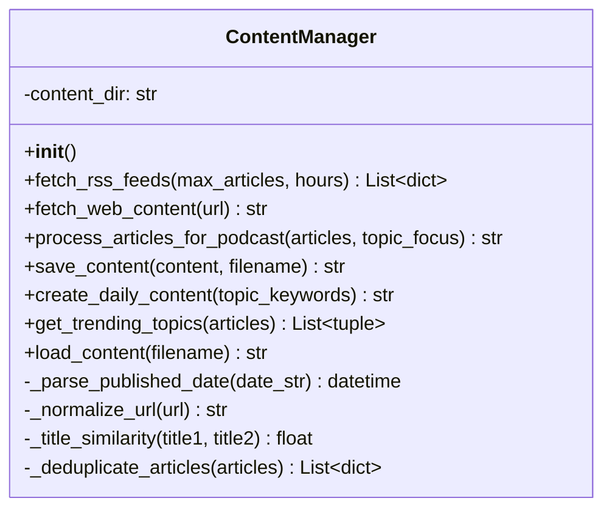
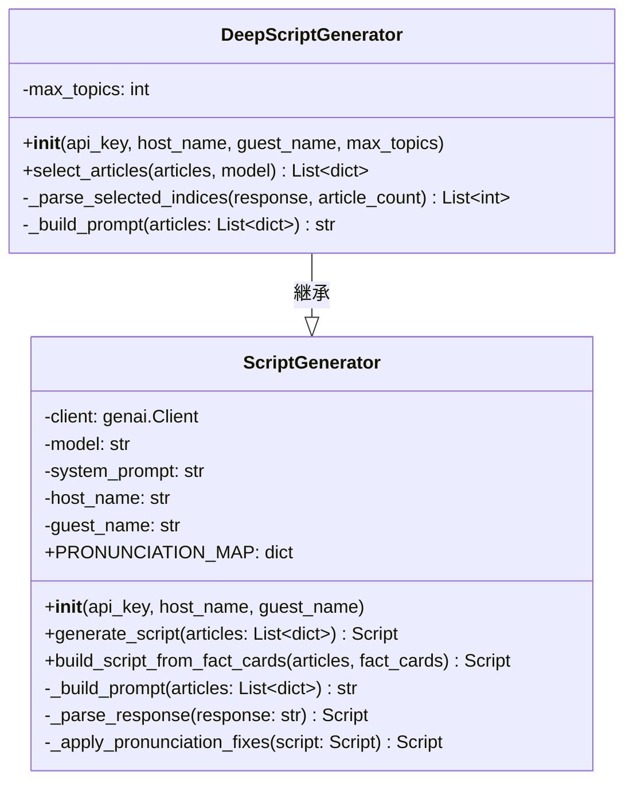
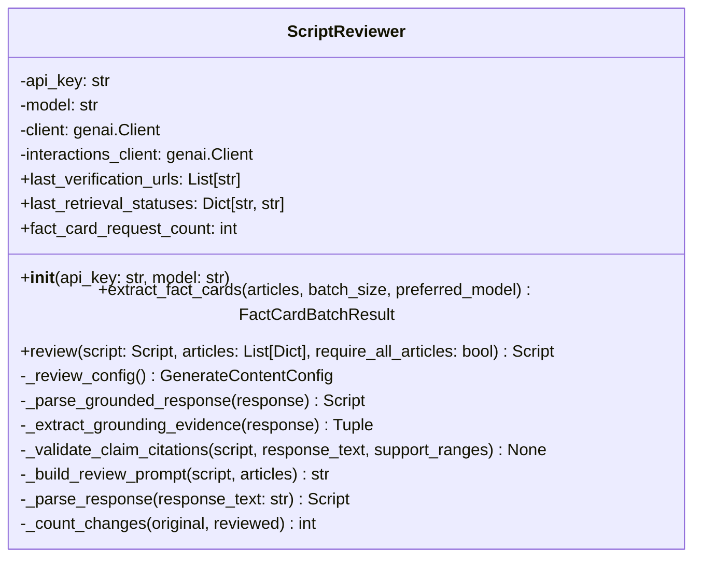
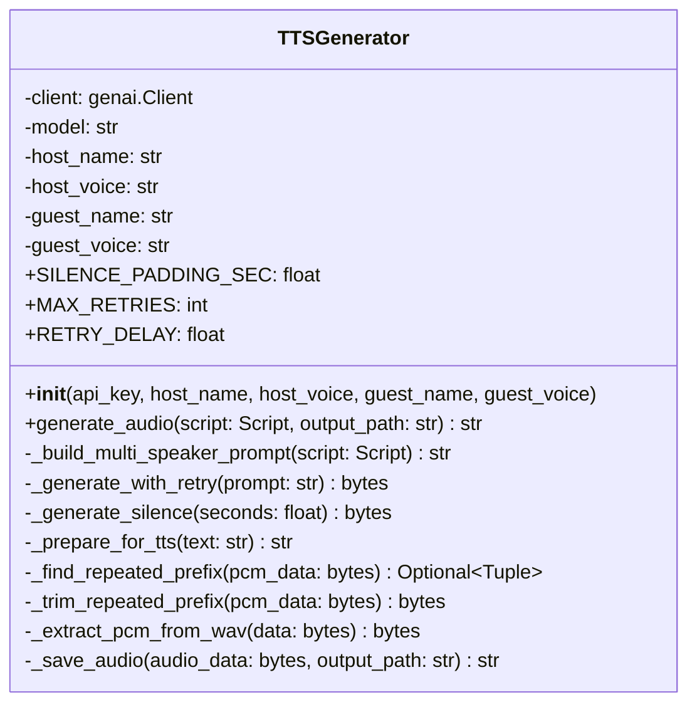
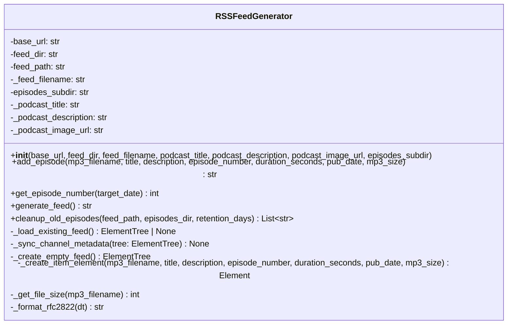
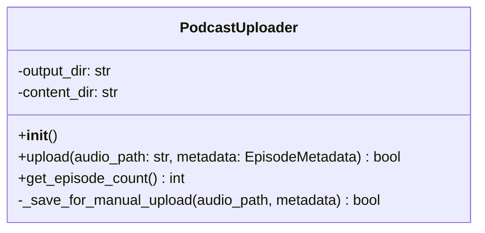
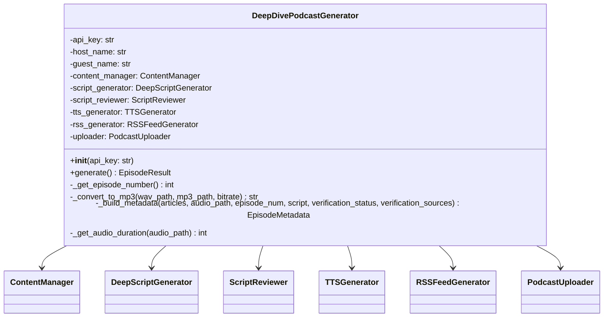

# LLD - Low-Level Design
## AI Auto Podcast 詳細設計書

**採用プラン: α（Gemini 3.8 Flash + Gemini 3.1 Flash TTS / 完全無料）**

> **設計状態（2026-09-26）**: [CRD](CRD.md) に従う配信品質ゲートの目標仕様。現行コードの見出し限定配信、引用範囲のみの判定、逐次実行とは異なる。

---

## 1. クラス・モジュール詳細設計

---

### 1.1 ContentManager (`content_manager.py`) — 既存流用

**責務**: RSSフィードからのコンテンツ収集、テキスト処理

#### クラス図

```mermaid
classDiagram
    class ContentManager {
        -content_dir: str
        +__init__()
        +fetch_rss_feeds(max_articles, hours) List~dict~
        +fetch_web_content(url) str
        +process_articles_for_podcast(articles, topic_focus) str
        +save_content(content, filename) str
        +create_daily_content(topic_keywords) str
        +get_trending_topics(articles) List~tuple~
        +load_content(filename) str
        -_parse_published_date(date_str) datetime
        -_normalize_url(url) str
        -_title_similarity(title1, title2) float
        -_deduplicate_articles(articles) List~dict~
    }
```

#### メソッド詳細

| メソッド | 入力 | 出力 | 処理概要 |
|---------|------|------|---------|
| `fetch_rss_feeds` | max_articles: int, hours: int | List[dict] | config.RSS_FEEDSの各URLをfeedparserで解析。hours時間以内の記事をフィルタ。URL・タイトル重複排除 |
| `fetch_web_content` | url: str | str | BeautifulSoupでHTML本文抽出。MAX_CONTENT_LENGTH文字で切り詰め |
| `process_articles_for_podcast` | articles, topic_focus | str | キーワードフィルタ → 上位5件をテキスト整形 |
| `create_daily_content` | topic_keywords | str(filepath) | fetch → process → save の統合処理 |

#### データ構造: 記事オブジェクト
```python
article = {
    'title': str,       # 記事タイトル
    'summary': str,     # 記事要約
    'link': str,        # 記事URL
    'published': str,   # 公開日時文字列
    'source': str       # フィード名
}
```

---

### 1.2 ScriptGenerator (`script_generator.py`) — 新規作成

**責務**: 速報版は元記事内容で裏付けられた事実カードだけから対話台本を構築する。継承先の深掘り版ではGemini Flash APIによる台本生成も提供する

#### クラス図

```mermaid
classDiagram
    class ScriptGenerator {
        -client: genai.Client
        -model: str
        -system_prompt: str
        -host_name: str
        -guest_name: str
        +PRONUNCIATION_MAP: dict
        +__init__(api_key, host_name, guest_name)
        +generate_script(articles: List~dict~) Script
        +build_script_from_fact_cards(articles, fact_cards) Script
        -_build_prompt(articles: List~dict~) str
        -_parse_response(response: str) Script
        -_apply_pronunciation_fixes(script: Script) Script
    }

    class DeepScriptGenerator {
        -max_topics: int
        +__init__(api_key, host_name, guest_name, max_topics)
        +select_articles(articles, model) List~dict~
        -_parse_selected_indices(response, article_count) List~int~
        -_build_prompt(articles: List~dict~) str
    }

    DeepScriptGenerator --|> ScriptGenerator : 継承
```

#### メソッド詳細

| メソッド | 入力 | 出力 | 処理概要 |
|---------|------|------|---------|
| `__init__` | api_key, host_name, guest_name | - | genai.Client初期化。ホスト/ゲスト名でプロンプトテンプレート展開 |
| `generate_script` | articles: List[dict] | Script | 記事リストからプロンプト構築 → Gemini呼び出し → レスポンス解析 |
| `build_script_from_fact_cards` | adopted_articles, fact_cards | Script | 採用記事だけを使い、裏付けのない見出しを繰り返さない日本語台本を構築。採用0件は呼び出さない |
| `_build_prompt` | articles: List[dict] | str | 記事タイトル・ソース名・URLのみを含むプロンプトテキスト構築（著作権対策によりsummary除去） |
| `_parse_response` | response: str | Script | Geminiレスポンスを構造化されたScript型に変換 |

#### システムプロンプト（概要）
```
あなたはポッドキャストの台本ライターです。
以下のニュース記事をもとに、{host_name}（ホスト）と{guest_name}（ゲスト）の
2人による自然な日本語の対話形式でポッドキャスト台本を作成してください。

要件:
- 5〜8分程度の会話（合計1500〜2500文字）
- 各記事について分かりやすく解説
- ホスト（進行役）、ゲスト（解説役）
- 自然な相槌・質問・感想を含める
- 英語の固有名詞にはカタカナ読みを併記
- TTS読み上げに適した平易な表現
- 著作権に関する注意: 元記事の文章をそのまま使わず独自に解説
- JSON形式で出力: [{"speaker": "{host_name}", "text": "..."}, ...]
```

#### データ構造: Script
```python
@dataclass
class ScriptLine:
    speaker: str        # "A" or "B"
    text: str           # 発話テキスト

Script = List[ScriptLine]
```

#### Gemini API呼び出し仕様
```python
from google import genai
from google.genai import types

client = genai.Client(api_key=api_key)
response = client.models.generate_content(
    model="gemini-3.8-flash",
    config=types.GenerateContentConfig(
        system_instruction=system_prompt,
        response_mime_type="application/json",
    ),
    contents=prompt,
)
```

---

### 1.2-D DeepScriptGenerator (`deep_script_generator.py`) — 新規作成

**責務**: ScriptGenerator を継承し、タイトル・媒体名による先行選定と6次元分析の深掘り台本生成を分離する

#### 継承関係
- `ScriptGenerator` を継承
- `PRONUNCIATION_MAP`（306エントリ）、`_parse_response`、`_apply_pronunciation_fixes` を親から再利用
- `system_prompt` と `_build_prompt` をオーバーライド

#### メソッド詳細

| メソッド | 入力 | 出力 | 処理概要 |
|---------|------|------|---------|
| `__init__` | api_key, host_name, guest_name, max_topics | - | 親クラス初期化後、`DEEP_SYSTEM_PROMPT_TEMPLATE` で system_prompt を上書き |
| `select_articles` | articles, model | List[dict] | 全候補のタイトル・媒体名だけを提示し、有効な記事番号を最大3件選定（URL・summaryは渡さない） |
| `_parse_selected_indices` | response, article_count | List[int] | 選定JSONを検査し、重複・範囲外・件数不正を拒否 |
| `_build_prompt` | articles: List[dict] | str | 選定済み最大3件だけで深掘り台本の生成を指示（summaryは渡さない） |

#### DEEP_SYSTEM_PROMPT_TEMPLATE（概要）
```
あなたはポッドキャストの台本ライターです。
以下の選定済みニュース記事をすべて扱い、
深い洞察と分析を含む対話形式のポッドキャスト台本を作成してください。

記事選定の基準:
- 社会的インパクトが大きいもの
- 技術的に革新的・興味深いもの
- 複数ソース（国内外）で報じられている注目度の高いもの
- リスナーにとって実用的な知見が得られるもの

各トピックで必ず含める6つの分析次元:
1. 背景・経緯
2. 技術的な解説
3. 業界・社会への影響
4. 異なる視点（賛否両論）
5. 日本と海外の比較
6. 今後の展望

要件:
- 10〜15分の会話（合計3000〜5000文字）
- 1トピックあたり5〜8往復の深い議論
- 冒頭で名乗り + 「AIによって自動生成」+ 「深掘りして解説」と趣旨説明
- 発音・表記ルール: 速報版と同一（カタカナ読み併記、ふりがな等）
- 出力形式: JSON配列 [{"speaker": "A", "text": "..."}, ...]
```

#### LLMモデル切替 + 配信見送り
深掘り記事の先行選定でも`gemini-3.8-flash`、`gemini-3.7-flash`、`gemini-3.6-flash`を順に使用し、一時障害または不正な選定JSONでは次のモデルへ切り替える。
台本生成で503・500・接続切断・タイムアウトが発生した場合、`gemini-3.8-flash`、`gemini-3.7-flash`、`gemini-3.6-flash`を各1回ずつ試す。
1リクエストは3分でタイムアウトし、SDK内部では再試行しない。429や認証エラーではモデルを切り替えない。
全候補の失敗時は当該番組を見送り、記事タイトルだけを読む台本には切り替えない。他方の番組は独立して処理する。

---

### 1.2-R ScriptReviewer (`script_reviewer.py`) — 新規作成

**責務**: 速報版ではURL Contextの取得・引用情報と元記事の内容を照合し、裏付け済みの記事だけを採用する。深掘り版では生成済み台本の主張を選定済み元記事と照合する。

#### クラス図

```mermaid
classDiagram
    class ScriptReviewer {
        -api_key: str
        -model: str
        -client: genai.Client
        -interactions_client: genai.Client
        +last_verification_urls: List[str]
        +last_retrieval_statuses: Dict[str, str]
        +fact_card_request_count: int
        +__init__(api_key: str, model: str)
        +extract_fact_cards(articles, batch_size, preferred_model) FactCardBatchResult
        +review(script: Script, articles: List[Dict], require_all_articles: bool) Script
        -_review_config() GenerateContentConfig
        -_parse_grounded_response(response) Script
        -_extract_grounding_evidence(response) Tuple
        -_validate_claim_citations(script, response_text, support_ranges) None
        -_build_review_prompt(script, articles) str
        -_parse_response(response_text: str) Script
        -_count_changes(original, reviewed) int
    }
```

#### レビュー6項目

| # | チェック項目 | 修正内容 |
|---|------------|---------|
| 1 | フォーマット不正 | speaker が "A"/"B" 以外、text が空の行を修正 |
| 2 | 不自然な会話 | 同一フレーズの繰り返し、唐突な話題転換を修正 |
| 3 | 記事カバレッジ | 提供記事への言及漏れを追加（重複記事のまとめはOK） |
| 4 | TTS不適切表現 | URL、コード片、括弧だらけの文を自然な日本語に変換 |
| 5 | 長さの偏り | 特定トピックだけ極端に長い/短い場合にバランス調整 |
| 6 | 事実整合性 | URL Contextで数値・年月・制度・主体と指標を確認。引用のない高リスク主張を拒否 |

#### メソッド詳細

| メソッド | 入力 | 出力 | 処理概要 |
|---------|------|------|---------|
| `__init__` | api_key, model | - | Gemini Client初期化 |
| `review` | script: Script, articles: List[Dict], require_all_articles | Script | 選定記事すべての本文と台本の主張をURLごとに照合。裏付け不足時は不合格 |
| `extract_fact_cards` | articles, batch_size, preferred_model | FactCardBatchResult | Interactions APIで最大5 URLずつ処理。裏付け済みカード、URLごとの不採用理由、API取得障害を分けて返す |
| `_build_review_prompt` | script, articles | str | 記事タイトル・媒体・URL＋台本JSONをプロンプトに構成 |
| `_extract_url_context_evidence` | response | tuple | 取得成功した元記事URLと引用文字範囲を抽出 |
| `_validate_claim_citations` | script, response_text, support_ranges | None | 事実行に引用を要求し、数値・年月・制度語は語単位で引用範囲を検証 |
| `_parse_response` | response_text | Script | JSON配列 → Script型に変換 |
| `_count_changes` | original, reviewed | int | 差分行数をカウント（ログ用） |

#### エラーハンドリング

- 429/5xxなどの一時障害: モデル別の回数・時間予算内で再試行。無料枠の上限到達は他モデルへ切り替えない
- 元記事取得・引用不足: 即時に1回再試行
- APIキー不正などの恒久エラー: 再試行しない
- 最終失敗: 速報は採用済み記事のみ保持し、0件なら見送り。深掘りは選定記事の裏付け不足なら見送り。いずれも記事タイトル限定台本へ切り替えない

#### API利用

- 速報版: Interactions APIで最大20件を5 URLずつ、通常最大4リクエスト。同一モデルへの要求は12秒以上空けてFree Tierの5 RPMを守る。`url_context_result`で取得状態、`url_citation`でURL別引用範囲を検証し、バッチ障害時のみ次のStableモデルへ切替
- 深掘り版: `generateContent` APIで選定済み最大3 URLを1リクエスト（証跡不足時は最大1回モデル切替）
- URL Context自体は無料。取得内容はGeminiの入力トークンに算入される

#### 根拠の状態と採否（目標仕様）

| 状態 | 判定 | 台本への利用 |
|------|------|-------------|
| 取得不可 | URL Contextまたは元記事本文へのアクセスが失敗 | 不可。記事別の失敗理由を記録 |
| 引用候補あり | URL取得成功、AI応答に同じURLの引用注釈あり | まだ不可。引用の文字範囲の重なりだけでは事実を確認できない |
| 裏付け済み | 各主張の根拠箇所を元記事本文で確認し、主体・数値・日付・因果関係が矛盾しない | 可。記事・主張ごとの根拠URLと採否を記録 |

- 事実カードの要約・重要事実は各主張を元記事本文に照らして採否を決める。背景・影響が確認できなければ項目を省略し、推測で埋めない
- 引用注釈のURLと元記事URLを対応付け、根拠となる短い原文箇所が取得した記事本文中にあるかを確かめる。該当箇所が主張を支持するかも確認し、数値・日付・主体を別途照合する
- 深掘り版は記事単位だけでなく台本の主張単位で根拠URLを対応付ける。選定記事を取得できない、または裏付けのない主張を解消できない場合は不合格
- `FactCardBatchResult` は裏付け済みカードと記事別の不採用理由に加え、外部APIの可用性を保持する。`unavailable` は確認処理が全く成立しなかった場合だけ真とし、一部のカードを採用できた場合は成功分を保持する。カード0件だけを理由に「品質不合格」と決めず、503・429・認証障害などで取得できなかった場合は実行障害として区別する
- 記事本文や長い原文引用は音声、RSS、公開メタデータへ含めない。内部の検証記録には採否理由と根拠URLを残す

---

### 1.3 TTSGenerator (`tts_generator.py`) — 新規作成

**責務**: Gemini 3.1 Flash TTS Interactions APIを使い、台本テキストから音声ファイルを生成

#### クラス図

```mermaid
classDiagram
    class TTSGenerator {
        -client: genai.Client
        -model: str
        -host_name: str
        -host_voice: str
        -guest_name: str
        -guest_voice: str
        +SILENCE_PADDING_SEC: float
        +MAX_RETRIES: int
        +RETRY_DELAY: float
        +__init__(api_key, host_name, host_voice, guest_name, guest_voice)
        +generate_audio(script: Script, output_path: str) str
        -_build_multi_speaker_prompt(script: Script) str
        -_generate_with_retry(prompt: str) bytes
        -_generate_silence(seconds: float) bytes
        -_prepare_for_tts(text: str) str
        -_find_repeated_prefix(pcm_data: bytes) Optional~Tuple~
        -_trim_repeated_prefix(pcm_data: bytes) bytes
        -_extract_pcm_from_wav(data: bytes) bytes
        -_save_audio(audio_data: bytes, output_path: str) str
    }
```

#### メソッド詳細

| メソッド | 入力 | 出力 | 処理概要 |
|---------|------|------|---------|
| `__init__` | api_key, host_name, host_voice, guest_name, guest_voice | - | genai.Client初期化。曜日ローテーションの音声名設定 |
| `generate_audio` | script, output_path | str | 台本を最大20行単位でMulti-Speaker TTS音声化し、結合してWAV保存。末尾が8行未満なら直前チャンクからA/Bペアを再配分 |
| `_build_multi_speaker_prompt` | script | str | Director's Notes + 話者名付きトランスクリプト構築 |
| `_call_tts_api` | prompt | bytes | Gemini TTS API呼び出し。SpeakerVoiceConfigで話者別音声指定 |
| `_prepare_for_tts` | text | str | 承認済みの読みアノテーションを読みへ変換し、単独の「国」など文脈依存語を補正 |
| `_find_repeated_prefix` | pcm_data | Optional[Tuple] | 先頭12秒の特徴量・波形が後続に再出現する位置を検出 |
| `_trim_repeated_prefix` | pcm_data | bytes | TTSが先頭から読み直した場合に未完了の先頭部分を除去 |
| `_save_audio` | audio_data, path | str | 音声データをWAVファイルに書き出し |

#### Gemini TTS API 呼び出し仕様（Multi-Speaker）
```python
from google import genai
from google.genai import types

client = genai.Client(
    api_key=api_key,
    http_options=types.HttpOptions(
        timeout=300_000,
        # google-genai 2.25.0では-1がInteractions内部再試行なしに対応
        retry_options=types.HttpRetryOptions(attempts=-1),
    ),
)
response = client.interactions.create(
    model="gemini-3.1-flash-tts-preview",
    input=multi_speaker_prompt,
    response_format={"type": "audio"},
    generation_config={
        "speech_config": [
            {"speaker": host_name, "voice": host_voice},
            {"speaker": guest_name, "voice": guest_voice},
        ],
    },
)
audio_data = base64.b64decode(response.output_audio.data)
```

#### 利用可能な音声（Gemini TTS）
```
Aoede, Charon, Fenrir, Kore, Puck,
Leda, Orus, Zephyr, ...
（※ 日本語対応の音声を要テスト・選定）
```

#### 音声仕様
```
TTS方式: Multi-Speaker（20行単位でチャンク分割）
末尾パディング: 2000ms の無音を挿入（SILENCE_PADDING_SEC=2.0）
出力フォーマット: WAV (PCM 24kHz 16bit mono)
後処理: pydub + ffmpeg で MP3 変換 (128kbps)
リトライ: チャンクごとに最大4試行、30秒/60秒/120秒の指数バックオフ
HTTP制御: 1リクエスト5分でタイムアウト、SDK内部の暗黙リトライは無効
リクエスト予算: 1番組あたり最大5回
失敗診断: 最終失敗したチャンクの送信内容・HTTPエラーを audio_files/diagnostics/*.json に保存（APIキーは伏字）。保存失敗時も元のエラーを優先
反復対策: 台本を一度だけ読む指示 + PCM先頭再出現の検出・除去（API再呼び出しなし）
話者: 速報版・深掘り版で同じ曜日ペアを使用
```

---

### 1.4 RSSFeedGenerator (`rss_feed_generator.py`)

**責務**: ポッドキャスト配信用 RSS 2.0 XML を生成・更新する。速報版・深掘り版の両方に対応（パラメータ化）。

#### クラス図

```mermaid
classDiagram
    class RSSFeedGenerator {
        -base_url: str
        -feed_dir: str
        -feed_path: str
        -_feed_filename: str
        -episodes_subdir: str
        -_podcast_title: str
        -_podcast_description: str
        -_podcast_image_url: str
        +__init__(base_url, feed_dir, feed_filename, podcast_title, podcast_description, podcast_image_url, episodes_subdir)
        +add_episode(mp3_filename, title, description, episode_number, duration_seconds, pub_date, mp3_size) str
        +get_episode_number(target_date) int
        +generate_feed() str
        +cleanup_old_episodes(feed_path, episodes_dir, retention_days) List~str~
        -_load_existing_feed() ElementTree | None
        -_sync_channel_metadata(tree: ElementTree) None
        -_create_empty_feed() ElementTree
        -_create_item_element(mp3_filename, title, description, episode_number, duration_seconds, pub_date, mp3_size) Element
        -_get_file_size(mp3_filename) int
        -_format_rfc2822(dt) str
    }
```

#### コンストラクタ パラメータ

| パラメータ | デフォルト | 速報版の値 | 深掘り版の値 |
|-----------|----------|-----------|------------|
| `feed_filename` | `config.RSS_FEED_FILENAME` | `feed.xml` | `feed_deep.xml` |
| `podcast_title` | `config.PODCAST_TITLE` | `テック速報 AI ニュースラジオ` | `テック深掘り AI 解説ラジオ` |
| `podcast_description` | `config.PODCAST_DESCRIPTION` | （速報版説明文） | （深掘り版説明文） |
| `podcast_image_url` | `config.PODCAST_IMAGE_URL` | `.../cover.jpg` | `.../cover_deep.jpg` |
| `episodes_subdir` | `config.EPISODES_DIR` | `episodes` | `episodes_deep` |

#### メソッド詳細

| メソッド | 入力 | 出力 | 処理概要 |
|---------|------|------|------|
| `add_episode` | mp3_filename, title, description, episode_number, duration_seconds, pub_date, mp3_size | str | 既存feed.xmlを読み込み → 同日の既存itemを置換 → 新エピソードを先頭に追加。feed.xmlパスを返す |
| `get_episode_number` | target_date | int | 対象日の既存回番号があれば再利用。なければ既存最大番号+1 |
| `generate_feed` | - | str | 空のフィードを新規作成（チャンネル情報のみ） |
| `_sync_channel_metadata` | tree: ElementTree | None | 既存フィードのチャンネルメタデータ（title, description, itunes:summary, itunes:image）を現在のconfig値に同期。config変更時に自動反映を保証する |
| `_create_item_element` | mp3_filename, metadata | Element | RSS item 要素を構築（enclosure + メタデータ） |

#### RSS 2.0 + iTunes 拡張仕様
```xml
<?xml version="1.0" encoding="UTF-8"?>
<rss version="2.0"
  xmlns:itunes="http://www.itunes.com/dtds/podcast-1.0.dtd"
  xmlns:atom="http://www.w3.org/2005/Atom">
  <channel>
    <title>テック速報 AI ニュースラジオ</title>
    <link>https://necoha.github.io/auto-podcast</link>
    <language>ja</language>
    <itunes:author>Auto Podcast Generator</itunes:author>
    <itunes:category text="Technology"/>
    <atom:link href=".../feed.xml" rel="self" type="application/rss+xml"/>

    <item>
      <title>第N話 - テック速報 AI ニュースラジオ (YYYY-MM-DD)</title>
      <enclosure url=".../episodes/xxx.mp3" length="..." type="audio/mpeg"/>
      <guid isPermaLink="false">episode-N-YYYYMMDD</guid>
      <pubDate>Mon, 17 Feb 2026 00:00:00 +0900</pubDate>
      <itunes:duration>600</itunes:duration>
      <description>...</description>
    </item>
  </channel>
</rss>
```

---

### 1.5 PodcastUploader (`podcast_uploader.py`)

**責務**: メタデータJSON保存。GitHub Actions が gh-pages へのデプロイを担当。

#### クラス図

```mermaid
classDiagram
    class PodcastUploader {
        -output_dir: str
        -content_dir: str
        +__init__()
        +upload(audio_path: str, metadata: EpisodeMetadata) bool
        +get_episode_count() int
        -_save_for_manual_upload(audio_path, metadata) bool
    }
```

#### メソッド詳細

| メソッド | 入力 | 出力 | 処理概要 |
|---------|------|------|---------|
| `upload` | audio_path, metadata | bool | メタデータJSONをcontent/に保存 |
| `get_episode_count` | - | int | content/内のJSONファイル数を返す |
| `_save_for_manual_upload` | audio_path, metadata | bool | メタデータJSON出力（手動Spotifyアップロード用） |

#### データ構造: EpisodeMetadata
```python
@dataclass
class EpisodeMetadata:
    title: str              # エピソードタイトル
    description: str        # エピソード説明文
    episode_number: int     # エピソード番号
    published_date: str     # 配信日
    source_articles: List[dict]  # 元記事情報
    duration_seconds: int   # 音声の長さ（秒）
    verification_status: str  # grounded / partially_grounded / title_only_fallback / not_applicable
    verification_sources: List[str]  # URL Contextで取得成功した元記事URL
    script_lines: List[dict]  # TTSへ渡した最終台本（事後監査用）
```

> **配信方式**: MP3 + feed.xml を gh-pages ブランチに push。
> GitHub Pages がホスティングし、Spotify / Apple Podcasts が
> RSS を定期取得して新エピソードを自動配信する。

---

### 1.6 PodcastGenerator (`podcast_generator.py`)

**責務**: 全体のオーケストレーション（収集→台本→音声→MP3変換→RSS更新→保存）

#### クラス図

```mermaid
classDiagram
    class PodcastGenerator {
        -host_name: str
        -guest_name: str
        -content_manager: ContentManager
        -script_generator: ScriptGenerator
        -script_reviewer: ScriptReviewer
        -tts_generator: TTSGenerator
        -rss_generator: RSSFeedGenerator
        -uploader: PodcastUploader
        +__init__(api_key: str)
        +generate() EpisodeResult
        -_get_episode_number() int
        -_convert_to_mp3(wav_path, mp3_path, bitrate) str
        -_build_metadata(articles, audio_path, episode_num, script, verification_status, verification_sources) EpisodeMetadata
        -_get_audio_duration(audio_path) int
    }

    PodcastGenerator --> ContentManager
    PodcastGenerator --> ScriptGenerator
    PodcastGenerator --> ScriptReviewer
    PodcastGenerator --> TTSGenerator
    PodcastGenerator --> PodcastUploader
```

#### メソッド詳細

| メソッド | 入力 | 出力 | 処理概要 |
|---------|------|------|---------|
| `__init__` | api_key: str | - | get_daily_speakers()で曜日別出演者を決定。5つのサブコンポーネントを初期化 |
| `generate` | - | EpisodeResult | 当該番組の `published` / `skipped_quality` / `failed_runtime` と理由を返す。見送り時にRSSを変更しない |
| `_get_episode_number` | - | int | 同日の再実行では既存回番号を再利用し、それ以外は既存最大番号+1 |
| `_build_metadata` | articles, audio_path, episode_num, script, verification_status, verification_sources | EpisodeMetadata | 元記事・検証状態・参照URL・最終台本を含むメタデータ構築 |

#### 番組別の配信判定（目標仕様）

| 結果 | 条件 | 音声・RSS | 実行ログ |
|------|------|-----------|---------|
| `published` | 事実・台本・完成音声がすべて合格 | 新規MP3と当該番組のRSS項目だけを追加 | 採用URLと品質検査結果を記録 |
| `skipped_quality` | 取得できた元記事の裏付け記事0件、分析・日本語・分量不足、音声品質不合格 | 追加しない。既存フィードを変更しない | 除外記事と見送り理由を記録。配信成功とは報告しない |
| `failed_runtime` | 外部APIの503・429・認証障害、TTS・変換などの実行障害 | 追加しない。既存フィードを変更しない | 失敗工程とAPIステータスを記録。予算外の再試行をしない |

`EpisodeResult` は `status`、機械可読な `reason_code`、採用URLと除外URLごとの理由、成功時のみ `EpisodeMetadata` を持つ。CLIは番組別の結果を非公開の実行結果JSONとして渡し、workflowは `published` の番組だけをデプロイ対象にする。APIキー・元記事本文・長い引用は結果JSONに含めない。

- 速報版と深掘り版は互いの結果に依存せず実行する。片方が見送り・障害でも、もう片方の合格回は配信できる
- `verification_status` は候補記事の事実確認結果を表し、`EpisodeResult` は番組の配信結果を表す。引用候補だけで `grounded` としない
- 配信日の台本表記・音声ファイル名・RSS公開日はすべて日本時間の日付を使用する
- 速報は採用記事の事実だけで1500〜2500文字・目標5〜8分、深掘りは3000〜5000文字・目標10〜15分を満たすかTTS前に確認する。TTS後は音声の実時間を確認し、短縮版を配信しない
- 英語の見出しを原文のまま読み上げず、意味を変えない日本語にする。台本の同じ見出しの言い直しも拒否する
- 完成音声は先頭読み直し、長い無音、発話の欠落・順序、放送日の不一致を検査する。機械判定が不確かな読みは品質確認に回し、未確認のまま合格としない

#### generate() フロー（疑似コード）
```python
def generate(self) -> EpisodeResult:
    # 1. コンテンツ収集（24h以内 + 重複排除）
    articles = self.content_manager.fetch_rss_feeds(max_articles=2, hours=24)
    today_jst = datetime.now(JST).date()

    # 2. URL Contextと元記事内容を照合し、記事別の採否と理由を保持
    extraction = self.script_reviewer.extract_fact_cards(articles, batch_size=5)
    if extraction.unavailable:
        return EpisodeResult.failed_runtime("元記事取得・検証APIの障害")
    fact_cards = extraction.verified_cards
    adopted_articles = [article for article in articles if article["link"] in fact_cards]
    if not adopted_articles:
        return EpisodeResult.skipped_quality("採用記事なし")

    # 2.5. 採用記事のみを日本語で構成し、分量不足なら配信しない
    script = self.script_generator.build_script_from_fact_cards(adopted_articles, fact_cards)
    if not script_gate_passes(script, target_minutes=(5, 8), jst_date=today_jst):
        return EpisodeResult.skipped_quality("台本品質不合格")

    # 3. TTS音声生成（Multi-Speaker、20行単位）
    self.tts_generator.generate_audio(script, audio_path)  # → WAV

    # 3.5 WAV → MP3 変換 (pydub + ffmpeg, 128kbps)
    mp3_path = self._convert_to_mp3(audio_path, mp3_path)

    # 3.6. 完成した音声を確認。合格するまでRSSに触れない
    if not audio_gate_passes(mp3_path, script, target_minutes=(5, 8)):
        return EpisodeResult.skipped_quality("音声品質不合格")

    # 4. 合格した番組だけRSSを更新
    self.rss_generator.add_episode(mp3_filename, metadata)

    # 5. メタデータ保存
    self.uploader.upload(mp3_path, metadata)
    return EpisodeResult.published(metadata)
    #   GitHub Actions が gh-pages に MP3 + feed.xml を push
```

---

### 1.6-D DeepDivePodcastGenerator (`deep_podcast_generator.py`) — 新規作成

**責務**: 深掘り版の全体オーケストレーション。速報版と同じパイプラインだが、DeepScriptGenerator・別RSS・別ディレクトリを使用。

#### クラス図

```mermaid
classDiagram
    class DeepDivePodcastGenerator {
        -api_key: str
        -host_name: str
        -guest_name: str
        -content_manager: ContentManager
        -script_generator: DeepScriptGenerator
        -script_reviewer: ScriptReviewer
        -tts_generator: TTSGenerator
        -rss_generator: RSSFeedGenerator
        -uploader: PodcastUploader
        +__init__(api_key: str)
        +generate() EpisodeResult
        -_get_episode_number() int
        -_convert_to_mp3(wav_path, mp3_path, bitrate) str
        -_build_metadata(articles, audio_path, episode_num, script, verification_status, verification_sources) EpisodeMetadata
        -_get_audio_duration(audio_path) int
    }

    DeepDivePodcastGenerator --> ContentManager
    DeepDivePodcastGenerator --> DeepScriptGenerator
    DeepDivePodcastGenerator --> ScriptReviewer
    DeepDivePodcastGenerator --> TTSGenerator
    DeepDivePodcastGenerator --> RSSFeedGenerator
    DeepDivePodcastGenerator --> PodcastUploader
```

#### 速報版との差分

| 項目 | 速報版 (PodcastGenerator) | 深掘り版 (DeepDivePodcastGenerator) |
|------|--------------------------|-------------------------------------|
| 台本生成 | `ScriptGenerator` | `DeepScriptGenerator`（継承） |
| URL Context | 最大20件を5 URLずつ事実カード化 | 選定済み最大3 URLで台本レビュー |
| 台本長 | 1500-2500文字 (5-8分) | 3000-5000文字 (10-15分) |
| 記事選定 | 全記事に触れつつ重複統合 | タイトル・媒体名だけで最大3件を先行選定 |
| 品質不合格 | 採用記事0件・台本/音声の品質不足は当該番組を見送り | 選定記事・主張の裏付け不足、台本/音声の品質不足は当該番組を見送り |
| RSSフィード | `feed.xml` | `feed_deep.xml` |
| MP3格納先 | `episodes/` | `episodes_deep/` |
| ファイル名 | `episode_N_YYYYMMDD.mp3` | `deep_N_YYYYMMDD.mp3` |
| カバーアート | `cover.jpg` | `cover_deep.jpg` |
| 話者ペア | `get_daily_speakers()` | 同一（同じ曜日ペア） |
| エピソード番号 | `feed.xml` の item 数 + 1 | `feed_deep.xml` の item 数 + 1 |

#### generate() フロー（疑似コード）
```python
def generate(self) -> EpisodeResult:
    # 1. コンテンツ収集（速報版と同じソースから全記事取得）
    articles = self.content_manager.fetch_rss_feeds(max_articles=2, hours=24)
    today_jst = datetime.now(JST).date()

    # 1.5. タイトル・媒体名だけで最大3件を先行選定
    selected_articles = self.script_generator.select_articles(articles)
    if not selected_articles:
        return EpisodeResult.skipped_quality("選定記事なし")

    # 2. 選定済み記事だけで深掘り台本を生成
    script = self.script_generator.generate_script(selected_articles)

    # 2.5. 選定済み記事本文と台本の全主張を照合。失敗時は見出し版を作らない
    try:
        script = self.script_reviewer.review(script, selected_articles)
    except VerificationServiceUnavailable:
        return EpisodeResult.failed_runtime("元記事取得・検証APIの障害")
    except FactVerificationError:
        return EpisodeResult.skipped_quality("選定記事・主張の裏付け不足")
    if not script_gate_passes(script, target_minutes=(10, 15), jst_date=today_jst):
        return EpisodeResult.skipped_quality("台本品質不合格")

    # 3. TTS音声生成（速報版と同じMulti-Speaker TTS）
    audio_filename = f"deep_{episode_num}_{today}.wav"
    self.tts_generator.generate_audio(script, audio_path)

    # 3.5 WAV → MP3 変換
    mp3_path = self._convert_to_mp3(audio_path, mp3_path)

    # 3.6. 完成音声の確認。合格するまでRSSに触れない
    if not audio_gate_passes(mp3_path, script, target_minutes=(10, 15)):
        return EpisodeResult.skipped_quality("音声品質不合格")

    # 4. 合格した場合のみRSS更新（feed_deep.xml）
    self.rss_generator.add_episode(mp3_filename, metadata)

    # 5. メタデータ保存
    self.uploader.upload(mp3_path, metadata)
    return EpisodeResult.published(metadata)

    # 5. メタデータ保存
    self.uploader.upload(mp3_path, metadata)
```

---

### 1.7 Config (`config.py`)

**責務**: 全コンポーネントの設定値を一元管理

#### 速報版設定

| 設定名 | 型 | 値 | 説明 |
|--------|---|-----|------|
| `GEMINI_API_KEY` | str | env | Gemini APIキー（台本 + TTS 共通） |
| `LLM_MODEL` | str | `gemini-3.8-flash` | 台本生成・URL Contextの優先モデル。環境変数で上書き可能 |
| `LLM_FALLBACK_MODELS` | tuple[str] | `3.7-flash`, `3.6-flash` | 一時障害時の代替モデル。環境変数はカンマ区切り |
| `TTS_MODEL` | str | `gemini-3.1-flash-tts-preview` | TTS用モデル。環境変数で上書き可能 |
| `TTS_VOICE` | str | `Kore` | デフォルト音声（フォールバック用） |
| `TTS_VOICE_A` | str | `Kore` | 話者A（ホスト）のデフォルト音声 |
| `TTS_VOICE_B` | str | `Charon` | 話者B（ゲスト）のデフォルト音声 |
| `DAILY_SPEAKERS` | dict | 7曜日分 | 曜日ローテーションテーブル（7ペア×14人） |
| `RSS_FEEDS` | List[str] | 13フィード | テクノロジーJP 6 + テクノロジーEN 3 + 経済JP 4 |
| `MAX_ARTICLES` | int | `2` | フィードあたりの最大取得数 |
| `MAX_TOTAL_ARTICLES` | int | `20` | 重複排除後の全体最大記事数（URL Context上限） |
| `URL_CONTEXT_BATCH_SIZE` | int | `5` | 速報版のURL Contextバッチ件数（最大20件なら4バッチ） |
| `PODCAST_BASE_URL` | str | `https://necoha.github.io/auto-podcast` | GitHub Pages URL |
| `PODCAST_TITLE` | str | `テック速報 AI ニュースラジオ` | 速報版ポッドキャスト名 |
| `PODCAST_AUTHOR` | str | `Auto Podcast Generator` | 著者名 |
| `PODCAST_LANGUAGE` | str | `ja` | 言語コード |
| `PODCAST_OWNER_EMAIL` | str | env | RSS/Spotify登録用メールアドレス |
| `PODCAST_DESCRIPTION` | str | (default) | ポッドキャスト説明文 |
| `PODCAST_IMAGE_URL` | str | `.../cover.jpg` | カバー画像URL |
| `MAX_CONTENT_LENGTH` | int | `10000` | コンテンツ文字数制限 |
| `AUDIO_OUTPUT_DIR` | str | `./audio_files` | 音声ファイル出力先 |
| `CONTENT_DIR` | str | `./content` | メタデータ保存先 |
| `RSS_FEED_FILENAME` | str | `feed.xml` | RSSフィードファイル名 |
| `EPISODES_DIR` | str | `episodes` | gh-pages上のMP3格納ディレクトリ |
| `EPISODE_RETENTION_DAYS` | int | `60` | エピソード保持日数 |

#### 深掘り版設定（DEEP_* プレフィックス）

| 設定名 | 型 | 値 | 説明 |
|--------|---|-----|------|
| `DEEP_PODCAST_TITLE` | str | `テック深掘り AI 解説ラジオ` | 深掘り版ポッドキャスト名 |
| `DEEP_PODCAST_DESCRIPTION` | str | (default) | 深掘り版説明文 |
| `DEEP_RSS_FEED_FILENAME` | str | `feed_deep.xml` | 深掘り版RSSファイル名 |
| `DEEP_EPISODES_DIR` | str | `episodes_deep` | 深掘り版MP3格納ディレクトリ |
| `DEEP_PODCAST_IMAGE_URL` | str | `.../cover_deep.jpg` | 深掘り版カバー画像URL |
| `DEEP_MAX_TOPICS` | int | `3` | AIが厳選するトピック数 |

#### RSSフィード一覧（13フィード）
| カテゴリ | ソース | URL |
|---------|--------|-----|
| テクノロジー(JP) | ITmedia NEWS | `rss.itmedia.co.jp/rss/2.0/news_bursts.xml` |
| テクノロジー(JP) | Publickey | `www.publickey1.jp/atom.xml` |
| テクノロジー(JP) | GIGAZINE | `gigazine.net/news/rss_2.0/` |
| テクノロジー(JP) | CNET Japan | `japan.cnet.com/rss/index.rdf` |
| テクノロジー(JP) | Impress Watch | `www.watch.impress.co.jp/data/rss/1.0/ipw/feed.rdf` |
| テクノロジー(JP) | ASCII.jp | `ascii.jp/rss.xml` |
| テクノロジー(EN) | TechCrunch | `techcrunch.com/feed/` |
| テクノロジー(EN) | Ars Technica | `feeds.arstechnica.com/arstechnica/index` |
| テクノロジー(EN) | Hacker News | `hnrss.org/frontpage?count=10` |
| 経済(JP) | 日経ビジネス | `business.nikkei.com/rss/sns/nb.rdf` |
| 経済(JP) | ロイター（日本語） | `assets.wor.jp/rss/rdf/reuters/top.rdf` |
| 経済(JP) | Yahoo経済 | `news.yahoo.co.jp/rss/topics/business.xml` |
| 経済(JP) | 朝日新聞経済 | `www.asahi.com/rss/asahi/business.rdf` |

### 1.8 ValidateFeeds (`validate_feeds.py`) — CI検証スクリプト

**責務**: デプロイ前にfeed.xml / feed_deep.xml のXML・チャンネル設定が config.py の期待値と一致するか自動検証する。不一致があればワークフローを失敗させ、壊れたフィードのデプロイを防止する。事実・台本・音声の品質判定は担当しない。

#### 検証項目

| 検証項目 | 比較対象（config.py） | 失敗時 |
|---------|---------------------|--------|
| `<title>` | `PODCAST_TITLE` / `DEEP_PODCAST_TITLE` | `exit(1)` |
| `<description>` | `PODCAST_DESCRIPTION` / `DEEP_PODCAST_DESCRIPTION` | `exit(1)` |
| `<itunes:summary>` | 同上 | `exit(1)` |
| `<itunes:image>` href | `PODCAST_IMAGE_URL` / `DEEP_PODCAST_IMAGE_URL` | `exit(1)` |
| enclosure URL | `EPISODES_DIR` / `DEEP_EPISODES_DIR` がURLに含まれること | `exit(1)` |
| エピソード件数 | 1件以上 | `exit(1)` |

#### 使用方法
```bash
# ローカルテスト
uv run python validate_feeds.py /path/to/feed_dir

# GitHub Actions（ワークフロー内）
uv run python validate_feeds.py audio_files
```

#### ワークフロー上の位置
```
podcast_generator.py → deep_podcast_generator.py → validate_feeds.py → Deploy to gh-pages
```
RSSの構造検証に合格しても番組の配信許可にはならない。事実・台本・音声の品質判定はRSS項目の追加前に番組ごとに実施し、見送り回については既存フィードを維持する。

### 1.9 著作権対策

Apple Podcasts Content Guidelines 準拠のため、以下の対策を実装。

#### 対策一覧

| # | 対策 | 実装箇所 | 効果 |
|---|------|----------|------|
| ① | システムプロンプトに著作権注意事項を追加 | `SYSTEM_PROMPT_TEMPLATE`, `DEEP_SYSTEM_PROMPT_TEMPLATE` | LLMが元記事を転載せず独自の言葉で解説 |
| ② | `_build_prompt()` から記事summaryを除去 | `script_generator.py`, `deep_script_generator.py` | 元記事本文がLLMに渡らないため転載リスクを根本排除 |
| ③ | 未検証記事を台本から除外し、内部照合に使った記事本文を公開メタデータへ含めない | 元記事照合・配信品質ゲート | 見出し・本文の長い転載を避ける |
| ④ | エピソード説明文にソース記事URLを追加 | `podcast_generator.py`, `deep_podcast_generator.py` | 出典明示によりフェアユース主張を強化 |
| ⑥ | チャンネル説明文にdisclaimer追加 | `config.py` | 「元記事の著作権は各メディアに帰属します」を明示 |

#### `_build_prompt()` が渡す情報（summary除去後）
```
--- 記事1 ---
タイトル: {title}
ソース: {source}
URL: {link}
```

#### プロンプトに追加された著作権指示
```
著作権に関する注意:
- 元記事の文章をそのまま引用・転載しないこと
- あなた自身の言葉で独自に要約・解説・分析すること
- 事実の伝達にとどめ、元記事の表現や文体を模倣しないこと
```

---

## 2. ファイル命名規則

| ファイル種別 | 命名パターン | 例 |
|------------|-------------|-----|
| 速報版音声 | `episode_{N}_{YYYYMMDD}.mp3` | `episode_42_20260216.mp3` |
| 深掘り版音声 | `deep_{N}_{YYYYMMDD}.mp3` | `deep_1_20260222.mp3` |
| 速報版メタデータ | `episode_{N}_{YYYYMMDD}.json` | `episode_42_20260216.json` |
| 深掘り版メタデータ | `deep_{N}_{YYYYMMDD}.json` | `deep_1_20260222.json` |
| 速報版RSS | `feed.xml` | — |
| 深掘り版RSS | `feed_deep.xml` | — |
| 速報版カバー | `cover.jpg` | 1400x1400, シアン/ブルー系 |
| 深掘り版カバー | `cover_deep.jpg` | 1400x1400, オレンジ/ピンク系 |

---

## 3. エラー処理パターン

### 3.1 例外処理の基本方針
- 各モジュールは自身のエラーをキャッチしログ出力
- `logging` モジュールを使用（`print()` から移行）
- メソッドは成功時に結果、失敗時に例外を送出
- オーケストレーターは番組ごとに `published` / `skipped_quality` / `failed_runtime` を返す。失敗を見出し台本の配信成功として扱わない

### 3.2 エラーと配信見送り

| シナリオ | 当該番組の結果 |
|---------|----------------|
| RSS取得失敗（一部） | 得られた記事の照合を続け、番組分量に不足するなら `skipped_quality` |
| RSS取得失敗（全部） | `failed_runtime`。記事が取得できなかった原因を記録し、既存RSSを維持 |
| 取得済み記事の裏付け0件、新着記事なし | `skipped_quality`。見出し版には切り替えない |
| 深掘り記事選定・主張照合の不合格 | 元記事は取得できたが主張を裏付けられなければ `skipped_quality`。API障害なら `failed_runtime` |
| 台本の日本語・分量、完成音声の品質不足 | `skipped_quality`。新規RSS項目を追加しない |
| 台本生成APIの一時障害 | 3.8→3.7→3.6を予算内で試し、全候補失敗なら `failed_runtime` |
| Gemini TTSの恒久障害・リトライ予算切れ | `failed_runtime`。音声・RSS項目を公開しない |
| レート制限・認証障害・アップロード失敗 | `failed_runtime`。他方の番組は独立して処理し、原因を記録 |

### 3.3 配信判定の受け入れ例（目標仕様）

| 状況 | 期待結果 |
|------|----------|
| 速報候補20件のうち裏付け0件 | 速報は見送り。取得できた記事が裏付け不足なら `skipped_quality`、API障害なら `failed_runtime`。TTS・feed.xml 更新はしない |
| 裏付けがあっても事実だけでは5〜8分の日本語台本を構成できない | 見出しで穴埋めせず速報を見送り |
| URL取得成功・AIの引用注釈あり、元記事本文と主張を照合できない | その記事は不採用。`grounded` にしない |
| 深掘り台本の選定記事が取得不可、または根拠不明の主張が残る | 深掘りを見送り。1分程度の見出し版を配信しない |
| 台本は合格したが音声の長さ・内容・日付が不合格 | その番組のみ見送り、RSSは変更しない |
| 速報が見送り、深掘りだけ合格 | 深掘りのMP3とfeed_deep.xml のみ更新。速報feed.xml は維持 |
| TTSがHTTP 400を返す | `failed_runtime` と診断記録。完成していない音声とRSS項目は公開しない |

---

## 4. 外部APIとのインタラクション

### 4.1 RSSフィード取得（既存）
```
プロトコル: HTTP GET
ライブラリ: feedparser
タイムアウト: feedparserデフォルト
レスポンス: XML (RSS/Atom)
エラー処理: フィード単位で例外キャッチ
```

### 4.2 Gemini Flash API（台本生成）
```
プロトコル: HTTPS
ライブラリ: google-genai
エンドポイント: generativelanguage.googleapis.com
認証: APIキー
モデル: gemini-3.8-flash（優先）→ gemini-3.7-flash → gemini-3.6-flash
入力: テキスト（記事情報 + システムプロンプト）
出力: JSON（対話台本）
レート制限（無料枠）: プロジェクトごとのAI Studio表示値を参照
```

### 4.3 Gemini 3.1 Flash TTS Interactions API（Multi-Speaker 音声生成）
```
プロトコル: HTTPS
ライブラリ: google-genai
エンドポイント: generativelanguage.googleapis.com
認証: APIキー（台本生成と共通）
モデル: gemini-3.1-flash-tts-preview
API: Interactions API
入力: Director's Notes + MultiSpeaker トランスクリプト
出力: 音声バイナリ（WAV PCM 24kHz 16bit mono）
レスポンスモダリティ: AUDIO
APIコール数: 通常1〜3回/エピソード（20行単位で分割）、再試行込み最大5回
レート制限 (Free Tier): 実割り当てはAI Studioを参照
実行上限: 速報版5回 + 深掘り版5回 = 定期実行1回あたり最大10回
話者: 曜日ローテーション（7ペア×14人）
```

---

## 5. GitHub Actions デプロイ仕様

### 5.1 目標ワークフロー（未実装）

CRDの定期実行要件は毎日06:00 JST（21:00 UTC）。現行workflowは23:00 JST（14:00 UTC）であり、時間帯の変更は別途無料枠への影響を確認してから実装する。実行タイムアウトの現行値は45分。

1. gh-pagesから速報版・深掘り版の既存フィードを復元する。
2. 速報版・深掘り版を番組単位で独立して実行し、`EpisodeResult` と採否理由を非公開の実行結果として残す。一方が失敗しても他方を実行する。
3. `published` の番組だけ品質ゲートで合格済みのMP3とRSS項目を追加する。`skipped_quality` / `failed_runtime` の番組は既存RSSを維持し、途中生成した音声をデプロイ対象にしない。
4. 少なくとも一方が `published` の場合だけ、`validate_feeds.py` で両フィードのXML構造を検査し、合格した番組の音声・RSS更新だけを gh-pages に反映する。両方見送りならpushしない。
5. 番組ごとの `published` / `skipped_quality` / `failed_runtime` を実行結果として報告する。見送りを配信成功として数えず、API障害は監視対象として残す。
6. 通常の音声・feed・メタデータは90日間のartifactへ保存する。TTS失敗診断は別artifactに7日間保存し、gh-pagesへはコピーしない。

#### CRDとの実装差分（2026-09-26時点）

| 項目 | 現行実装 | 目標仕様 |
|------|----------|----------|
| 配信時刻 | 23:00 JST | CRDの06:00 JST。変更前に無料枠と日付境界を再確認 |
| 事実確認 | URL取得・AI引用範囲の重なりを主に確認 | 元記事本文と主張を照合し、根拠を主張ごとに保持 |
| 速報の検証失敗 | 未検証記事も見出しで紹介し、0件採用でも配信 | 未検証記事を除外し、採用0件・分量不足なら見送り |
| 深掘りの検証失敗 | 1分程度の見出し限定版へ切り替え | 記事・主張・10〜15分の分析が不合格なら見送り |
| 音声・日付 | TTS API成功時に配信可能。台本日は実行環境の時計に依存 | 完成音声の品質を検査し、台本・音声・RSS日付をJSTで統一 |
| CIとフィード | 速報失敗で深掘りをスキップし、XML構造のみ検査 | 番組単位で独立判定し、合格した番組の更新だけ配信 |

#### デプロイ時の注意: MP3ファイル振り分け

ワークフローの deploy ステップでは、`audio_files/` 内の全 MP3 を正しいディレクトリに振り分ける必要がある:

| ファイルパターン | コピー先 | 説明 |
|----------------|---------|------|
| `episode_*.mp3` | `gh-pages-deploy/episodes/` | 速報版 MP3 |
| `deep_*.mp3` | `gh-pages-deploy/episodes_deep/` | 深掘り版 MP3 |

```
gh-pages/
├── feed.xml              # 速報版ポッドキャスト RSS
├── feed_deep.xml         # 深掘り版ポッドキャスト RSS
├── cover.jpg             # 速報版カバーアート (1400x1400)
├── cover_deep.jpg        # 深掘り版カバーアート (1400x1400)
├── episodes/
│   ├── episode_1_20260217.mp3
│   ├── episode_2_20260218.mp3
│   └── ...
├── episodes_deep/
│   ├── deep_1_20260222.mp3
│   └── ...
└── index.html            # 簡易ランディングページ
```

公開URL: `https://necoha.github.io/auto-podcast/`
速報版 RSS URL: `https://necoha.github.io/auto-podcast/feed.xml`
深掘り版 RSS URL: `https://necoha.github.io/auto-podcast/feed_deep.xml`

### 5.3 セットアップ手順
1. GitHub Secrets に `GEMINI_API_KEY` と `PODCAST_OWNER_EMAIL` を設定
2. `gh-pages` ブランチを作成
3. GitHub Pages を `gh-pages` ブランチから配信に設定
4. Spotify for Creators に RSS URL を登録
5. Apple Podcasts Connect に RSS URL を登録
6. Actions タブで手動実行 or cron 待ち

---

## 6. 依存パッケージ一覧

**パッケージ管理: uv** (`pyproject.toml` + `uv.lock`)

| パッケージ | バージョン | 用途 |
|-----------|----------|------|
| google-genai | 2.25.0 | Gemini API（台本生成 + 新Interactions APIによるMulti-Speaker TTS） |
| feedparser | >=6.0.10 | RSS/Atomフィード解析 |
| beautifulsoup4 | >=4.12.2 | HTML本文抽出 |
| requests | >=2.31.0 | HTTP通信 |
| python-dotenv | >=1.0.0 | ローカル環境変数読み込み |
| pydub | >=0.25.1 | WAV→MP3変換（ffmpeg経由） |

### システム依存
| ツール | 用途 |
|-------|------|
| ffmpeg | pydubのバックエンド（MP3エンコード） |
| uv | パッケージ管理・仮想環境 |
