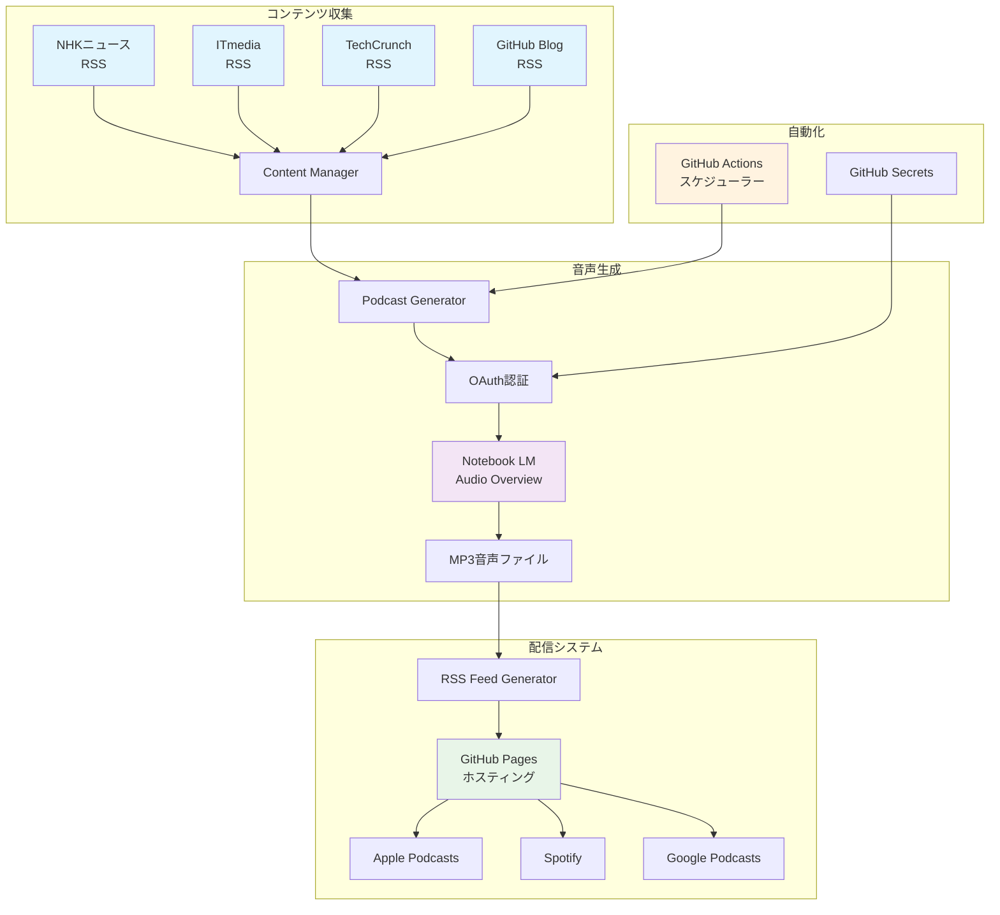
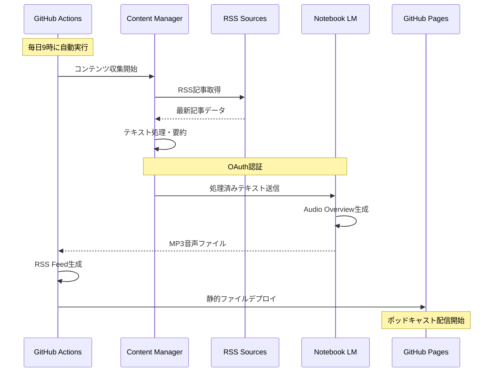
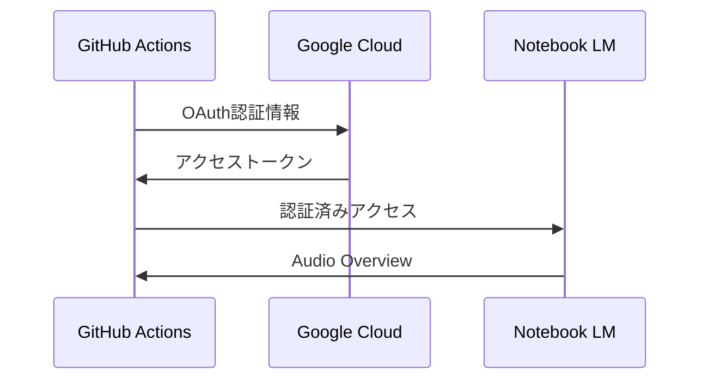
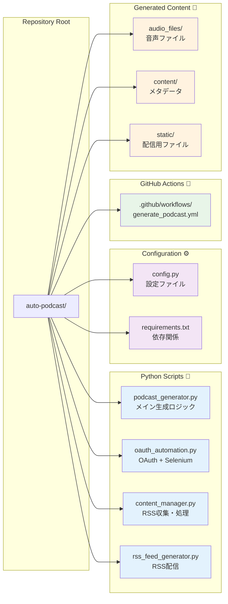
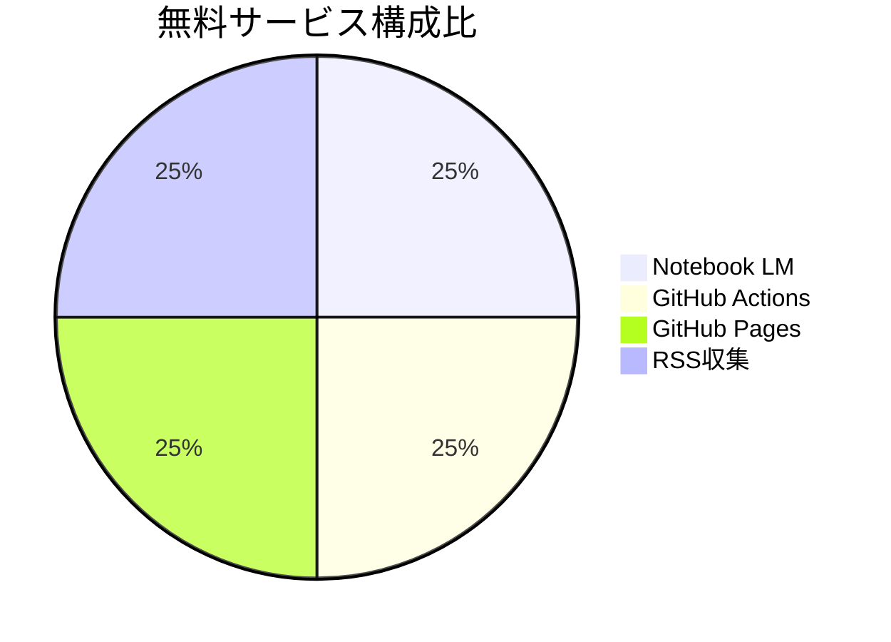
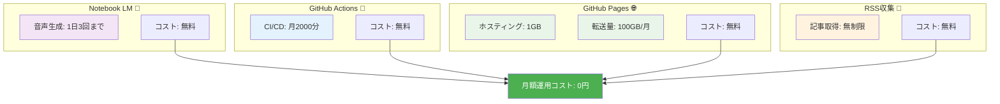
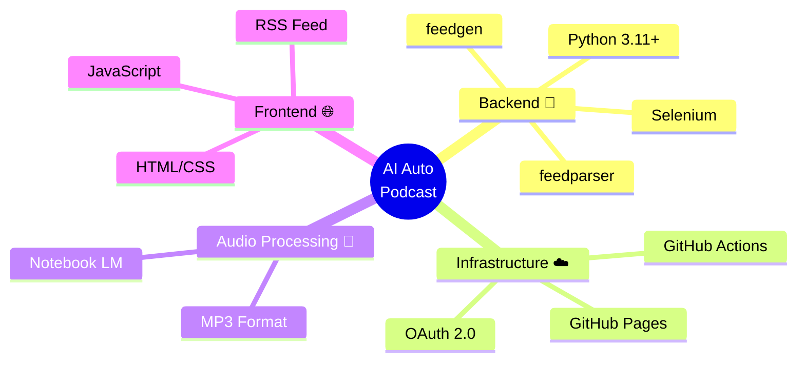
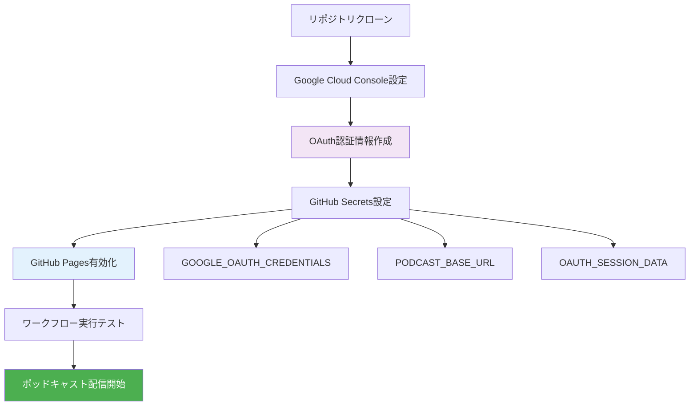
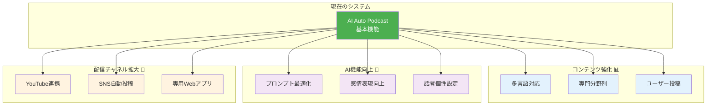

# 🎙️ AI Auto Podcast System
## Notebook LM Audio Overview を活用した自動ポッドキャスト配信システム

**完全無料 × 自動化 × 高品質音声**

---

## 📋 システム概要

### 🎯 目的
- RSSフィードから最新ニュースを自動収集
- Notebook LMのAudio Overview機能で高品質な対話音声を生成
- RSS配信でポッドキャストアプリに自動配信

### 💰 コスト
- **完全無料** で運用可能
- GitHub Actions + GitHub Pages + Notebook LM無料版

---

## 🏗️ システム構成図



---

## 📊 データフロー



---

## 🔄 自動化ワークフロー

### ⏰ **スケジュール実行**
```yaml
# 毎日日本時間9時に自動実行
schedule:
  - cron: '0 0 * * *'
```

### 🔧 **実行ステップ**
1. **コンテンツ収集** - RSS記事取得
2. **OAuth認証** - Notebook LMアクセス
3. **音声生成** - Audio Overview作成
4. **RSS更新** - 配信フィード更新
5. **GitHub Pages** - 自動デプロイ

---

## 🎵 コンテンツソース

### 📰 **現在の設定**
- **NHKニュース** - 一般ニュース
- **ITmedia** - テクノロジー
- **TechCrunch** - スタートアップ
- **Ars Technica** - 技術詳細
- **GitHub Blog** - 開発者情報

### ⚙️ **カスタマイズ可能**
```python
RSS_FEEDS = [
    "https://your-favorite-news.com/rss",
    "https://custom-blog.com/feed.xml"
]
```

---

## 🔐 認証システム

### 🎫 **OAuth 2.0 認証**


### 🔑 **セキュリティ**
- GitHub Secretsで認証情報を安全に管理
- OAuth認証でアプリパスワード不要
- セッション永続化で効率的な認証

---

## 📁 ファイル構成



---

## 🌐 配信システム

### 📡 **RSS配信**
```xml
<rss version="2.0">
  <channel>
    <title>AI Auto Podcast</title>
    <link>https://necoha.github.io/auto-podcast/</link>
    <item>
      <title>第1話 - AI Auto Podcast</title>
      <enclosure url="https://.../episode_001.mp3" 
                 type="audio/mpeg"/>
    </item>
  </channel>
</rss>
```

### 📱 **ポッドキャストアプリ対応**
- Apple Podcasts、Spotify、Google Podcasts
- RSS URL: `https://necoha.github.io/auto-podcast/feed.xml`

---

## 💰 無料サービス活用



### 📊 サービス制限とコスト



---

## 🔧 技術スタック



---

## 🚀 セットアップフロー

```mermaid
gitgraph
    commit id: "1. Repository準備"
    commit id: "2. OAuth設定"
    commit id: "3. GitHub Pages有効化"
    commit id: "4. Secrets設定"
    commit id: "5. 自動実行開始"
```

### セットアップステップ詳細



---

## 📈 システムの利点

### ✅ **完全自動化**
- 人手不要で継続的なポッドキャスト配信
- スケジュール実行で安定運用

### ✅ **高品質音声**
- Notebook LMの自然な対話形式
- プロフェッショナルなポッドキャスト品質

### ✅ **無料運用**
- 全サービス無料枠内で運用
- スケールアップ時も低コスト

### ✅ **カスタマイズ性**
- RSS源、生成頻度、プロンプト調整可能
- オープンソースで完全カスタマイズ

---

## 🔄 運用フロー（日次）

```mermaid
gantt
    title Daily Podcast Generation Flow
    dateFormat HH:mm
    axisFormat %H:%M
    
    section Morning
    RSS収集        :active, rss, 09:00, 09:05
    コンテンツ処理   :content, after rss, 09:10
    
    section Generation
    OAuth認証      :auth, after content, 09:12
    音声生成       :audio, after auth, 09:25
    
    section Publishing
    RSS更新       :feed, after audio, 09:27
    Pages配信     :deploy, after feed, 09:30
```



**毎朝9時に自動実行 → 30分以内にポッドキャスト配信完了**

---

## 🎯 今後の拡張可能性



---

## 🏁 まとめ

### 🎪 **実現できること**
- **完全無料**でプロ品質のポッドキャスト自動配信
- **Notebook LM**の最新AI技術活用
- **GitHub**エコシステムでの安定運用

### 🚀 **次のステップ**
1. OAuth認証情報設定
2. 初回手動実行テスト
3. RSS配信確認
4. ポッドキャストアプリで購読

**Let's start your AI-powered podcast journey! 🎙️**